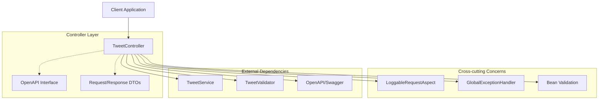
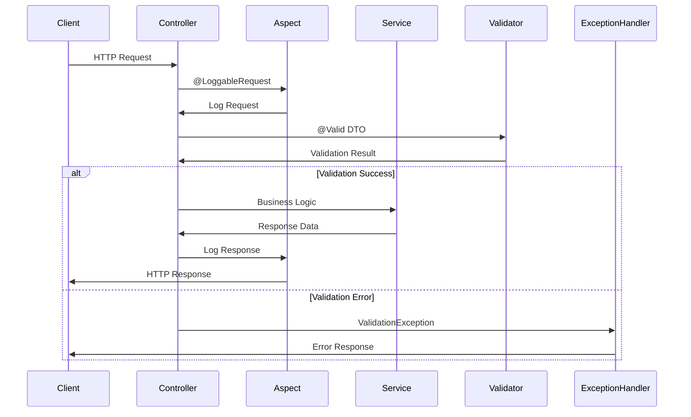

# Проектирование Controller Layer для Tweet API

## Meta
- project: twitter-tweet-api
- design_date: 2025-01-27
- designer: AI Assistant
- version: 1.0
- status: completed
- layer: Controller

## Executive Summary

Данный документ содержит детальное проектирование Controller Layer для сервиса Tweet API. Проектирование основано на анализе существующих паттернов users-api, API контрактах и лучших практиках Spring Boot разработки.

## 1. Архитектурные принципы Controller Layer

### 1.1 Основные принципы

#### Слоистая архитектура:
- **Controller** → **Service** → **Repository** → **Entity**
- **Четкое разделение ответственности** между слоями
- **Делегирование бизнес-логики** в Service Layer
- **Обработка HTTP** специфичных операций

#### RESTful принципы:
- **Ресурс-ориентированный дизайн** с четкими URL паттернами
- **HTTP методы** соответствуют операциям (GET, POST, PUT, DELETE)
- **Статус коды** отражают результат операции
- **Версионирование** через URL path (/api/v1/)

### 1.2 Паттерны из users-api

#### Структура контроллера:
```java
@Slf4j
@RestController
@RequestMapping("/api/v1/tweets")
@RequiredArgsConstructor
public class TweetController implements TweetApi {
    
    private final TweetService tweetService;
    
    @LoggableRequest
    @GetMapping("/{tweetId}")
    @Override
    public ResponseEntity<TweetResponseDto> getTweetById(@PathVariable UUID tweetId) {
        return tweetService.getTweetById(tweetId)
            .map(ResponseEntity::ok)
            .orElse(ResponseEntity.notFound().build());
    }
}
```

#### Ключевые аннотации:
- **@RestController**: автоматическая сериализация в JSON
- **@RequestMapping**: базовый путь для всех endpoints
- **@RequiredArgsConstructor**: автоматическая инъекция зависимостей
- **@LoggableRequest**: автоматическое логирование запросов/ответов

## 2. Проектирование REST Endpoints

### 2.1 Основные операции с твитами

#### POST /api/v1/tweets - Создание твита
```java
@LoggableRequest(hideFields = {"password"})
@PostMapping
@Override
public ResponseEntity<TweetResponseDto> createTweet(@RequestBody @Valid CreateTweetRequestDto request) {
    TweetResponseDto tweet = tweetService.createTweet(request);
    return ResponseEntity.status(HttpStatus.CREATED).body(tweet);
}
```

**Особенности:**
- **@Valid**: автоматическая валидация DTO
- **HttpStatus.CREATED**: статус 201 для создания ресурса
- **hideFields**: скрытие чувствительных данных в логах

#### GET /api/v1/tweets/{tweetId} - Получение твита
```java
@LoggableRequest
@GetMapping("/{tweetId}")
@Override
public ResponseEntity<TweetResponseDto> getTweetById(@PathVariable UUID tweetId) {
    return tweetService.getTweetById(tweetId)
        .map(ResponseEntity::ok)
        .orElse(ResponseEntity.notFound().build());
}
```

**Особенности:**
- **Optional pattern**: обработка отсутствующих данных
- **ResponseEntity.notFound()**: стандартный 404 ответ

#### PUT /api/v1/tweets/{tweetId} - Обновление твита
```java
@LoggableRequest(hideFields = {"password"})
@PutMapping("/{tweetId}")
@Override
public ResponseEntity<TweetResponseDto> updateTweet(
    @PathVariable UUID tweetId, 
    @RequestBody @Valid UpdateTweetRequestDto request) {
    return tweetService.updateTweet(tweetId, request)
        .map(ResponseEntity::ok)
        .orElse(ResponseEntity.notFound().build());
}
```

**Особенности:**
- **Авторизация**: проверка прав автора в Service Layer
- **Валидация**: @Valid для входных данных

#### DELETE /api/v1/tweets/{tweetId} - Удаление твита
```java
@LoggableRequest
@DeleteMapping("/{tweetId}")
@Override
public ResponseEntity<Void> deleteTweet(@PathVariable UUID tweetId) {
    return tweetService.deleteTweet(tweetId)
        .map(tweet -> ResponseEntity.noContent().<Void>build())
        .orElse(ResponseEntity.notFound().build());
}
```

**Особенности:**
- **Soft delete**: логическое удаление в Service Layer
- **ResponseEntity.noContent()**: статус 204 для успешного удаления

### 2.2 Операции с пользователями

#### GET /api/v1/tweets/user/{userId} - Твиты пользователя
```java
@LoggableRequest
@GetMapping("/user/{userId}")
@Override
public PagedModel<TweetResponseDto> getUserTweets(
    @PathVariable UUID userId,
    @PageableDefault(size = 20) Pageable pageable) {
    Page<TweetResponseDto> tweets = tweetService.getUserTweets(userId, pageable);
    return new PagedModel<>(tweets);
}
```

**Особенности:**
- **Пагинация**: @PageableDefault для настроек по умолчанию
- **PagedModel**: стандартная структура для пагинированных ответов

#### GET /api/v1/tweets/timeline/{userId} - Лента новостей
```java
@LoggableRequest
@GetMapping("/timeline/{userId}")
@Override
public PagedModel<TweetResponseDto> getUserTimeline(
    @PathVariable UUID userId,
    @PageableDefault(size = 20) Pageable pageable) {
    Page<TweetResponseDto> timeline = tweetService.getUserTimeline(userId, pageable);
    return new PagedModel<>(timeline);
}
```

**Особенности:**
- **Сложная бизнес-логика**: делегирование в Service Layer
- **Производительность**: оптимизация запросов в Service Layer

### 2.3 Социальные функции

#### POST /api/v1/tweets/{tweetId}/like - Лайк твита
```java
@LoggableRequest
@PostMapping("/{tweetId}/like")
@Override
public ResponseEntity<LikeResponseDto> likeTweet(
    @PathVariable UUID tweetId,
    @RequestBody @Valid LikeTweetRequestDto request) {
    LikeResponseDto like = tweetService.likeTweet(tweetId, request);
    return ResponseEntity.status(HttpStatus.CREATED).body(like);
}
```

**Особенности:**
- **Вложенные ресурсы**: /tweets/{id}/like паттерн
- **Бизнес-правила**: проверка дублирования в Service Layer

#### DELETE /api/v1/tweets/{tweetId}/like - Убрать лайк
```java
@LoggableRequest
@DeleteMapping("/{tweetId}/like")
@Override
public ResponseEntity<Void> unlikeTweet(
    @PathVariable UUID tweetId,
    @RequestBody @Valid UnlikeTweetRequestDto request) {
    tweetService.unlikeTweet(tweetId, request);
    return ResponseEntity.noContent().build();
}
```

#### POST /api/v1/tweets/{tweetId}/retweet - Ретвит
```java
@LoggableRequest
@PostMapping("/{tweetId}/retweet")
@Override
public ResponseEntity<RetweetResponseDto> retweetTweet(
    @PathVariable UUID tweetId,
    @RequestBody @Valid RetweetRequestDto request) {
    RetweetResponseDto retweet = tweetService.retweetTweet(tweetId, request);
    return ResponseEntity.status(HttpStatus.CREATED).body(retweet);
}
```

### 2.4 Получение статистики и списков

#### GET /api/v1/tweets/{tweetId}/likes - Кто лайкнул
```java
@LoggableRequest
@GetMapping("/{tweetId}/likes")
@Override
public PagedModel<LikeResponseDto> getTweetLikes(
    @PathVariable UUID tweetId,
    @PageableDefault(size = 20) Pageable pageable) {
    Page<LikeResponseDto> likes = tweetService.getTweetLikes(tweetId, pageable);
    return new PagedModel<>(likes);
}
```

#### GET /api/v1/tweets/{tweetId}/retweets - Кто ретвитнул
```java
@LoggableRequest
@GetMapping("/{tweetId}/retweets")
@Override
public PagedModel<RetweetResponseDto> getTweetRetweets(
    @PathVariable UUID tweetId,
    @PageableDefault(size = 20) Pageable pageable) {
    Page<RetweetResponseDto> retweets = tweetService.getTweetRetweets(tweetId, pageable);
    return new PagedModel<>(retweets);
}
```

## 3. Проектирование обработки HTTP статусов

### 3.1 Стандартные статус коды

#### Успешные операции:
- **200 OK**: успешное получение/обновление данных
- **201 Created**: успешное создание ресурса
- **204 No Content**: успешное удаление без возврата данных

#### Ошибки клиента:
- **400 Bad Request**: ошибки валидации входных данных
- **401 Unauthorized**: отсутствие аутентификации
- **403 Forbidden**: недостаточно прав для операции
- **404 Not Found**: ресурс не найден
- **409 Conflict**: конфликт состояния (дублирование)

#### Ошибки сервера:
- **500 Internal Server Error**: внутренние ошибки сервера
- **503 Service Unavailable**: внешний сервис недоступен

### 3.2 Паттерны обработки ошибок

#### Использование Optional:
```java
public ResponseEntity<TweetResponseDto> getTweetById(@PathVariable UUID tweetId) {
    return tweetService.getTweetById(tweetId)
        .map(ResponseEntity::ok)
        .orElse(ResponseEntity.notFound().build());
}
```

#### Обработка исключений:
```java
@ExceptionHandler(TweetNotFoundException.class)
public ResponseEntity<ErrorResponseDto> handleTweetNotFound(TweetNotFoundException ex) {
    ErrorResponseDto error = ErrorResponseDto.builder()
        .code("TWEET_NOT_FOUND")
        .message(ex.getMessage())
        .timestamp(Instant.now())
        .build();
    return ResponseEntity.status(HttpStatus.NOT_FOUND).body(error);
}
```

## 4. Проектирование интеграции с OpenAPI/Swagger

### 4.1 OpenAPI интерфейс

#### TweetApi интерфейс:
```java
@Tag(name = "Tweets", description = "Tweet management operations")
public interface TweetApi {
    
    @Operation(
        summary = "Create a new tweet",
        description = "Creates a new tweet for the authenticated user",
        operationId = "createTweet"
    )
    @ApiResponses({
        @ApiResponse(responseCode = "201", description = "Tweet created successfully"),
        @ApiResponse(responseCode = "400", description = "Bad request - validation errors"),
        @ApiResponse(responseCode = "401", description = "Unauthorized"),
        @ApiResponse(responseCode = "404", description = "User not found")
    })
    ResponseEntity<TweetResponseDto> createTweet(@RequestBody @Valid CreateTweetRequestDto request);
    
    @Operation(
        summary = "Get tweet by ID",
        description = "Retrieves a specific tweet by its ID",
        operationId = "getTweetById"
    )
    @ApiResponses({
        @ApiResponse(responseCode = "200", description = "Tweet retrieved successfully"),
        @ApiResponse(responseCode = "404", description = "Tweet not found")
    })
    ResponseEntity<TweetResponseDto> getTweetById(@PathVariable UUID tweetId);
}
```

### 4.2 DTO с OpenAPI аннотациями

#### CreateTweetRequestDto:
```java
@Schema(
    name = "CreateTweetRequest",
    description = "Data structure for creating new tweets",
    example = """
        {
          "content": "Hello Twitter! This is my first tweet.",
          "userId": "12345678-1234-1234-1234-123456789abc"
        }
        """
)
public record CreateTweetRequestDto(
    @Schema(
        description = "Tweet content",
        example = "Hello Twitter! This is my first tweet.",
        minLength = 1,
        maxLength = 280,
        requiredMode = Schema.RequiredMode.REQUIRED
    )
    @NotBlank(message = "Tweet content cannot be blank")
    @Size(min = 1, max = 280, message = "Tweet content must be between 1 and 280 characters")
    String content,
    
    @Schema(
        description = "ID of the user creating the tweet",
        example = "12345678-1234-1234-1234-123456789abc",
        format = "uuid",
        requiredMode = Schema.RequiredMode.REQUIRED
    )
    @NotNull(message = "User ID cannot be null")
    UUID userId
) {}
```

#### TweetResponseDto:
```java
@Schema(
    name = "TweetResponse",
    description = "Tweet information returned by the API",
    example = """
        {
          "id": "12345678-1234-1234-1234-123456789abc",
          "userId": "12345678-1234-1234-1234-123456789abc",
          "content": "Hello Twitter! This is my first tweet.",
          "createdAt": "2025-01-27T10:30:00Z",
          "updatedAt": "2025-01-27T10:30:00Z",
          "isDeleted": false,
          "stats": {
            "likesCount": 42,
            "retweetsCount": 15,
            "repliesCount": 8
          }
        }
        """
)
public record TweetResponseDto(
    @Schema(description = "Unique identifier of the tweet", format = "uuid")
    UUID id,
    
    @Schema(description = "ID of the tweet author", format = "uuid")
    UUID userId,
    
    @Schema(description = "Tweet content")
    String content,
    
    @Schema(description = "Tweet creation timestamp", format = "date-time")
    LocalDateTime createdAt,
    
    @Schema(description = "Tweet last update timestamp", format = "date-time")
    LocalDateTime updatedAt,
    
    @Schema(description = "Soft delete flag")
    boolean isDeleted,
    
    @Schema(description = "Tweet statistics")
    TweetStatsDto stats
) {}
```

### 4.3 Конфигурация OpenAPI

#### TweetApiOpenApiConfig:
```java
@Configuration
public class TweetApiOpenApiConfig {
    
    @Bean
    public OpenAPI tweetApiOpenAPI() {
        return new OpenAPI()
            .info(new Info()
                .title("Twitter Tweet API")
                .description("""
                    REST API for tweet management in the Twitter microservices system.
                    
                    This API provides comprehensive tweet management capabilities including:
                    - Tweet creation and management
                    - Social interactions (likes, retweets)
                    - User timeline and feed management
                    - Advanced filtering and pagination
                    - Real-time statistics
                    
                    ## Authentication
                    Currently, the API does not require authentication for basic operations.
                    Future versions will implement JWT-based authentication.
                    
                    ## Rate Limiting
                    API requests are subject to rate limiting to ensure system stability.
                    Please refer to response headers for current rate limit information.
                    
                    ## Error Handling
                    The API uses standard HTTP status codes and follows RFC 7807 Problem Details
                    for error responses, providing detailed information about validation failures
                    and business rule violations.
                    """)
                .version("1.0.0"))
            .servers(List.of(
                new Server()
                    .url("http://localhost:8082")
                    .description("Local development server")
            ));
    }
}
```

## 5. Проектирование валидации входных данных

### 5.1 Bean Validation аннотации

#### Валидация контента:
```java
@NotBlank(message = "Tweet content cannot be blank")
@Size(min = 1, max = 280, message = "Tweet content must be between 1 and 280 characters")
@Pattern(regexp = "^[\\p{L}\\p{N}\\p{P}\\p{Z}]*$", message = "Tweet content contains invalid characters")
String content;
```

#### Валидация UUID:
```java
@NotNull(message = "User ID cannot be null")
@Valid
UUID userId;

@NotNull(message = "Tweet ID cannot be null")
UUID tweetId;
```

### 5.2 Кастомные валидаторы

#### Проверка существования пользователя:
```java
@Target({ElementType.FIELD})
@Retention(RetentionPolicy.RUNTIME)
@Constraint(validatedBy = UserExistsValidator.class)
public @interface UserExists {
    String message() default "User does not exist";
    Class<?>[] groups() default {};
    Class<? extends Payload>[] payload() default {};
}
```

#### Проверка на самолайк/саморетвит:
```java
@Target({ElementType.TYPE})
@Retention(RetentionPolicy.RUNTIME)
@Constraint(validatedBy = NoSelfActionValidator.class)
public @interface NoSelfAction {
    String message() default "User cannot perform action on their own tweet";
    Class<?>[] groups() default {};
    Class<? extends Payload>[] payload() default {};
}
```

### 5.3 Валидация на уровне контроллера

#### Группы валидации:
```java
@PostMapping
public ResponseEntity<TweetResponseDto> createTweet(
    @RequestBody @Validated(CreateGroup.class) CreateTweetRequestDto request) {
    // Валидация с группой CreateGroup
}
```

#### Кастомная обработка ошибок валидации:
```java
@ExceptionHandler(MethodArgumentNotValidException.class)
public ResponseEntity<ValidationErrorResponseDto> handleValidationErrors(
    MethodArgumentNotValidException ex) {
    List<ValidationErrorDto> errors = ex.getBindingResult()
        .getFieldErrors()
        .stream()
        .map(error -> ValidationErrorDto.builder()
            .field(error.getField())
            .message(error.getDefaultMessage())
            .rejectedValue(error.getRejectedValue())
            .build())
        .collect(Collectors.toList());
    
    ValidationErrorResponseDto response = ValidationErrorResponseDto.builder()
        .code("VALIDATION_ERROR")
        .message("Validation failed")
        .errors(errors)
        .timestamp(Instant.now())
        .build();
    
    return ResponseEntity.badRequest().body(response);
}
```

## 6. Архитектурная диаграмма Controller Layer

### 6.1 Диаграмма взаимодействия



### 6.2 Диаграмма потока данных



## 7. Рекомендации по реализации

### 7.1 Структура пакетов

```
com.twitter.controller/
├── TweetController.java           # Основной контроллер
├── TweetApi.java                  # OpenAPI интерфейс
├── dto/
│   ├── request/
│   │   ├── CreateTweetRequestDto.java
│   │   ├── UpdateTweetRequestDto.java
│   │   ├── LikeTweetRequestDto.java
│   │   └── RetweetRequestDto.java
│   ├── response/
│   │   ├── TweetResponseDto.java
│   │   ├── LikeResponseDto.java
│   │   └── RetweetResponseDto.java
│   └── error/
│       ├── ErrorResponseDto.java
│       └── ValidationErrorResponseDto.java
└── validation/
    ├── UserExistsValidator.java
    └── NoSelfActionValidator.java
```

### 7.2 Зависимости

#### build.gradle:
```gradle
dependencies {
    implementation project(':shared:common-lib')
    implementation 'org.springframework.boot:spring-boot-starter-web'
    implementation 'org.springframework.boot:spring-boot-starter-validation'
    implementation 'org.springdoc:springdoc-openapi-starter-webmvc-ui'
    implementation 'org.mapstruct:mapstruct'
    annotationProcessor 'org.mapstruct:mapstruct-processor'
}
```

### 7.3 Конфигурация

#### application.yml:
```yaml
springdoc:
  api-docs:
    path: /v3/api-docs
  swagger-ui:
    path: /swagger-ui.html
    enabled: true
    operations-sorter: method
    tags-sorter: alpha
    try-it-out-enabled: true
    filter: true
    display-request-duration: true
    display-operation-id: true
    default-models-expand-depth: 1
    default-model-expand-depth: 1
    doc-expansion: none
    show-extensions: true
    show-common-extensions: true
    deep-linking: true
    show-tags: true
    show-operations: true
    show-request-headers: true
    show-response-headers: true
    persist-authorization: true
    layout: StandaloneLayout
    config-url: /v3/api-docs/swagger-config
    url: /v3/api-docs
    urls:
      - name: Tweet API
        url: /v3/api-docs
        display-name: Twitter Tweet API v1.0.0
```

## 8. Заключение

### 8.1 Ключевые архитектурные решения

1. **RESTful дизайн** с четким разделением ресурсов
2. **Слоистая архитектура** с делегированием в Service Layer
3. **Автоматическое логирование** через @LoggableRequest
4. **Централизованная обработка ошибок** через GlobalExceptionHandler
5. **Comprehensive валидация** через Bean Validation и кастомные валидаторы
6. **OpenAPI интеграция** для документации и тестирования

### 8.2 Готовность к реализации

Controller Layer спроектирован с учетом:
- ✅ **Существующих паттернов** users-api
- ✅ **API контрактов** из TWEET_API_CONTRACTS.md
- ✅ **Shared компонентов** из common-lib
- ✅ **Лучших практик** Spring Boot разработки

### 8.3 Следующие шаги

1. **Реализация Service Layer** с бизнес-логикой
2. **Создание DTO классов** с валидацией
3. **Настройка OpenAPI** конфигурации
4. **Интеграция с shared/common-lib** компонентами

---

*Документ создан: 2025-01-27*  
*Версия: 1.0*  
*Статус: Completed*
