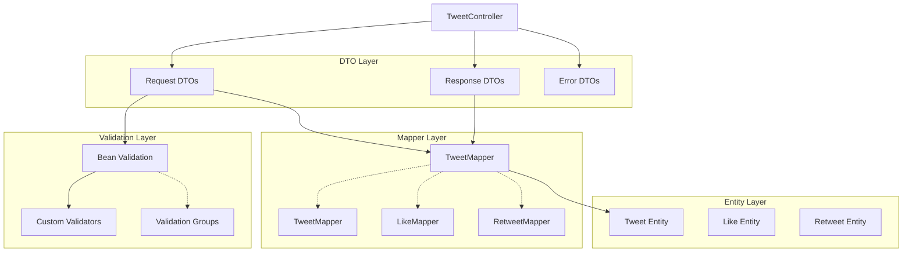
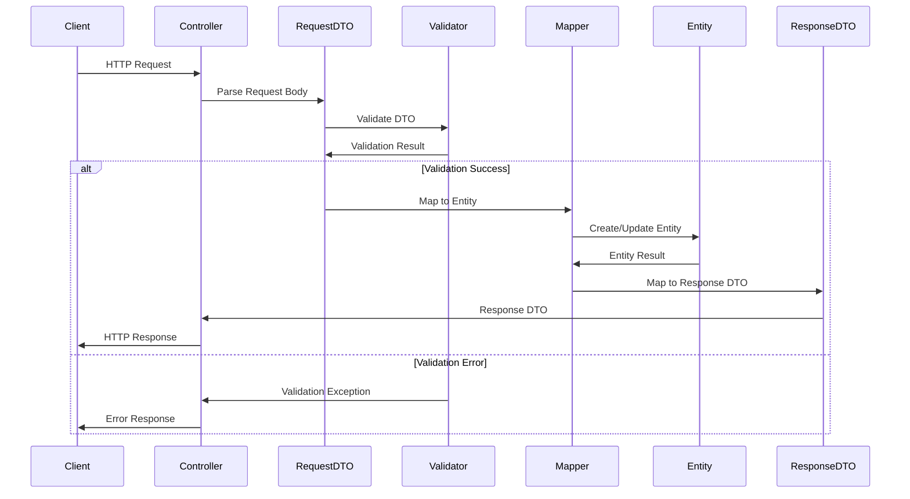

# Проектирование DTO/Mapper Layer для Tweet API

## Meta
- project: twitter-tweet-api
- design_date: 2025-01-27
- designer: AI Assistant
- version: 1.0
- status: completed
- layer: DTO/Mapper

## Executive Summary

Данный документ содержит детальное проектирование DTO/Mapper Layer для сервиса Tweet API. Проектирование основано на API контрактах, архитектурных паттернах users-api и принципах MapStruct для автоматического маппинга.

## 1. Архитектурные принципы DTO/Mapper Layer

### 1.1 Основные принципы

#### Разделение ответственности:
- **DTO (Data Transfer Objects)** - структуры для обмена данными между слоями
- **Mapper** - автоматическое преобразование Entity ↔ DTO через MapStruct
- **Валидация** - Bean Validation аннотации на DTO
- **Документация** - OpenAPI аннотации для Swagger

#### Паттерны из users-api:
```java
@Mapper
public interface TweetMapper {
    
    @Mapping(target = "id", ignore = true)
    @Mapping(target = "createdAt", ignore = true)
    @Mapping(target = "updatedAt", ignore = true)
    @Mapping(target = "isDeleted", ignore = true)
    @Mapping(target = "deletedAt", ignore = true)
    @Mapping(target = "likesCount", ignore = true)
    @Mapping(target = "retweetsCount", ignore = true)
    @Mapping(target = "repliesCount", ignore = true)
    @Mapping(target = "statsUpdatedAt", ignore = true)
    Tweet toTweet(CreateTweetRequestDto requestDto);
    
    TweetResponseDto toTweetResponseDto(Tweet tweet);
    
    @Mapping(target = "id", ignore = true)
    @Mapping(target = "createdAt", ignore = true)
    @Mapping(target = "updatedAt", ignore = true)
    @Mapping(target = "isDeleted", ignore = true)
    @Mapping(target = "deletedAt", ignore = true)
    @Mapping(target = "likesCount", ignore = true)
    @Mapping(target = "retweetsCount", ignore = true)
    @Mapping(target = "repliesCount", ignore = true)
    @Mapping(target = "statsUpdatedAt", ignore = true)
    void updateTweetFromUpdateDto(UpdateTweetRequestDto updateDto, @MappingTarget Tweet tweet);
}
```

### 1.2 Ключевые компоненты

#### DTO структуры:
- **Request DTOs** - для входящих данных (CreateTweetRequestDto, UpdateTweetRequestDto)
- **Response DTOs** - для исходящих данных (TweetResponseDto, LikeResponseDto)
- **Error DTOs** - для обработки ошибок (ErrorResponseDto, ValidationErrorResponseDto)

#### Mapper интерфейсы:
- **TweetMapper** - маппинг твитов
- **LikeMapper** - маппинг лайков
- **RetweetMapper** - маппинг ретвитов

## 2. Проектирование Request DTOs

### 2.1 CreateTweetRequestDto

#### DTO для создания твита:
```java
@Schema(
    name = "CreateTweetRequest",
    description = "Data structure for creating new tweets",
    example = """
        {
          "content": "Hello Twitter! This is my first tweet.",
          "userId": "12345678-1234-1234-1234-123456789abc"
        }
        """
)
public record CreateTweetRequestDto(
    @Schema(
        description = "Tweet content",
        example = "Hello Twitter! This is my first tweet.",
        minLength = 1,
        maxLength = 280,
        requiredMode = Schema.RequiredMode.REQUIRED
    )
    @NotBlank(message = "Tweet content cannot be blank")
    @Size(min = 1, max = 280, message = "Tweet content must be between 1 and 280 characters")
    @Pattern(regexp = "^[\\p{L}\\p{N}\\p{P}\\p{Z}]*$", message = "Tweet content contains invalid characters")
    String content,
    
    @Schema(
        description = "ID of the user creating the tweet",
        example = "12345678-1234-1234-1234-123456789abc",
        format = "uuid",
        requiredMode = Schema.RequiredMode.REQUIRED
    )
    @NotNull(message = "User ID cannot be null")
    @Valid
    UUID userId
) {}
```

### 2.2 UpdateTweetRequestDto

#### DTO для обновления твита:
```java
@Schema(
    name = "UpdateTweetRequest",
    description = "Data structure for updating existing tweets",
    example = """
        {
          "content": "Updated tweet content",
          "userId": "12345678-1234-1234-1234-123456789abc"
        }
        """
)
public record UpdateTweetRequestDto(
    @Schema(
        description = "Updated tweet content",
        example = "Updated tweet content",
        minLength = 1,
        maxLength = 280,
        requiredMode = Schema.RequiredMode.REQUIRED
    )
    @NotBlank(message = "Tweet content cannot be blank")
    @Size(min = 1, max = 280, message = "Tweet content must be between 1 and 280 characters")
    @Pattern(regexp = "^[\\p{L}\\p{N}\\p{P}\\p{Z}]*$", message = "Tweet content contains invalid characters")
    String content,
    
    @Schema(
        description = "ID of the user updating the tweet",
        example = "12345678-1234-1234-1234-123456789abc",
        format = "uuid",
        requiredMode = Schema.RequiredMode.REQUIRED
    )
    @NotNull(message = "User ID cannot be null")
    @Valid
    UUID userId
) {}
```

### 2.3 LikeTweetRequestDto

#### DTO для лайка твита:
```java
@Schema(
    name = "LikeTweetRequest",
    description = "Data structure for liking tweets",
    example = """
        {
          "userId": "12345678-1234-1234-1234-123456789abc"
        }
        """
)
public record LikeTweetRequestDto(
    @Schema(
        description = "ID of the user liking the tweet",
        example = "12345678-1234-1234-1234-123456789abc",
        format = "uuid",
        requiredMode = Schema.RequiredMode.REQUIRED
    )
    @NotNull(message = "User ID cannot be null")
    @Valid
    UUID userId
) {}
```

### 2.4 RetweetRequestDto

#### DTO для ретвита:
```java
@Schema(
    name = "RetweetRequest",
    description = "Data structure for retweeting tweets",
    example = """
        {
          "userId": "12345678-1234-1234-1234-123456789abc",
          "comment": "Great tweet! Adding my thoughts..."
        }
        """
)
public record RetweetRequestDto(
    @Schema(
        description = "ID of the user retweeting",
        example = "12345678-1234-1234-1234-123456789abc",
        format = "uuid",
        requiredMode = Schema.RequiredMode.REQUIRED
    )
    @NotNull(message = "User ID cannot be null")
    @Valid
    UUID userId,
    
    @Schema(
        description = "Optional comment for the retweet",
        example = "Great tweet! Adding my thoughts...",
        maxLength = 280,
        requiredMode = Schema.RequiredMode.NOT_REQUIRED
    )
    @Size(max = 280, message = "Retweet comment must not exceed 280 characters")
    @Pattern(regexp = "^[\\p{L}\\p{N}\\p{P}\\p{Z}]*$", message = "Retweet comment contains invalid characters")
    String comment
) {}
```

## 3. Проектирование Response DTOs

### 3.1 TweetResponseDto

#### DTO для ответа с твитом:
```java
@Schema(
    name = "TweetResponse",
    description = "Tweet information returned by the API",
    example = """
        {
          "id": "12345678-1234-1234-1234-123456789abc",
          "userId": "12345678-1234-1234-1234-123456789abc",
          "content": "Hello Twitter! This is my first tweet.",
          "createdAt": "2025-01-27T10:30:00Z",
          "updatedAt": "2025-01-27T10:30:00Z",
          "isDeleted": false,
          "stats": {
            "likesCount": 42,
            "retweetsCount": 15,
            "repliesCount": 8
          }
        }
        """
)
public record TweetResponseDto(
    @Schema(description = "Unique identifier of the tweet", format = "uuid")
    UUID id,
    
    @Schema(description = "ID of the tweet author", format = "uuid")
    UUID userId,
    
    @Schema(description = "Tweet content")
    String content,
    
    @Schema(description = "Tweet creation timestamp", format = "date-time")
    LocalDateTime createdAt,
    
    @Schema(description = "Tweet last update timestamp", format = "date-time")
    LocalDateTime updatedAt,
    
    @Schema(description = "Soft delete flag")
    boolean isDeleted,
    
    @Schema(description = "Tweet statistics")
    TweetStatsDto stats
) {}
```

### 3.2 TweetStatsDto

#### DTO для статистики твита:
```java
@Schema(
    name = "TweetStats",
    description = "Statistics for a tweet",
    example = """
        {
          "likesCount": 42,
          "retweetsCount": 15,
          "repliesCount": 8
        }
        """
)
public record TweetStatsDto(
    @Schema(description = "Number of likes", example = "42")
    @Min(value = 0, message = "Likes count cannot be negative")
    Integer likesCount,
    
    @Schema(description = "Number of retweets", example = "15")
    @Min(value = 0, message = "Retweets count cannot be negative")
    Integer retweetsCount,
    
    @Schema(description = "Number of replies", example = "8")
    @Min(value = 0, message = "Replies count cannot be negative")
    Integer repliesCount
) {}
```

### 3.3 LikeResponseDto

#### DTO для ответа с лайком:
```java
@Schema(
    name = "LikeResponse",
    description = "Like information returned by the API",
    example = """
        {
          "id": "12345678-1234-1234-1234-123456789abc",
          "tweetId": "12345678-1234-1234-1234-123456789abc",
          "userId": "12345678-1234-1234-1234-123456789abc",
          "createdAt": "2025-01-27T10:30:00Z"
        }
        """
)
public record LikeResponseDto(
    @Schema(description = "Unique identifier of the like", format = "uuid")
    UUID id,
    
    @Schema(description = "ID of the liked tweet", format = "uuid")
    UUID tweetId,
    
    @Schema(description = "ID of the user who liked", format = "uuid")
    UUID userId,
    
    @Schema(description = "Like creation timestamp", format = "date-time")
    LocalDateTime createdAt
) {}
```

### 3.4 RetweetResponseDto

#### DTO для ответа с ретвитом:
```java
@Schema(
    name = "RetweetResponse",
    description = "Retweet information returned by the API",
    example = """
        {
          "id": "12345678-1234-1234-1234-123456789abc",
          "tweetId": "12345678-1234-1234-1234-123456789abc",
          "userId": "12345678-1234-1234-1234-123456789abc",
          "comment": "Great tweet! Adding my thoughts...",
          "createdAt": "2025-01-27T10:30:00Z"
        }
        """
)
public record RetweetResponseDto(
    @Schema(description = "Unique identifier of the retweet", format = "uuid")
    UUID id,
    
    @Schema(description = "ID of the retweeted tweet", format = "uuid")
    UUID tweetId,
    
    @Schema(description = "ID of the user who retweeted", format = "uuid")
    UUID userId,
    
    @Schema(description = "Optional comment for the retweet")
    String comment,
    
    @Schema(description = "Retweet creation timestamp", format = "date-time")
    LocalDateTime createdAt
) {}
```

## 4. Проектирование Error DTOs

### 4.1 ErrorResponseDto

#### Базовый DTO для ошибок:
```java
@Schema(
    name = "ErrorResponse",
    description = "Standard error response structure",
    example = """
        {
          "error": {
            "code": "TWEET_NOT_FOUND",
            "message": "Tweet with id '12345678-1234-1234-1234-123456789abc' not found",
            "details": {
              "field": "tweetId",
              "value": "12345678-1234-1234-1234-123456789abc"
            }
          },
          "meta": {
            "timestamp": "2025-01-27T10:30:00Z",
            "requestId": "req-12345678-1234-1234-1234-123456789abc"
          }
        }
        """
)
public record ErrorResponseDto(
    @Schema(description = "Error information")
    ErrorInfoDto error,
    
    @Schema(description = "Response metadata")
    ResponseMetaDto meta
) {}
```

### 4.2 ErrorInfoDto

#### Информация об ошибке:
```java
@Schema(
    name = "ErrorInfo",
    description = "Detailed error information",
    example = """
        {
          "code": "TWEET_NOT_FOUND",
          "message": "Tweet with id '12345678-1234-1234-1234-123456789abc' not found",
          "details": {
            "field": "tweetId",
            "value": "12345678-1234-1234-1234-123456789abc"
          }
        }
        """
)
public record ErrorInfoDto(
    @Schema(description = "Error code", example = "TWEET_NOT_FOUND")
    String code,
    
    @Schema(description = "Human-readable error message")
    String message,
    
    @Schema(description = "Additional error details")
    Map<String, Object> details
) {}
```

### 4.3 ValidationErrorResponseDto

#### DTO для ошибок валидации:
```java
@Schema(
    name = "ValidationErrorResponse",
    description = "Validation error response structure",
    example = """
        {
          "error": {
            "code": "VALIDATION_ERROR",
            "message": "Validation failed",
            "details": {
              "validationErrors": [
                {
                  "field": "content",
                  "message": "Tweet content cannot be blank",
                  "rejectedValue": ""
                }
              ]
            }
          },
          "meta": {
            "timestamp": "2025-01-27T10:30:00Z",
            "requestId": "req-12345678-1234-1234-1234-123456789abc"
          }
        }
        """
)
public record ValidationErrorResponseDto(
    @Schema(description = "Error information")
    ErrorInfoDto error,
    
    @Schema(description = "Response metadata")
    ResponseMetaDto meta
) {}
```

## 5. Проектирование MapStruct Mappers

### 5.1 TweetMapper

#### Основной маппер для твитов:
```java
@Mapper(componentModel = "spring")
public interface TweetMapper {
    
    // Создание твита из Request DTO
    @Mapping(target = "id", ignore = true)
    @Mapping(target = "createdAt", ignore = true)
    @Mapping(target = "updatedAt", ignore = true)
    @Mapping(target = "isDeleted", ignore = true)
    @Mapping(target = "deletedAt", ignore = true)
    @Mapping(target = "likesCount", ignore = true)
    @Mapping(target = "retweetsCount", ignore = true)
    @Mapping(target = "repliesCount", ignore = true)
    @Mapping(target = "statsUpdatedAt", ignore = true)
    Tweet toTweet(CreateTweetRequestDto requestDto);
    
    // Преобразование Entity в Response DTO
    @Mapping(target = "stats", source = ".", qualifiedByName = "toTweetStats")
    TweetResponseDto toTweetResponseDto(Tweet tweet);
    
    // Обновление твита из Update DTO
    @Mapping(target = "id", ignore = true)
    @Mapping(target = "createdAt", ignore = true)
    @Mapping(target = "updatedAt", ignore = true)
    @Mapping(target = "isDeleted", ignore = true)
    @Mapping(target = "deletedAt", ignore = true)
    @Mapping(target = "likesCount", ignore = true)
    @Mapping(target = "retweetsCount", ignore = true)
    @Mapping(target = "repliesCount", ignore = true)
    @Mapping(target = "statsUpdatedAt", ignore = true)
    void updateTweetFromUpdateDto(UpdateTweetRequestDto updateDto, @MappingTarget Tweet tweet);
    
    // Преобразование статистики
    @Named("toTweetStats")
    default TweetStatsDto toTweetStats(Tweet tweet) {
        return new TweetStatsDto(
            tweet.getLikesCount(),
            tweet.getRetweetsCount(),
            tweet.getRepliesCount()
        );
    }
    
    // Маппинг для списков
    List<TweetResponseDto> toTweetResponseDtoList(List<Tweet> tweets);
    
    // Маппинг для Page
    default Page<TweetResponseDto> toTweetResponseDtoPage(Page<Tweet> tweetPage) {
        return tweetPage.map(this::toTweetResponseDto);
    }
}
```

### 5.2 LikeMapper

#### Маппер для лайков:
```java
@Mapper(componentModel = "spring")
public interface LikeMapper {
    
    // Создание лайка из Request DTO
    @Mapping(target = "id", ignore = true)
    @Mapping(target = "createdAt", ignore = true)
    Like toLike(LikeTweetRequestDto requestDto, UUID tweetId);
    
    // Преобразование Entity в Response DTO
    LikeResponseDto toLikeResponseDto(Like like);
    
    // Маппинг для списков
    List<LikeResponseDto> toLikeResponseDtoList(List<Like> likes);
    
    // Маппинг для Page
    default Page<LikeResponseDto> toLikeResponseDtoPage(Page<Like> likePage) {
        return likePage.map(this::toLikeResponseDto);
    }
    
    // Кастомный маппер для создания лайка
    @Mapping(target = "id", ignore = true)
    @Mapping(target = "tweetId", source = "tweetId")
    @Mapping(target = "userId", source = "requestDto.userId")
    @Mapping(target = "createdAt", ignore = true)
    Like toLikeWithTweetId(LikeTweetRequestDto requestDto, UUID tweetId);
}
```

### 5.3 RetweetMapper

#### Маппер для ретвитов:
```java
@Mapper(componentModel = "spring")
public interface RetweetMapper {
    
    // Создание ретвита из Request DTO
    @Mapping(target = "id", ignore = true)
    @Mapping(target = "createdAt", ignore = true)
    Retweet toRetweet(RetweetRequestDto requestDto, UUID tweetId);
    
    // Преобразование Entity в Response DTO
    RetweetResponseDto toRetweetResponseDto(Retweet retweet);
    
    // Маппинг для списков
    List<RetweetResponseDto> toRetweetResponseDtoList(List<Retweet> retweets);
    
    // Маппинг для Page
    default Page<RetweetResponseDto> toRetweetResponseDtoPage(Page<Retweet> retweetPage) {
        return retweetPage.map(this::toRetweetResponseDto);
    }
    
    // Кастомный маппер для создания ретвита
    @Mapping(target = "id", ignore = true)
    @Mapping(target = "tweetId", source = "tweetId")
    @Mapping(target = "userId", source = "requestDto.userId")
    @Mapping(target = "comment", source = "requestDto.comment")
    @Mapping(target = "createdAt", ignore = true)
    Retweet toRetweetWithTweetId(RetweetRequestDto requestDto, UUID tweetId);
}
```

## 6. Проектирование валидации DTO

### 6.1 Кастомные валидаторы

#### Валидатор существования пользователя:
```java
@Target({ElementType.FIELD})
@Retention(RetentionPolicy.RUNTIME)
@Constraint(validatedBy = UserExistsValidator.class)
public @interface UserExists {
    String message() default "User does not exist";
    Class<?>[] groups() default {};
    Class<? extends Payload>[] payload() default {};
}

@Component
public class UserExistsValidator implements ConstraintValidator<UserExists, UUID> {
    
    private final UsersApiClient usersApiClient;
    
    public UserExistsValidator(UsersApiClient usersApiClient) {
        this.usersApiClient = usersApiClient;
    }
    
    @Override
    public boolean isValid(UUID userId, ConstraintValidatorContext context) {
        if (userId == null) {
            return true; // null проверяется отдельно
        }
        
        try {
            return usersApiClient.getUserById(userId).isPresent();
        } catch (Exception e) {
            // В случае ошибки API считаем валидным (fallback)
            return true;
        }
    }
}
```

#### Валидатор на самолайк/саморетвит:
```java
@Target({ElementType.TYPE})
@Retention(RetentionPolicy.RUNTIME)
@Constraint(validatedBy = NoSelfActionValidator.class)
public @interface NoSelfAction {
    String message() default "User cannot perform action on their own tweet";
    Class<?>[] groups() default {};
    Class<? extends Payload>[] payload() default {};
}

@Component
public class NoSelfActionValidator implements ConstraintValidator<NoSelfAction, Object> {
    
    @Override
    public boolean isValid(Object obj, ConstraintValidatorContext context) {
        if (obj == null) {
            return true;
        }
        
        // Рефлексия для получения userId из разных DTO
        try {
            Method getUserId = obj.getClass().getMethod("getUserId");
            UUID userId = (UUID) getUserId.invoke(obj);
            
            // Для LikeTweetRequestDto и RetweetRequestDto
            if (obj instanceof LikeTweetRequestDto || obj instanceof RetweetRequestDto) {
                // Проверка на самолайк/саморетвит будет в Service Layer
                // так как нужен tweetId из path параметра
                return true;
            }
            
            return true;
        } catch (Exception e) {
            return true; // В случае ошибки считаем валидным
        }
    }
}
```

### 6.2 Группы валидации

#### Группы для разных операций:
```java
public interface ValidationGroups {
    interface Create {}
    interface Update {}
    interface Patch {}
}
```

#### Использование групп в DTO:
```java
public record CreateTweetRequestDto(
    @NotBlank(message = "Tweet content cannot be blank", groups = ValidationGroups.Create.class)
    @Size(min = 1, max = 280, message = "Tweet content must be between 1 and 280 characters", groups = ValidationGroups.Create.class)
    String content,
    
    @NotNull(message = "User ID cannot be null", groups = ValidationGroups.Create.class)
    @UserExists(groups = ValidationGroups.Create.class)
    UUID userId
) {}
```

## 7. Архитектурная диаграмма DTO/Mapper Layer

### 7.1 Диаграмма взаимодействия



### 7.2 Диаграмма потока данных



## 8. Рекомендации по реализации

### 8.1 Структура пакетов

```
com.twitter.dto/
├── request/
│   ├── CreateTweetRequestDto.java
│   ├── UpdateTweetRequestDto.java
│   ├── LikeTweetRequestDto.java
│   └── RetweetRequestDto.java
├── response/
│   ├── TweetResponseDto.java
│   ├── TweetStatsDto.java
│   ├── LikeResponseDto.java
│   └── RetweetResponseDto.java
├── error/
│   ├── ErrorResponseDto.java
│   ├── ErrorInfoDto.java
│   ├── ValidationErrorResponseDto.java
│   └── ResponseMetaDto.java
└── validation/
    ├── ValidationGroups.java
    ├── UserExists.java
    ├── UserExistsValidator.java
    ├── NoSelfAction.java
    └── NoSelfActionValidator.java

com.twitter.mapper/
├── TweetMapper.java
├── LikeMapper.java
└── RetweetMapper.java
```

### 8.2 Зависимости

#### build.gradle:
```gradle
dependencies {
    implementation 'org.springframework.boot:spring-boot-starter-validation'
    implementation 'org.mapstruct:mapstruct'
    implementation 'io.swagger.core.v3:swagger-annotations'
    annotationProcessor 'org.mapstruct:mapstruct-processor'
    annotationProcessor 'org.springframework.boot:spring-boot-configuration-processor'
}
```

### 8.3 Конфигурация MapStruct

#### application.yml:
```yaml
mapstruct:
  default-component-model: spring
  unmapped-target-policy: ignore
  null-value-check-strategy: always
```

## 9. Заключение

### 9.1 Ключевые архитектурные решения

1. **Record-based DTOs** для неизменяемости и краткости кода
2. **MapStruct мапперы** для автоматического преобразования Entity ↔ DTO
3. **Bean Validation** с кастомными валидаторами для бизнес-правил
4. **OpenAPI аннотации** для автоматической документации API
5. **Группы валидации** для разных операций (Create, Update, Patch)
6. **Типизированные Error DTOs** для консистентной обработки ошибок

### 9.2 Готовность к реализации

DTO/Mapper Layer спроектирован с учетом:
- ✅ **API контрактов** из TWEET_API_CONTRACTS.md
- ✅ **Архитектурных паттернов** users-api
- ✅ **MapStruct** лучших практик
- ✅ **Bean Validation** стандартов

### 9.3 Следующие шаги

1. **Реализация Controller Layer** с использованием спроектированных DTO
2. **Создание Service Layer** с бизнес-логикой
3. **Настройка валидации** и обработки ошибок
4. **Интеграция с OpenAPI/Swagger**

---

*Документ создан: 2025-01-27*  
*Версия: 1.0*  
*Статус: Completed*
