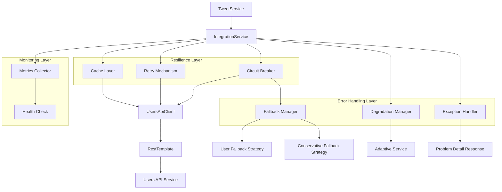
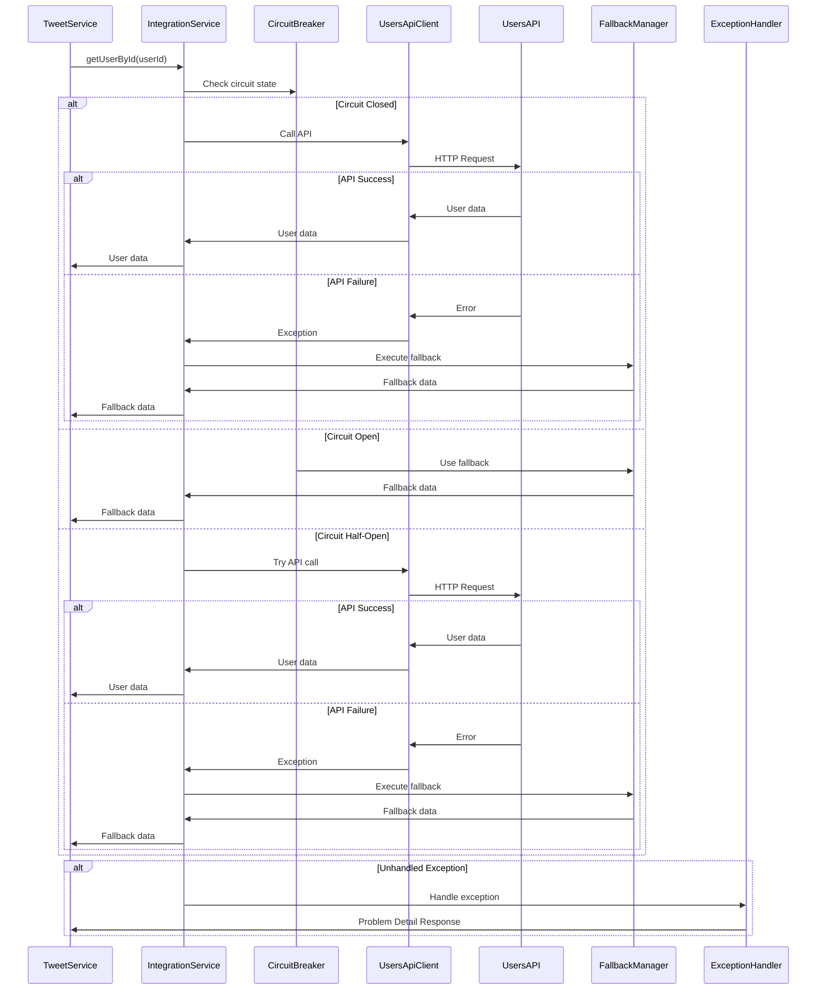

# Проектирование обработки ошибок интеграции для Tweet API

## Meta
- project: twitter-tweet-api
- design_date: 2025-01-27
- designer: AI Assistant
- version: 1.0
- status: completed
- integration: error-handling

## Executive Summary

Данный документ содержит детальное проектирование системы обработки ошибок интеграции с users-api для сервиса Tweet API. Проектирование основано на анализе существующих паттернов обработки ошибок в users-api и shared/common-lib, с учетом принципов отказоустойчивости и graceful degradation.

## 1. Анализ существующих паттернов обработки ошибок

### 1.1 Паттерны из users-api

#### Иерархия исключений:
```
ValidationException (abstract)
├── UniquenessValidationException (409 Conflict)
├── BusinessRuleValidationException (409 Conflict)
└── FormatValidationException (400 Bad Request)
```

#### Стандартные HTTP статусы:
- **400 Bad Request** - Ошибки валидации формата
- **404 Not Found** - Ресурс не найден
- **409 Conflict** - Нарушение уникальности или бизнес-правил
- **500 Internal Server Error** - Неожиданные ошибки сервера

#### Формат ответа (RFC 7807 Problem Details):
```json
{
  "type": "https://example.com/errors/validation-error",
  "title": "Validation Error",
  "status": 400,
  "detail": "Validation failed: email must be a valid email address",
  "timestamp": "2025-01-27T15:30:00Z"
}
```

### 1.2 Паттерны из shared/common-lib

#### GlobalExceptionHandler:
- Централизованная обработка всех исключений
- Стандартизированный формат ответов
- Автоматическое логирование ошибок
- Поддержка ProblemDetail для всех типов ошибок

## 2. Проектирование системы обработки ошибок интеграции

### 2.1 Иерархия исключений интеграции

#### Базовые исключения:
```java
/**
 * Базовое исключение для всех ошибок интеграции с внешними сервисами
 */
public abstract class IntegrationException extends RuntimeException {
    
    private final String serviceName;
    private final String operation;
    private final IntegrationErrorType errorType;
    
    protected IntegrationException(String serviceName, String operation, 
                                 IntegrationErrorType errorType, String message) {
        super(message);
        this.serviceName = serviceName;
        this.operation = operation;
        this.errorType = errorType;
    }
    
    protected IntegrationException(String serviceName, String operation, 
                                 IntegrationErrorType errorType, String message, Throwable cause) {
        super(message, cause);
        this.serviceName = serviceName;
        this.operation = operation;
        this.errorType = errorType;
    }
    
    // Getters...
}

/**
 * Типы ошибок интеграции
 */
public enum IntegrationErrorType {
    CONNECTION_TIMEOUT,      // Таймаут соединения
    SERVICE_UNAVAILABLE,     // Сервис недоступен
    AUTHENTICATION_FAILED,   // Ошибка аутентификации
    AUTHORIZATION_FAILED,    // Ошибка авторизации
    RATE_LIMIT_EXCEEDED,     // Превышен лимит запросов
    INVALID_RESPONSE,        // Некорректный ответ
    CIRCUIT_BREAKER_OPEN,   // Circuit Breaker открыт
    RETRY_EXHAUSTED,        // Исчерпаны попытки повтора
    UNKNOWN_ERROR          // Неизвестная ошибка
}
```

#### Специализированные исключения:
```java
/**
 * Исключение для ошибок интеграции с users-api
 */
public class UsersApiIntegrationException extends IntegrationException {
    
    public UsersApiIntegrationException(String operation, IntegrationErrorType errorType, 
                                       String message) {
        super("users-api", operation, errorType, message);
    }
    
    public UsersApiIntegrationException(String operation, IntegrationErrorType errorType, 
                                       String message, Throwable cause) {
        super("users-api", operation, errorType, message, cause);
    }
    
    // Factory методы для различных типов ошибок
    public static UsersApiIntegrationException connectionTimeout(String operation, Throwable cause) {
        return new UsersApiIntegrationException(
            operation, 
            IntegrationErrorType.CONNECTION_TIMEOUT,
            "Connection timeout to users-api during " + operation,
            cause
        );
    }
    
    public static UsersApiIntegrationException serviceUnavailable(String operation, Throwable cause) {
        return new UsersApiIntegrationException(
            operation, 
            IntegrationErrorType.SERVICE_UNAVAILABLE,
            "Users-api service is unavailable during " + operation,
            cause
        );
    }
    
    public static UsersApiIntegrationException circuitBreakerOpen(String operation) {
        return new UsersApiIntegrationException(
            operation, 
            IntegrationErrorType.CIRCUIT_BREAKER_OPEN,
            "Circuit breaker is open for users-api during " + operation
        );
    }
    
    public static UsersApiIntegrationException retryExhausted(String operation, int attempts) {
        return new UsersApiIntegrationException(
            operation, 
            IntegrationErrorType.RETRY_EXHAUSTED,
            "Retry exhausted after " + attempts + " attempts for " + operation
        );
    }
    
    public static UsersApiIntegrationException invalidResponse(String operation, String details) {
        return new UsersApiIntegrationException(
            operation, 
            IntegrationErrorType.INVALID_RESPONSE,
            "Invalid response from users-api during " + operation + ": " + details
        );
    }
}

/**
 * Исключение для ошибок кэширования
 */
public class CacheIntegrationException extends IntegrationException {
    
    public CacheIntegrationException(String operation, IntegrationErrorType errorType, 
                                    String message) {
        super("cache", operation, errorType, message);
    }
    
    public CacheIntegrationException(String operation, IntegrationErrorType errorType, 
                                    String message, Throwable cause) {
        super("cache", operation, errorType, message, cause);
    }
    
    public static CacheIntegrationException cacheUnavailable(String operation, Throwable cause) {
        return new CacheIntegrationException(
            operation, 
            IntegrationErrorType.SERVICE_UNAVAILABLE,
            "Cache service is unavailable during " + operation,
            cause
        );
    }
}
```

### 2.2 Расширенный GlobalExceptionHandler

#### Обработка исключений интеграции:
```java
@RestControllerAdvice
@Slf4j
public class IntegrationExceptionHandler {
    
    /**
     * Обработка исключений интеграции с users-api
     */
    @ExceptionHandler(UsersApiIntegrationException.class)
    public ProblemDetail handleUsersApiIntegrationException(UsersApiIntegrationException ex) {
        log.error("Users API integration error: {}", ex.getMessage(), ex);
        
        HttpStatus status = determineHttpStatus(ex.getErrorType());
        String detail = buildErrorDetail(ex);
        
        ProblemDetail problemDetail = ProblemDetail.forStatusAndDetail(status, detail);
        problemDetail.setTitle("Users API Integration Error");
        problemDetail.setType(URI.create("https://example.com/errors/users-api-integration"));
        problemDetail.setProperty("timestamp", Instant.now());
        problemDetail.setProperty("service", ex.getServiceName());
        problemDetail.setProperty("operation", ex.getOperation());
        problemDetail.setProperty("errorType", ex.getErrorType().name());
        
        return problemDetail;
    }
    
    /**
     * Обработка исключений кэширования
     */
    @ExceptionHandler(CacheIntegrationException.class)
    public ProblemDetail handleCacheIntegrationException(CacheIntegrationException ex) {
        log.warn("Cache integration error: {}", ex.getMessage(), ex);
        
        // Для ошибок кэша возвращаем 503, но не блокируем основную функциональность
        ProblemDetail problemDetail = ProblemDetail.forStatusAndDetail(
            HttpStatus.SERVICE_UNAVAILABLE, 
            "Cache service temporarily unavailable"
        );
        problemDetail.setTitle("Cache Service Error");
        problemDetail.setType(URI.create("https://example.com/errors/cache-integration"));
        problemDetail.setProperty("timestamp", Instant.now());
        problemDetail.setProperty("service", ex.getServiceName());
        problemDetail.setProperty("operation", ex.getOperation());
        problemDetail.setProperty("errorType", ex.getErrorType().name());
        
        return problemDetail;
    }
    
    /**
     * Обработка Circuit Breaker исключений
     */
    @ExceptionHandler(CallNotPermittedException.class)
    public ProblemDetail handleCircuitBreakerException(CallNotPermittedException ex) {
        log.warn("Circuit breaker is open: {}", ex.getMessage());
        
        ProblemDetail problemDetail = ProblemDetail.forStatusAndDetail(
            HttpStatus.SERVICE_UNAVAILABLE,
            "Service temporarily unavailable due to high error rate"
        );
        problemDetail.setTitle("Service Temporarily Unavailable");
        problemDetail.setType(URI.create("https://example.com/errors/circuit-breaker-open"));
        problemDetail.setProperty("timestamp", Instant.now());
        problemDetail.setProperty("reason", "Circuit breaker is open");
        
        return problemDetail;
    }
    
    /**
     * Обработка таймаутов
     */
    @ExceptionHandler(TimeoutException.class)
    public ProblemDetail handleTimeoutException(TimeoutException ex) {
        log.warn("Request timeout: {}", ex.getMessage());
        
        ProblemDetail problemDetail = ProblemDetail.forStatusAndDetail(
            HttpStatus.REQUEST_TIMEOUT,
            "Request timeout - service is taking too long to respond"
        );
        problemDetail.setTitle("Request Timeout");
        problemDetail.setType(URI.create("https://example.com/errors/timeout"));
        problemDetail.setProperty("timestamp", Instant.now());
        
        return problemDetail;
    }
    
    private HttpStatus determineHttpStatus(IntegrationErrorType errorType) {
        return switch (errorType) {
            case CONNECTION_TIMEOUT, SERVICE_UNAVAILABLE, CIRCUIT_BREAKER_OPEN -> 
                HttpStatus.SERVICE_UNAVAILABLE;
            case AUTHENTICATION_FAILED -> HttpStatus.UNAUTHORIZED;
            case AUTHORIZATION_FAILED -> HttpStatus.FORBIDDEN;
            case RATE_LIMIT_EXCEEDED -> HttpStatus.TOO_MANY_REQUESTS;
            case INVALID_RESPONSE -> HttpStatus.BAD_GATEWAY;
            case RETRY_EXHAUSTED -> HttpStatus.SERVICE_UNAVAILABLE;
            case UNKNOWN_ERROR -> HttpStatus.INTERNAL_SERVER_ERROR;
        };
    }
    
    private String buildErrorDetail(IntegrationException ex) {
        return String.format(
            "Integration error with %s during %s: %s (Error type: %s)",
            ex.getServiceName(),
            ex.getOperation(),
            ex.getMessage(),
            ex.getErrorType()
        );
    }
}
```

## 3. Проектирование Fallback стратегий

### 3.1 Иерархия Fallback стратегий

#### Базовый интерфейс Fallback:
```java
/**
 * Базовый интерфейс для всех fallback стратегий
 */
public interface FallbackStrategy<T, R> {
    
    /**
     * Выполняет fallback операцию
     */
    R execute(T input, Exception originalException);
    
    /**
     * Проверяет, может ли данная стратегия обработать исключение
     */
    boolean canHandle(Exception exception);
    
    /**
     * Возвращает приоритет стратегии (меньше = выше приоритет)
     */
    int getPriority();
    
    /**
     * Возвращает название стратегии
     */
    String getStrategyName();
}

/**
 * Контекст для fallback операций
 */
public class FallbackContext {
    private final String operation;
    private final Map<String, Object> parameters;
    private final Exception originalException;
    private final Instant timestamp;
    
    public FallbackContext(String operation, Map<String, Object> parameters, 
                          Exception originalException) {
        this.operation = operation;
        this.parameters = parameters;
        this.originalException = originalException;
        this.timestamp = Instant.now();
    }
    
    // Getters...
}
```

#### Специализированные Fallback стратегии:
```java
/**
 * Fallback стратегия для получения пользователя
 */
@Component
@Slf4j
public class UserFallbackStrategy implements FallbackStrategy<UUID, Optional<UserResponseDto>> {
    
    @Override
    public Optional<UserResponseDto> execute(UUID userId, Exception originalException) {
        log.warn("Using fallback strategy for user: {}, original error: {}", 
                userId, originalException.getMessage());
        
        // Создаем минимальную информацию о пользователе
        UserResponseDto fallbackUser = UserResponseDto.builder()
            .id(userId)
            .login("unknown_user_" + userId.toString().substring(0, 8))
            .firstName("Unknown")
            .lastName("User")
            .email("unknown@example.com")
            .status(UserStatus.ACTIVE)  // Предполагаем активный статус
            .role(UserRole.USER)        // Предполагаем обычного пользователя
            .createdAt(LocalDateTime.now())
            .build();
            
        return Optional.of(fallbackUser);
    }
    
    @Override
    public boolean canHandle(Exception exception) {
        return exception instanceof UsersApiIntegrationException ||
               exception instanceof CallNotPermittedException ||
               exception instanceof TimeoutException;
    }
    
    @Override
    public int getPriority() {
        return 1; // Высокий приоритет
    }
    
    @Override
    public String getStrategyName() {
        return "UserFallbackStrategy";
    }
}

/**
 * Консервативная Fallback стратегия для критических операций
 */
@Component
@Slf4j
public class ConservativeUserFallbackStrategy implements FallbackStrategy<UUID, Optional<UserResponseDto>> {
    
    @Override
    public Optional<UserResponseDto> execute(UUID userId, Exception originalException) {
        log.warn("Using conservative fallback strategy for user: {}, original error: {}", 
                userId, originalException.getMessage());
        
        // Консервативный подход: возвращаем пустой результат
        return Optional.empty();
    }
    
    @Override
    public boolean canHandle(Exception exception) {
        return exception instanceof UsersApiIntegrationException;
    }
    
    @Override
    public int getPriority() {
        return 2; // Средний приоритет
    }
    
    @Override
    public String getStrategyName() {
        return "ConservativeUserFallbackStrategy";
    }
}

/**
 * Fallback стратегия для проверки существования пользователя
 */
@Component
@Slf4j
public class UserExistsFallbackStrategy implements FallbackStrategy<UUID, Boolean> {
    
    @Override
    public Boolean execute(UUID userId, Exception originalException) {
        log.warn("Using fallback strategy for user existence check: {}, original error: {}", 
                userId, originalException.getMessage());
        
        // Предполагаем, что пользователь существует
        return true;
    }
    
    @Override
    public boolean canHandle(Exception exception) {
        return exception instanceof UsersApiIntegrationException ||
               exception instanceof CallNotPermittedException;
    }
    
    @Override
    public int getPriority() {
        return 1;
    }
    
    @Override
    public String getStrategyName() {
        return "UserExistsFallbackStrategy";
    }
}

/**
 * Fallback стратегия для проверки активности пользователя
 */
@Component
@Slf4j
public class UserActiveFallbackStrategy implements FallbackStrategy<UUID, Boolean> {
    
    @Override
    public Boolean execute(UUID userId, Exception originalException) {
        log.warn("Using fallback strategy for user active check: {}, original error: {}", 
                userId, originalException.getMessage());
        
        // Консервативный подход: предполагаем неактивного пользователя
        return false;
    }
    
    @Override
    public boolean canHandle(Exception exception) {
        return exception instanceof UsersApiIntegrationException ||
               exception instanceof CallNotPermittedException;
    }
    
    @Override
    public int getPriority() {
        return 1;
    }
    
    @Override
    public String getStrategyName() {
        return "UserActiveFallbackStrategy";
    }
}
```

### 3.2 Fallback Manager

#### Централизованное управление Fallback стратегиями:
```java
@Service
@RequiredArgsConstructor
@Slf4j
public class FallbackManager {
    
    private final List<FallbackStrategy<?, ?>> fallbackStrategies;
    
    /**
     * Выполняет fallback операцию с автоматическим выбором стратегии
     */
    @SuppressWarnings("unchecked")
    public <T, R> R executeFallback(T input, Exception exception, Class<R> returnType) {
        log.warn("Executing fallback for input: {}, exception: {}", input, exception.getMessage());
        
        // Находим подходящую стратегию
        FallbackStrategy<T, R> strategy = findSuitableStrategy(input, exception, returnType);
        
        if (strategy == null) {
            log.error("No suitable fallback strategy found for input: {}, exception: {}", 
                    input, exception.getClass().getSimpleName());
            throw new RuntimeException("No fallback strategy available", exception);
        }
        
        log.info("Using fallback strategy: {} for input: {}", 
                strategy.getStrategyName(), input);
        
        try {
            R result = strategy.execute(input, exception);
            log.info("Fallback strategy {} executed successfully", strategy.getStrategyName());
            return result;
        } catch (Exception e) {
            log.error("Fallback strategy {} failed: {}", strategy.getStrategyName(), e.getMessage(), e);
            throw new RuntimeException("Fallback strategy failed", e);
        }
    }
    
    @SuppressWarnings("unchecked")
    private <T, R> FallbackStrategy<T, R> findSuitableStrategy(T input, Exception exception, 
                                                               Class<R> returnType) {
        return (FallbackStrategy<T, R>) fallbackStrategies.stream()
            .filter(strategy -> strategy.canHandle(exception))
            .filter(strategy -> isCompatibleType(strategy, returnType))
            .min(Comparator.comparingInt(FallbackStrategy::getPriority))
            .orElse(null);
    }
    
    private boolean isCompatibleType(FallbackStrategy<?, ?> strategy, Class<?> returnType) {
        // Упрощенная проверка совместимости типов
        // В реальной реализации можно использовать более сложную логику
        return true;
    }
    
    /**
     * Получает список доступных стратегий для исключения
     */
    public List<String> getAvailableStrategies(Exception exception) {
        return fallbackStrategies.stream()
            .filter(strategy -> strategy.canHandle(exception))
            .map(FallbackStrategy::getStrategyName)
            .collect(Collectors.toList());
    }
}
```

## 4. Проектирование Graceful Degradation

### 4.1 Система деградации функциональности

#### Уровни деградации:
```java
/**
 * Уровни деградации функциональности
 */
public enum DegradationLevel {
    NONE,           // Полная функциональность
    MINIMAL,        // Минимальная деградация
    MODERATE,       // Умеренная деградация
    SEVERE,         // Серьезная деградация
    CRITICAL        // Критическая деградация
}

/**
 * Контекст деградации
 */
public class DegradationContext {
    private final DegradationLevel level;
    private final String reason;
    private final Instant timestamp;
    private final Map<String, Object> metadata;
    
    public DegradationContext(DegradationLevel level, String reason) {
        this.level = level;
        this.reason = reason;
        this.timestamp = Instant.now();
        this.metadata = new HashMap<>();
    }
    
    // Getters and setters...
}
```

#### Менеджер деградации:
```java
@Service
@RequiredArgsConstructor
@Slf4j
public class DegradationManager {
    
    private final CircuitBreaker circuitBreaker;
    private final UsersApiMetrics metrics;
    
    private volatile DegradationContext currentContext = 
        new DegradationContext(DegradationLevel.NONE, "System operating normally");
    
    /**
     * Оценивает текущий уровень деградации
     */
    public DegradationLevel assessDegradationLevel() {
        CircuitBreaker.State state = circuitBreaker.getState();
        
        switch (state) {
            case CLOSED:
                return DegradationLevel.NONE;
            case HALF_OPEN:
                return DegradationLevel.MINIMAL;
            case OPEN:
                return assessOpenStateDegradation();
            default:
                return DegradationLevel.CRITICAL;
        }
    }
    
    private DegradationLevel assessOpenStateDegradation() {
        // Анализируем метрики для определения уровня деградации
        double failureRate = metrics.getFailureRate();
        long openDuration = metrics.getOpenDuration();
        
        if (failureRate > 0.8 || openDuration > Duration.ofMinutes(10).toMillis()) {
            return DegradationLevel.CRITICAL;
        } else if (failureRate > 0.6 || openDuration > Duration.ofMinutes(5).toMillis()) {
            return DegradationLevel.SEVERE;
        } else {
            return DegradationLevel.MODERATE;
        }
    }
    
    /**
     * Обновляет контекст деградации
     */
    public void updateDegradationContext(DegradationLevel level, String reason) {
        DegradationContext oldContext = this.currentContext;
        this.currentContext = new DegradationContext(level, reason);
        
        log.info("Degradation level changed from {} to {}: {}", 
                oldContext.getLevel(), level, reason);
        
        // Уведомляем о изменении уровня деградации
        notifyDegradationChange(oldContext, this.currentContext);
    }
    
    /**
     * Проверяет, разрешена ли операция при текущем уровне деградации
     */
    public boolean isOperationAllowed(String operation, DegradationLevel requiredLevel) {
        DegradationLevel currentLevel = assessDegradationLevel();
        return currentLevel.ordinal() <= requiredLevel.ordinal();
    }
    
    private void notifyDegradationChange(DegradationContext oldContext, DegradationContext newContext) {
        // Здесь можно добавить уведомления (email, Slack, etc.)
        log.warn("System degradation level changed: {} -> {} (Reason: {})", 
                oldContext.getLevel(), newContext.getLevel(), newContext.getReason());
    }
    
    public DegradationContext getCurrentContext() {
        return currentContext;
    }
}
```

### 4.2 Адаптивные стратегии

#### Адаптивный сервис интеграции:
```java
@Service
@RequiredArgsConstructor
@Slf4j
public class AdaptiveUsersApiService {
    
    private final UsersApiClient primaryClient;
    private final FallbackManager fallbackManager;
    private final DegradationManager degradationManager;
    private final CircuitBreaker circuitBreaker;
    
    /**
     * Адаптивное получение пользователя
     */
    public Optional<UserResponseDto> getUserById(UUID userId) {
        DegradationLevel currentLevel = degradationManager.assessDegradationLevel();
        
        switch (currentLevel) {
            case NONE:
                return executeWithFullFunctionality(userId);
            case MINIMAL:
                return executeWithMinimalDegradation(userId);
            case MODERATE:
                return executeWithModerateDegradation(userId);
            case SEVERE:
                return executeWithSevereDegradation(userId);
            case CRITICAL:
                return executeWithCriticalDegradation(userId);
            default:
                return executeWithCriticalDegradation(userId);
        }
    }
    
    private Optional<UserResponseDto> executeWithFullFunctionality(UUID userId) {
        try {
            return primaryClient.getUserById(userId);
        } catch (Exception e) {
            log.warn("Primary client failed in full functionality mode: {}", e.getMessage());
            return fallbackManager.executeFallback(userId, e, Optional.class);
        }
    }
    
    private Optional<UserResponseDto> executeWithMinimalDegradation(UUID userId) {
        try {
            // Пробуем основной клиент с коротким таймаутом
            return primaryClient.getUserById(userId);
        } catch (Exception e) {
            log.warn("Primary client failed in minimal degradation mode: {}", e.getMessage());
            return fallbackManager.executeFallback(userId, e, Optional.class);
        }
    }
    
    private Optional<UserResponseDto> executeWithModerateDegradation(UUID userId) {
        // При умеренной деградации сразу используем fallback
        log.info("Using fallback due to moderate degradation for user: {}", userId);
        return fallbackManager.executeFallback(userId, 
            new UsersApiIntegrationException("getUserById", IntegrationErrorType.SERVICE_UNAVAILABLE, 
                "Service degraded"), Optional.class);
    }
    
    private Optional<UserResponseDto> executeWithSevereDegradation(UUID userId) {
        // При серьезной деградации используем консервативный fallback
        log.warn("Using conservative fallback due to severe degradation for user: {}", userId);
        return Optional.empty();
    }
    
    private Optional<UserResponseDto> executeWithCriticalDegradation(UUID userId) {
        // При критической деградации возвращаем минимальную информацию
        log.error("Using minimal fallback due to critical degradation for user: {}", userId);
        return Optional.of(createMinimalUser(userId));
    }
    
    private UserResponseDto createMinimalUser(UUID userId) {
        return UserResponseDto.builder()
            .id(userId)
            .login("degraded_user")
            .firstName("System")
            .lastName("Degraded")
            .email("degraded@system.local")
            .status(UserStatus.ACTIVE)
            .role(UserRole.USER)
            .createdAt(LocalDateTime.now())
            .build();
    }
}
```

## 5. Проектирование кэширования данных пользователей

### 5.1 Стратегии кэширования

#### Многоуровневое кэширование:
```java
@Service
@RequiredArgsConstructor
@Slf4j
public class MultiLevelUserCacheService {
    
    private final CacheManager cacheManager;
    private final UsersApiClient usersApiClient;
    private final FallbackManager fallbackManager;
    
    // L1 Cache - быстрый кэш в памяти
    private final Cache<String, UserResponseDto> l1Cache;
    
    // L2 Cache - более медленный, но больший кэш
    private final Cache<String, UserResponseDto> l2Cache;
    
    public MultiLevelUserCacheService() {
        this.l1Cache = Caffeine.newBuilder()
            .maximumSize(100)
            .expireAfterWrite(Duration.ofMinutes(1))
            .build();
            
        this.l2Cache = Caffeine.newBuilder()
            .maximumSize(1000)
            .expireAfterWrite(Duration.ofMinutes(10))
            .build();
    }
    
    /**
     * Получение пользователя с многоуровневым кэшированием
     */
    public Optional<UserResponseDto> getUserById(UUID userId) {
        String cacheKey = userId.toString();
        
        // L1 Cache
        UserResponseDto user = l1Cache.getIfPresent(cacheKey);
        if (user != null) {
            log.debug("L1 cache hit for user: {}", userId);
            return Optional.of(user);
        }
        
        // L2 Cache
        user = l2Cache.getIfPresent(cacheKey);
        if (user != null) {
            log.debug("L2 cache hit for user: {}", userId);
            l1Cache.put(cacheKey, user); // Поднимаем в L1
            return Optional.of(user);
        }
        
        // Cache miss - обращаемся к API
        log.debug("Cache miss for user: {}, fetching from API", userId);
        try {
            Optional<UserResponseDto> apiUser = usersApiClient.getUserById(userId);
            if (apiUser.isPresent()) {
                UserResponseDto userDto = apiUser.get();
                l1Cache.put(cacheKey, userDto);
                l2Cache.put(cacheKey, userDto);
                return apiUser;
            }
        } catch (Exception e) {
            log.warn("API call failed for user: {}, using fallback", userId);
            return fallbackManager.executeFallback(userId, e, Optional.class);
        }
        
        return Optional.empty();
    }
    
    /**
     * Инвалидация кэша для пользователя
     */
    public void invalidateUserCache(UUID userId) {
        String cacheKey = userId.toString();
        l1Cache.invalidate(cacheKey);
        l2Cache.invalidate(cacheKey);
        log.info("Cache invalidated for user: {}", userId);
    }
    
    /**
     * Очистка всего кэша
     */
    public void clearAllCache() {
        l1Cache.invalidateAll();
        l2Cache.invalidateAll();
        log.info("All user cache cleared");
    }
    
    /**
     * Получение статистики кэша
     */
    public CacheStats getCacheStats() {
        return CacheStats.builder()
            .l1HitRate(l1Cache.stats().hitRate())
            .l2HitRate(l2Cache.stats().hitRate())
            .l1Size(l1Cache.estimatedSize())
            .l2Size(l2Cache.estimatedSize())
            .build();
    }
    
    @Data
    @Builder
    public static class CacheStats {
        private final double l1HitRate;
        private final double l2HitRate;
        private final long l1Size;
        private final long l2Size;
    }
}
```

### 5.2 Кэширование с TTL и инвалидацией

#### Умное кэширование:
```java
@Service
@RequiredArgsConstructor
@Slf4j
public class SmartUserCacheService {
    
    private final Cache<String, CachedUserData> userCache;
    private final UsersApiClient usersApiClient;
    
    public SmartUserCacheService() {
        this.userCache = Caffeine.newBuilder()
            .maximumSize(1000)
            .expireAfterWrite(Duration.ofMinutes(5))
            .expireAfterAccess(Duration.ofMinutes(2))
            .removalListener(this::onCacheRemoval)
            .build();
    }
    
    /**
     * Получение пользователя с умным кэшированием
     */
    public Optional<UserResponseDto> getUserById(UUID userId) {
        String cacheKey = userId.toString();
        
        CachedUserData cachedData = userCache.getIfPresent(cacheKey);
        if (cachedData != null && !cachedData.isExpired()) {
            log.debug("Cache hit for user: {}", userId);
            return Optional.of(cachedData.getUser());
        }
        
        // Cache miss или expired
        log.debug("Cache miss/expired for user: {}, fetching from API", userId);
        try {
            Optional<UserResponseDto> apiUser = usersApiClient.getUserById(userId);
            if (apiUser.isPresent()) {
                UserResponseDto user = apiUser.get();
                
                // Определяем TTL на основе типа пользователя
                Duration ttl = determineTTL(user);
                
                CachedUserData newCachedData = CachedUserData.builder()
                    .user(user)
                    .cachedAt(Instant.now())
                    .ttl(ttl)
                    .build();
                    
                userCache.put(cacheKey, newCachedData);
                return Optional.of(user);
            }
        } catch (Exception e) {
            log.warn("API call failed for user: {}, checking for stale cache", userId);
            
            // Если есть устаревшие данные, используем их
            if (cachedData != null && cachedData.isStale()) {
                log.warn("Using stale cache data for user: {}", userId);
                return Optional.of(cachedData.getUser());
            }
            
            throw new UsersApiIntegrationException("getUserById", 
                IntegrationErrorType.SERVICE_UNAVAILABLE, 
                "API unavailable and no stale cache", e);
        }
        
        return Optional.empty();
    }
    
    private Duration determineTTL(UserResponseDto user) {
        // Администраторы кэшируются дольше
        if (user.role() == UserRole.ADMIN) {
            return Duration.ofMinutes(15);
        }
        
        // Активные пользователи кэшируются стандартно
        if (user.status() == UserStatus.ACTIVE) {
            return Duration.ofMinutes(5);
        }
        
        // Неактивные пользователи кэшируются короче
        return Duration.ofMinutes(2);
    }
    
    private void onCacheRemoval(String key, CachedUserData value, RemovalCause cause) {
        log.debug("Cache removal: key={}, cause={}", key, cause);
        
        // Можно добавить логику для отправки данных в L2 кэш или persistent storage
        if (cause == RemovalCause.SIZE) {
            log.info("Cache eviction due to size limit for user: {}", key);
        }
    }
    
    @Data
    @Builder
    private static class CachedUserData {
        private final UserResponseDto user;
        private final Instant cachedAt;
        private final Duration ttl;
        
        public boolean isExpired() {
            return Instant.now().isAfter(cachedAt.plus(ttl));
        }
        
        public boolean isStale() {
            // Данные считаются устаревшими через 2x TTL
            return Instant.now().isAfter(cachedAt.plus(ttl.multipliedBy(2)));
        }
    }
}
```

## 6. Проектирование мониторинга интеграции

### 6.1 Расширенные метрики интеграции

#### Детальные метрики:
```java
@Component
@RequiredArgsConstructor
@Slf4j
public class AdvancedUsersApiMetrics {
    
    private final MeterRegistry meterRegistry;
    
    // Основные счетчики
    private final Counter successCounter;
    private final Counter failureCounter;
    private final Counter fallbackCounter;
    private final Counter circuitBreakerOpenCounter;
    
    // Таймеры
    private final Timer responseTimer;
    private final Timer fallbackTimer;
    
    // Гауги
    private final Gauge circuitBreakerStateGauge;
    private final Gauge cacheHitRateGauge;
    private final Gauge degradationLevelGauge;
    
    // Гистограммы
    private final DistributionSummary responseSizeSummary;
    private final DistributionSummary errorRateSummary;
    
    public AdvancedUsersApiMetrics(MeterRegistry meterRegistry) {
        this.meterRegistry = meterRegistry;
        
        // Инициализация счетчиков
        this.successCounter = Counter.builder("users.api.calls.success")
            .description("Number of successful calls to users API")
            .tag("service", "users-api")
            .register(meterRegistry);
            
        this.failureCounter = Counter.builder("users.api.calls.failure")
            .description("Number of failed calls to users API")
            .tag("service", "users-api")
            .register(meterRegistry);
            
        this.fallbackCounter = Counter.builder("users.api.fallback.executed")
            .description("Number of fallback executions")
            .tag("service", "users-api")
            .register(meterRegistry);
            
        this.circuitBreakerOpenCounter = Counter.builder("users.api.circuit.breaker.open")
            .description("Number of circuit breaker open events")
            .tag("service", "users-api")
            .register(meterRegistry);
        
        // Инициализация таймеров
        this.responseTimer = Timer.builder("users.api.response.time")
            .description("Response time for users API calls")
            .tag("service", "users-api")
            .register(meterRegistry);
            
        this.fallbackTimer = Timer.builder("users.api.fallback.time")
            .description("Time taken by fallback operations")
            .tag("service", "users-api")
            .register(meterRegistry);
        
        // Инициализация гаугов
        this.circuitBreakerStateGauge = Gauge.builder("users.api.circuit.breaker.state")
            .description("Current state of circuit breaker")
            .tag("service", "users-api")
            .register(meterRegistry, this, AdvancedUsersApiMetrics::getCircuitBreakerState);
            
        this.cacheHitRateGauge = Gauge.builder("users.api.cache.hit.rate")
            .description("Cache hit rate")
            .tag("service", "users-api")
            .register(meterRegistry, this, AdvancedUsersApiMetrics::getCacheHitRate);
            
        this.degradationLevelGauge = Gauge.builder("users.api.degradation.level")
            .description("Current degradation level")
            .tag("service", "users-api")
            .register(meterRegistry, this, AdvancedUsersApiMetrics::getDegradationLevel);
        
        // Инициализация гистограмм
        this.responseSizeSummary = DistributionSummary.builder("users.api.response.size")
            .description("Size of API responses")
            .tag("service", "users-api")
            .register(meterRegistry);
            
        this.errorRateSummary = DistributionSummary.builder("users.api.error.rate")
            .description("Error rate over time")
            .tag("service", "users-api")
            .register(meterRegistry);
    }
    
    // Методы для записи метрик
    public void recordSuccess() {
        successCounter.increment();
    }
    
    public void recordFailure(String errorType) {
        failureCounter.increment(Tags.of("error_type", errorType));
    }
    
    public void recordFallback(String strategy) {
        fallbackCounter.increment(Tags.of("strategy", strategy));
    }
    
    public void recordCircuitBreakerOpen() {
        circuitBreakerOpenCounter.increment();
    }
    
    public Timer.Sample startResponseTimer() {
        return Timer.start(meterRegistry);
    }
    
    public void recordResponseTime(Timer.Sample sample) {
        sample.stop(responseTimer);
    }
    
    public Timer.Sample startFallbackTimer() {
        return Timer.start(meterRegistry);
    }
    
    public void recordFallbackTime(Timer.Sample sample) {
        sample.stop(fallbackTimer);
    }
    
    public void recordResponseSize(int size) {
        responseSizeSummary.record(size);
    }
    
    public void recordErrorRate(double rate) {
        errorRateSummary.record(rate);
    }
    
    // Методы для гаугов
    private double getCircuitBreakerState() {
        // Возвращает числовое представление состояния Circuit Breaker
        // 0 = CLOSED, 1 = HALF_OPEN, 2 = OPEN
        return 0.0; // Заглушка, должна быть реализована
    }
    
    private double getCacheHitRate() {
        // Возвращает процент попаданий в кэш
        return 0.0; // Заглушка, должна быть реализована
    }
    
    private double getDegradationLevel() {
        // Возвращает числовое представление уровня деградации
        // 0 = NONE, 1 = MINIMAL, 2 = MODERATE, 3 = SEVERE, 4 = CRITICAL
        return 0.0; // Заглушка, должна быть реализована
    }
}
```

### 6.2 Health Check с детальной диагностикой

#### Расширенный Health Indicator:
```java
@Component
@RequiredArgsConstructor
@Slf4j
public class DetailedUsersApiHealthIndicator implements HealthIndicator {
    
    private final UsersApiClient usersApiClient;
    private final CircuitBreaker circuitBreaker;
    private final AdvancedUsersApiMetrics metrics;
    private final DegradationManager degradationManager;
    private final SmartUserCacheService cacheService;
    
    @Override
    public Health health() {
        Health.Builder builder = Health.up();
        
        try {
            // Проверяем состояние Circuit Breaker
            CircuitBreaker.State state = circuitBreaker.getState();
            builder.withDetail("circuitBreaker.state", state.name());
            builder.withDetail("circuitBreaker.failureRate", circuitBreaker.getMetrics().getFailureRate());
            
            // Проверяем уровень деградации
            DegradationLevel degradationLevel = degradationManager.assessDegradationLevel();
            builder.withDetail("degradation.level", degradationLevel.name());
            
            // Проверяем кэш
            SmartUserCacheService.CacheStats cacheStats = cacheService.getCacheStats();
            builder.withDetail("cache.l1HitRate", cacheStats.getL1HitRate());
            builder.withDetail("cache.l2HitRate", cacheStats.getL2HitRate());
            builder.withDetail("cache.l1Size", cacheStats.getL1Size());
            builder.withDetail("cache.l2Size", cacheStats.getL2Size());
            
            // Пробуем простой вызов API
            long startTime = System.currentTimeMillis();
            boolean apiAvailable = usersApiClient.existsUser(UUID.randomUUID());
            long responseTime = System.currentTimeMillis() - startTime;
            
            builder.withDetail("api.available", apiAvailable);
            builder.withDetail("api.responseTime", responseTime + "ms");
            
            // Определяем общее состояние здоровья
            HealthStatus overallStatus = determineOverallHealth(state, degradationLevel, responseTime);
            
            if (overallStatus == HealthStatus.DOWN) {
                builder.down();
            } else if (overallStatus == HealthStatus.DEGRADED) {
                builder.status("DEGRADED");
            }
            
            return builder.build();
            
        } catch (Exception e) {
            log.error("Health check failed: {}", e.getMessage(), e);
            return Health.down()
                .withDetail("error", e.getMessage())
                .withDetail("circuitBreaker", circuitBreaker.getState().name())
                .withDetail("degradation", degradationManager.getCurrentContext().getLevel().name())
                .build();
        }
    }
    
    private HealthStatus determineOverallHealth(CircuitBreaker.State state, 
                                               DegradationLevel degradationLevel, 
                                               long responseTime) {
        // Критерии для определения состояния здоровья
        if (state == CircuitBreaker.State.OPEN || degradationLevel == DegradationLevel.CRITICAL) {
            return HealthStatus.DOWN;
        }
        
        if (state == CircuitBreaker.State.HALF_OPEN || 
            degradationLevel == DegradationLevel.SEVERE ||
            responseTime > 5000) { // 5 секунд
            return HealthStatus.DEGRADED;
        }
        
        if (degradationLevel == DegradationLevel.MODERATE || responseTime > 2000) { // 2 секунды
            return HealthStatus.DEGRADED;
        }
        
        return HealthStatus.UP;
    }
    
    private enum HealthStatus {
        UP, DEGRADED, DOWN
    }
}
```

## 7. Архитектурные диаграммы

### 7.1 Диаграмма обработки ошибок интеграции



### 7.2 Диаграмма потока обработки ошибок



## 8. Рекомендации по реализации

### 8.1 Структура пакетов

```
com.twitter.integration/
├── exception/
│   ├── IntegrationException.java
│   ├── UsersApiIntegrationException.java
│   └── CacheIntegrationException.java
├── fallback/
│   ├── FallbackStrategy.java
│   ├── FallbackManager.java
│   ├── UserFallbackStrategy.java
│   ├── ConservativeUserFallbackStrategy.java
│   └── UserExistsFallbackStrategy.java
├── degradation/
│   ├── DegradationLevel.java
│   ├── DegradationContext.java
│   ├── DegradationManager.java
│   └── AdaptiveUsersApiService.java
├── cache/
│   ├── MultiLevelUserCacheService.java
│   ├── SmartUserCacheService.java
│   └── CachedUserData.java
├── metrics/
│   ├── AdvancedUsersApiMetrics.java
│   └── DetailedUsersApiHealthIndicator.java
└── handler/
    └── IntegrationExceptionHandler.java
```

### 8.2 Конфигурация

#### application.yml:
```yaml
# Resilience4j конфигурация
resilience4j:
  circuitbreaker:
    instances:
      users-api:
        failure-rate-threshold: 50
        wait-duration-in-open-state: 30s
        sliding-window-size: 10
        minimum-number-of-calls: 5
        permitted-number-of-calls-in-half-open-state: 3
        automatic-transition-from-open-to-half-open-enabled: true
        record-exceptions:
          - com.twitter.integration.exception.UsersApiIntegrationException
        ignore-exceptions:
          - org.springframework.web.client.HttpClientErrorException$NotFound
  retry:
    instances:
      users-api:
        max-attempts: 3
        wait-duration: 1s
        retry-exceptions:
          - com.twitter.integration.exception.UsersApiIntegrationException
        ignore-exceptions:
          - org.springframework.web.client.HttpClientErrorException$NotFound
  timelimiter:
    instances:
      users-api:
        timeout-duration: 5s

# Кэширование
spring:
  cache:
    type: caffeine
    caffeine:
      spec: maximumSize=1000,expireAfterWrite=5m,expireAfterAccess=2m

# Мониторинг
management:
  endpoints:
    web:
      exposure:
        include: health,info,metrics,prometheus
  endpoint:
    health:
      show-details: always
  metrics:
    export:
      prometheus:
        enabled: true

# Пользовательские настройки
users-api:
  base-url: http://localhost:8081
  timeout: 5000
  retry-attempts: 3
  cache:
    l1-size: 100
    l2-size: 1000
    l1-ttl: 1m
    l2-ttl: 10m
  fallback:
    enabled: true
    strategies:
      - user-fallback
      - conservative-fallback
  degradation:
    enabled: true
    thresholds:
      moderate: 0.3
      severe: 0.6
      critical: 0.8
```

## 9. Заключение

### 9.1 Ключевые архитектурные решения

1. **Иерархия исключений интеграции** с типизированными ошибками
2. **Многоуровневые Fallback стратегии** с приоритизацией
3. **Graceful Degradation** с адаптивными уровнями деградации
4. **Умное кэширование** с TTL и инвалидацией
5. **Расширенный мониторинг** с детальными метриками
6. **Централизованная обработка ошибок** через GlobalExceptionHandler

### 9.2 Готовность к реализации

Система обработки ошибок интеграции спроектирована с учетом:
- ✅ **Отказоустойчивости** через Circuit Breaker и Fallback стратегии
- ✅ **Graceful Degradation** через адаптивные уровни деградации
- ✅ **Производительности** через многоуровневое кэширование
- ✅ **Мониторинга** через расширенные метрики и health checks
- ✅ **Масштабируемости** через адаптивные стратегии

### 9.3 Следующие шаги

1. **Реализация системы исключений** интеграции
2. **Настройка Fallback стратегий** и Degradation Manager
3. **Конфигурация кэширования** и мониторинга
4. **Тестирование** обработки ошибок и fallback механизмов

---

*Документ создан: 2025-01-27*  
*Версия: 1.0*  
*Статус: Completed*
