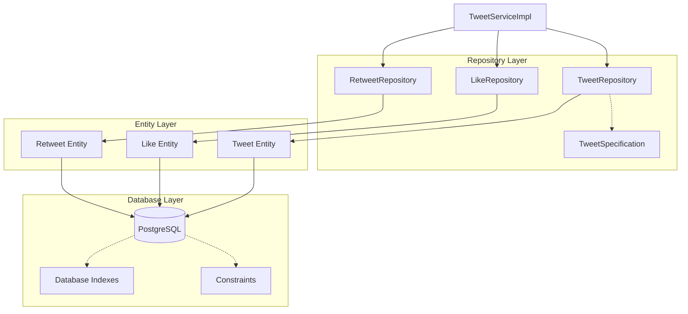
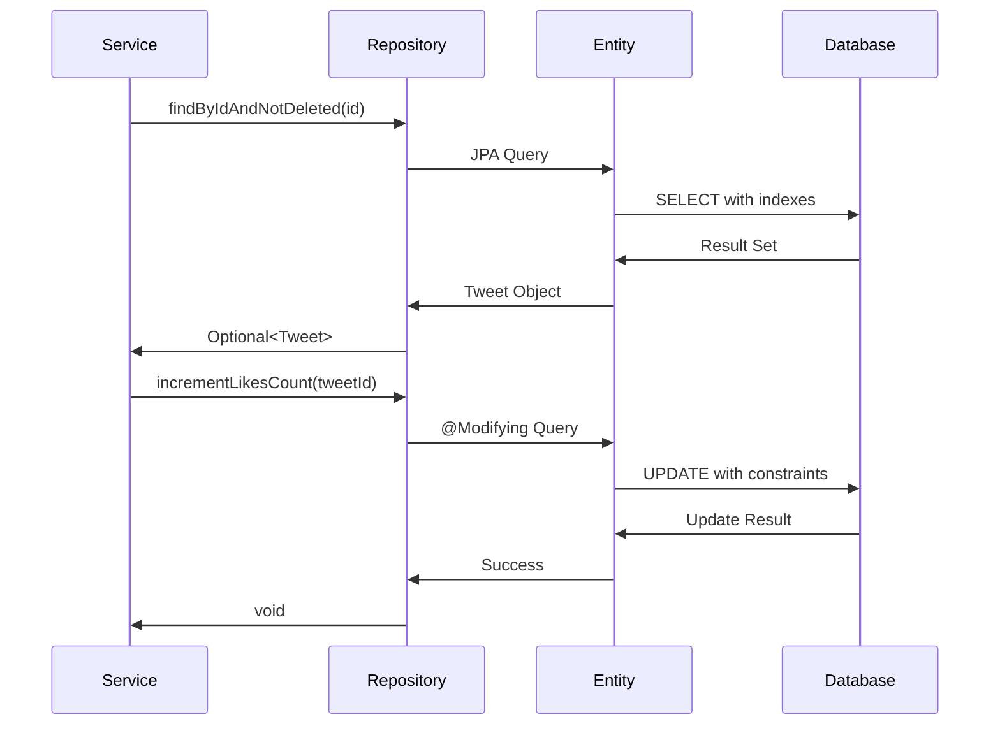

# Проектирование Repository Layer для Tweet API

## Meta
- project: twitter-tweet-api
- design_date: 2025-01-27
- designer: AI Assistant
- version: 1.0
- status: completed
- layer: Repository

## Executive Summary

Данный документ содержит детальное проектирование Repository Layer для сервиса Tweet API. Проектирование основано на SQL модели данных, архитектурных паттернах users-api и принципах Spring Data JPA.

## 1. Архитектурные принципы Repository Layer

### 1.1 Основные принципы

#### Слоистая архитектура:
- **Service** → **Repository** → **Entity** → **Database**
- **Абстракция доступа к данным** через Repository интерфейсы
- **Spring Data JPA** для автоматической реализации
- **Кастомные запросы** для сложной бизнес-логики

#### Паттерны из users-api:
```java
public interface TweetRepository extends JpaRepository<Tweet, UUID>, JpaSpecificationExecutor<Tweet> {
    
    // Автоматические методы Spring Data JPA
    Optional<Tweet> findByIdAndStatusNot(UUID id, TweetStatus status);
    
    // Кастомные методы с @Query
    @Query("SELECT t FROM Tweet t WHERE t.userId = :userId AND t.status != :status ORDER BY t.createdAt DESC")
    Page<Tweet> findByUserIdAndStatusNotOrderByCreatedAtDesc(@Param("userId") UUID userId, @Param("status") TweetStatus status, Pageable pageable);
    
    // Методы для статистики
    @Modifying
    @Query("UPDATE Tweet t SET t.likesCount = t.likesCount + 1 WHERE t.id = :tweetId")
    void incrementLikesCount(@Param("tweetId") UUID tweetId);
}
```

### 1.2 Ключевые компоненты

#### Repository интерфейсы:
- **TweetRepository** - основные операции с твитами
- **LikeRepository** - операции с лайками
- **RetweetRepository** - операции с ретвитами
- **JpaSpecificationExecutor** - для динамических запросов

## 2. Проектирование JPA Entities

### 2.1 Tweet Entity

#### Основная сущность твита:
```java
@Entity
@Table(name = "tweets", indexes = {
    @Index(name = "idx_tweets_user_id_created_at", columnList = "user_id, created_at DESC"),
    @Index(name = "idx_tweets_created_at", columnList = "created_at DESC"),
    @Index(name = "idx_tweets_status", columnList = "is_deleted"),
    @Index(name = "idx_tweets_stats", columnList = "likes_count DESC, retweets_count DESC")
})
@Data
@Accessors(chain = true)
@NoArgsConstructor
@AllArgsConstructor
@Builder
public class Tweet {
    
    @Id
    @GeneratedValue(generator = "UUID")
    @GenericGenerator(name = "UUID", strategy = "org.hibernate.id.UUIDGenerator")
    @Column(name = "id", updatable = false, nullable = false)
    private UUID id;
    
    @Column(name = "user_id", nullable = false)
    private UUID userId;
    
    @Column(name = "content", nullable = false, length = 280)
    @Size(max = 280, message = "Tweet content must not exceed 280 characters")
    @NotBlank(message = "Tweet content cannot be blank")
    private String content;
    
    @CreationTimestamp
    @Column(name = "created_at", nullable = false, updatable = false)
    private LocalDateTime createdAt;
    
    @UpdateTimestamp
    @Column(name = "updated_at", nullable = false)
    private LocalDateTime updatedAt;
    
    @Column(name = "is_deleted", nullable = false)
    @Builder.Default
    private Boolean isDeleted = false;
    
    @Column(name = "deleted_at")
    private LocalDateTime deletedAt;
    
    @Column(name = "likes_count", nullable = false)
    @Builder.Default
    private Integer likesCount = 0;
    
    @Column(name = "retweets_count", nullable = false)
    @Builder.Default
    private Integer retweetsCount = 0;
    
    @Column(name = "replies_count", nullable = false)
    @Builder.Default
    private Integer repliesCount = 0;
    
    @Column(name = "stats_updated_at")
    private LocalDateTime statsUpdatedAt;
    
    // Бизнес-методы
    public boolean isActive() {
        return !isDeleted;
    }
    
    public void softDelete() {
        this.isDeleted = true;
        this.deletedAt = LocalDateTime.now();
        this.updatedAt = LocalDateTime.now();
    }
    
    public void incrementLikesCount() {
        this.likesCount++;
        this.statsUpdatedAt = LocalDateTime.now();
        this.updatedAt = LocalDateTime.now();
    }
    
    public void decrementLikesCount() {
        if (this.likesCount > 0) {
            this.likesCount--;
            this.statsUpdatedAt = LocalDateTime.now();
            this.updatedAt = LocalDateTime.now();
        }
    }
    
    public void incrementRetweetsCount() {
        this.retweetsCount++;
        this.statsUpdatedAt = LocalDateTime.now();
        this.updatedAt = LocalDateTime.now();
    }
    
    public void decrementRetweetsCount() {
        if (this.retweetsCount > 0) {
            this.retweetsCount--;
            this.statsUpdatedAt = LocalDateTime.now();
            this.updatedAt = LocalDateTime.now();
        }
    }
}
```

**Особенности:**
- **Индексы**: оптимизация для частых запросов
- **Валидация**: Bean Validation аннотации
- **Бизнес-методы**: инкапсуляция логики работы с твитом
- **Soft delete**: поддержка логического удаления

### 2.2 Like Entity

#### Сущность лайка:
```java
@Entity
@Table(name = "tweet_likes", 
       uniqueConstraints = @UniqueConstraint(name = "uk_tweet_likes_user_tweet", columnNames = {"tweet_id", "user_id"}),
       indexes = {
           @Index(name = "idx_likes_tweet_id", columnList = "tweet_id"),
           @Index(name = "idx_likes_user_id", columnList = "user_id"),
           @Index(name = "idx_likes_created_at", columnList = "created_at DESC")
       })
@Data
@Accessors(chain = true)
@NoArgsConstructor
@AllArgsConstructor
@Builder
public class Like {
    
    @Id
    @GeneratedValue(generator = "UUID")
    @GenericGenerator(name = "UUID", strategy = "org.hibernate.id.UUIDGenerator")
    @Column(name = "id", updatable = false, nullable = false)
    private UUID id;
    
    @Column(name = "tweet_id", nullable = false)
    private UUID tweetId;
    
    @Column(name = "user_id", nullable = false)
    private UUID userId;
    
    @CreationTimestamp
    @Column(name = "created_at", nullable = false, updatable = false)
    private LocalDateTime createdAt;
    
    // Бизнес-методы
    public boolean isByUser(UUID userId) {
        return this.userId.equals(userId);
    }
    
    public boolean isForTweet(UUID tweetId) {
        return this.tweetId.equals(tweetId);
    }
}
```

### 2.3 Retweet Entity

#### Сущность ретвита:
```java
@Entity
@Table(name = "tweet_retweets",
       uniqueConstraints = @UniqueConstraint(name = "uk_tweet_retweets_user_tweet", columnNames = {"tweet_id", "user_id"}),
       indexes = {
           @Index(name = "idx_retweets_tweet_id", columnList = "tweet_id"),
           @Index(name = "idx_retweets_user_id", columnList = "user_id"),
           @Index(name = "idx_retweets_created_at", columnList = "created_at DESC")
       })
@Data
@Accessors(chain = true)
@NoArgsConstructor
@AllArgsConstructor
@Builder
public class Retweet {
    
    @Id
    @GeneratedValue(generator = "UUID")
    @GenericGenerator(name = "UUID", strategy = "org.hibernate.id.UUIDGenerator")
    @Column(name = "id", updatable = false, nullable = false)
    private UUID id;
    
    @Column(name = "tweet_id", nullable = false)
    private UUID tweetId;
    
    @Column(name = "user_id", nullable = false)
    private UUID userId;
    
    @Column(name = "comment", length = 280)
    @Size(max = 280, message = "Retweet comment must not exceed 280 characters")
    private String comment;
    
    @CreationTimestamp
    @Column(name = "created_at", nullable = false, updatable = false)
    private LocalDateTime createdAt;
    
    // Бизнес-методы
    public boolean isByUser(UUID userId) {
        return this.userId.equals(userId);
    }
    
    public boolean isForTweet(UUID tweetId) {
        return this.tweetId.equals(tweetId);
    }
    
    public boolean hasComment() {
        return comment != null && !comment.trim().isEmpty();
    }
}
```

## 3. Проектирование Repository интерфейсов

### 3.1 TweetRepository

#### Основной репозиторий для твитов:
```java
public interface TweetRepository extends JpaRepository<Tweet, UUID>, JpaSpecificationExecutor<Tweet> {
    
    // Базовые операции с фильтрацией
    @Query("SELECT t FROM Tweet t WHERE t.id = :id AND t.isDeleted = false")
    Optional<Tweet> findByIdAndNotDeleted(@Param("id") UUID id);
    
    @Query("SELECT t FROM Tweet t WHERE t.userId = :userId AND t.isDeleted = false ORDER BY t.createdAt DESC")
    Page<Tweet> findByUserIdAndNotDeletedOrderByCreatedAtDesc(@Param("userId") UUID userId, Pageable pageable);
    
    @Query("SELECT t FROM Tweet t WHERE t.userId IN :userIds AND t.isDeleted = false ORDER BY t.createdAt DESC")
    Page<Tweet> findByUserIdInAndNotDeletedOrderByCreatedAtDesc(@Param("userIds") List<UUID> userIds, Pageable pageable);
    
    // Операции со статистикой
    @Modifying
    @Query("UPDATE Tweet t SET t.likesCount = t.likesCount + 1, t.statsUpdatedAt = CURRENT_TIMESTAMP, t.updatedAt = CURRENT_TIMESTAMP WHERE t.id = :tweetId")
    void incrementLikesCount(@Param("tweetId") UUID tweetId);
    
    @Modifying
    @Query("UPDATE Tweet t SET t.likesCount = t.likesCount - 1, t.statsUpdatedAt = CURRENT_TIMESTAMP, t.updatedAt = CURRENT_TIMESTAMP WHERE t.id = :tweetId AND t.likesCount > 0")
    void decrementLikesCount(@Param("tweetId") UUID tweetId);
    
    @Modifying
    @Query("UPDATE Tweet t SET t.retweetsCount = t.retweetsCount + 1, t.statsUpdatedAt = CURRENT_TIMESTAMP, t.updatedAt = CURRENT_TIMESTAMP WHERE t.id = :tweetId")
    void incrementRetweetsCount(@Param("tweetId") UUID tweetId);
    
    @Modifying
    @Query("UPDATE Tweet t SET t.retweetsCount = t.retweetsCount - 1, t.statsUpdatedAt = CURRENT_TIMESTAMP, t.updatedAt = CURRENT_TIMESTAMP WHERE t.id = :tweetId AND t.retweetsCount > 0")
    void decrementRetweetsCount(@Param("tweetId") UUID tweetId);
    
    // Статистические запросы
    @Query("SELECT COUNT(t) FROM Tweet t WHERE t.userId = :userId AND t.isDeleted = false")
    long countByUserIdAndNotDeleted(@Param("userId") UUID userId);
    
    @Query("SELECT t FROM Tweet t WHERE t.isDeleted = false ORDER BY t.likesCount DESC, t.retweetsCount DESC, t.createdAt DESC")
    Page<Tweet> findTopTweetsByEngagement(Pageable pageable);
    
    // Поиск и фильтрация
    @Query("SELECT t FROM Tweet t WHERE t.content LIKE %:keyword% AND t.isDeleted = false ORDER BY t.createdAt DESC")
    Page<Tweet> findByContentContainingAndNotDeleted(@Param("keyword") String keyword, Pageable pageable);
    
    // Soft delete операции
    @Modifying
    @Query("UPDATE Tweet t SET t.isDeleted = true, t.deletedAt = CURRENT_TIMESTAMP, t.updatedAt = CURRENT_TIMESTAMP WHERE t.id = :tweetId")
    void softDeleteById(@Param("tweetId") UUID tweetId);
    
    @Modifying
    @Query("UPDATE Tweet t SET t.isDeleted = true, t.deletedAt = CURRENT_TIMESTAMP, t.updatedAt = CURRENT_TIMESTAMP WHERE t.userId = :userId")
    void softDeleteByUserId(@Param("userId") UUID userId);
}
```

### 3.2 LikeRepository

#### Репозиторий для лайков:
```java
public interface LikeRepository extends JpaRepository<Like, UUID>, JpaSpecificationExecutor<Like> {
    
    // Базовые операции
    @Query("SELECT l FROM Like l WHERE l.tweetId = :tweetId AND l.userId = :userId")
    Optional<Like> findByTweetIdAndUserId(@Param("tweetId") UUID tweetId, @Param("userId") UUID userId);
    
    @Query("SELECT l FROM Like l WHERE l.tweetId = :tweetId ORDER BY l.createdAt DESC")
    Page<Like> findByTweetIdOrderByCreatedAtDesc(@Param("tweetId") UUID tweetId, Pageable pageable);
    
    @Query("SELECT l FROM Like l WHERE l.userId = :userId ORDER BY l.createdAt DESC")
    Page<Like> findByUserIdOrderByCreatedAtDesc(@Param("userId") UUID userId, Pageable pageable);
    
    // Статистические запросы
    @Query("SELECT COUNT(l) FROM Like l WHERE l.tweetId = :tweetId")
    long countByTweetId(@Param("tweetId") UUID tweetId);
    
    @Query("SELECT COUNT(l) FROM Like l WHERE l.userId = :userId")
    long countByUserId(@Param("userId") UUID userId);
    
    // Проверка существования
    @Query("SELECT CASE WHEN COUNT(l) > 0 THEN true ELSE false END FROM Like l WHERE l.tweetId = :tweetId AND l.userId = :userId")
    boolean existsByTweetIdAndUserId(@Param("tweetId") UUID tweetId, @Param("userId") UUID userId);
    
    // Массовые операции
    @Modifying
    @Query("DELETE FROM Like l WHERE l.tweetId = :tweetId")
    void deleteByTweetId(@Param("tweetId") UUID tweetId);
    
    @Modifying
    @Query("DELETE FROM Like l WHERE l.userId = :userId")
    void deleteByUserId(@Param("userId") UUID userId);
    
    // Получение пользователей, лайкнувших твит
    @Query("SELECT l.userId FROM Like l WHERE l.tweetId = :tweetId ORDER BY l.createdAt DESC")
    Page<UUID> findUserIdsByTweetId(@Param("tweetId") UUID tweetId, Pageable pageable);
}
```

### 3.3 RetweetRepository

#### Репозиторий для ретвитов:
```java
public interface RetweetRepository extends JpaRepository<Retweet, UUID>, JpaSpecificationExecutor<Retweet> {
    
    // Базовые операции
    @Query("SELECT r FROM Retweet r WHERE r.tweetId = :tweetId AND r.userId = :userId")
    Optional<Retweet> findByTweetIdAndUserId(@Param("tweetId") UUID tweetId, @Param("userId") UUID userId);
    
    @Query("SELECT r FROM Retweet r WHERE r.tweetId = :tweetId ORDER BY r.createdAt DESC")
    Page<Retweet> findByTweetIdOrderByCreatedAtDesc(@Param("tweetId") UUID tweetId, Pageable pageable);
    
    @Query("SELECT r FROM Retweet r WHERE r.userId = :userId ORDER BY r.createdAt DESC")
    Page<Retweet> findByUserIdOrderByCreatedAtDesc(@Param("userId") UUID userId, Pageable pageable);
    
    // Статистические запросы
    @Query("SELECT COUNT(r) FROM Retweet r WHERE r.tweetId = :tweetId")
    long countByTweetId(@Param("tweetId") UUID tweetId);
    
    @Query("SELECT COUNT(r) FROM Retweet r WHERE r.userId = :userId")
    long countByUserId(@Param("userId") UUID userId);
    
    // Проверка существования
    @Query("SELECT CASE WHEN COUNT(r) > 0 THEN true ELSE false END FROM Retweet r WHERE r.tweetId = :tweetId AND r.userId = :userId")
    boolean existsByTweetIdAndUserId(@Param("tweetId") UUID tweetId, @Param("userId") UUID userId);
    
    // Ретвиты с комментариями
    @Query("SELECT r FROM Retweet r WHERE r.tweetId = :tweetId AND r.comment IS NOT NULL AND r.comment != '' ORDER BY r.createdAt DESC")
    Page<Retweet> findByTweetIdWithComments(@Param("tweetId") UUID tweetId, Pageable pageable);
    
    // Массовые операции
    @Modifying
    @Query("DELETE FROM Retweet r WHERE r.tweetId = :tweetId")
    void deleteByTweetId(@Param("tweetId") UUID tweetId);
    
    @Modifying
    @Query("DELETE FROM Retweet r WHERE r.userId = :userId")
    void deleteByUserId(@Param("userId") UUID userId);
    
    // Получение пользователей, ретвитнувших твит
    @Query("SELECT r.userId FROM Retweet r WHERE r.tweetId = :tweetId ORDER BY r.createdAt DESC")
    Page<UUID> findUserIdsByTweetId(@Param("tweetId") UUID tweetId, Pageable pageable);
}
```

## 4. Проектирование кастомных запросов и спецификаций

### 4.1 Specification для динамических запросов

#### TweetSpecification:
```java
public class TweetSpecification {
    
    public static Specification<Tweet> hasUserId(UUID userId) {
        return (root, query, criteriaBuilder) -> 
            criteriaBuilder.equal(root.get("userId"), userId);
    }
    
    public static Specification<Tweet> isNotDeleted() {
        return (root, query, criteriaBuilder) -> 
            criteriaBuilder.equal(root.get("isDeleted"), false);
    }
    
    public static Specification<Tweet> hasContentContaining(String keyword) {
        return (root, query, criteriaBuilder) -> 
            criteriaBuilder.like(
                criteriaBuilder.lower(root.get("content")), 
                "%" + keyword.toLowerCase() + "%"
            );
    }
    
    public static Specification<Tweet> createdAfter(LocalDateTime date) {
        return (root, query, criteriaBuilder) -> 
            criteriaBuilder.greaterThanOrEqualTo(root.get("createdAt"), date);
    }
    
    public static Specification<Tweet> createdBefore(LocalDateTime date) {
        return (root, query, criteriaBuilder) -> 
            criteriaBuilder.lessThanOrEqualTo(root.get("createdAt"), date);
    }
    
    public static Specification<Tweet> hasMinLikesCount(Integer minLikes) {
        return (root, query, criteriaBuilder) -> 
            criteriaBuilder.greaterThanOrEqualTo(root.get("likesCount"), minLikes);
    }
    
    public static Specification<Tweet> hasMinRetweetsCount(Integer minRetweets) {
        return (root, query, criteriaBuilder) -> 
            criteriaBuilder.greaterThanOrEqualTo(root.get("retweetsCount"), minRetweets);
    }
    
    public static Specification<Tweet> orderByCreatedAtDesc() {
        return (root, query, criteriaBuilder) -> {
            query.orderBy(criteriaBuilder.desc(root.get("createdAt")));
            return null;
        };
    }
    
    public static Specification<Tweet> orderByEngagementDesc() {
        return (root, query, criteriaBuilder) -> {
            query.orderBy(
                criteriaBuilder.desc(root.get("likesCount")),
                criteriaBuilder.desc(root.get("retweetsCount")),
                criteriaBuilder.desc(root.get("createdAt"))
            );
            return null;
        };
    }
}
```

### 4.2 Использование спецификаций

#### В Service Layer:
```java
@Service
@RequiredArgsConstructor
public class TweetServiceImpl implements TweetService {
    
    private final TweetRepository tweetRepository;
    
    public Page<TweetResponseDto> searchTweets(TweetSearchCriteria criteria, Pageable pageable) {
        Specification<Tweet> spec = Specification.where(TweetSpecification.isNotDeleted());
        
        if (criteria.getUserId() != null) {
            spec = spec.and(TweetSpecification.hasUserId(criteria.getUserId()));
        }
        
        if (criteria.getKeyword() != null && !criteria.getKeyword().trim().isEmpty()) {
            spec = spec.and(TweetSpecification.hasContentContaining(criteria.getKeyword()));
        }
        
        if (criteria.getMinLikes() != null) {
            spec = spec.and(TweetSpecification.hasMinLikesCount(criteria.getMinLikes()));
        }
        
        if (criteria.getMinRetweets() != null) {
            spec = spec.and(TweetSpecification.hasMinRetweetsCount(criteria.getMinRetweets()));
        }
        
        if (criteria.getCreatedAfter() != null) {
            spec = spec.and(TweetSpecification.createdAfter(criteria.getCreatedAfter()));
        }
        
        if (criteria.getCreatedBefore() != null) {
            spec = spec.and(TweetSpecification.createdBefore(criteria.getCreatedBefore()));
        }
        
        // Добавляем сортировку
        if (criteria.isOrderByEngagement()) {
            spec = spec.and(TweetSpecification.orderByEngagementDesc());
        } else {
            spec = spec.and(TweetSpecification.orderByCreatedAtDesc());
        }
        
        Page<Tweet> tweets = tweetRepository.findAll(spec, pageable);
        return tweets.map(tweetMapper::toTweetResponseDto);
    }
}
```

## 5. Проектирование индексов и оптимизации

### 5.1 Индексы для производительности

#### Основные индексы:
```sql
-- Индексы для таблицы tweets
CREATE INDEX idx_tweets_user_id_created_at ON tweets(user_id, created_at DESC);
CREATE INDEX idx_tweets_created_at ON tweets(created_at DESC);
CREATE INDEX idx_tweets_is_deleted ON tweets(is_deleted);
CREATE INDEX idx_tweets_likes_count ON tweets(likes_count DESC);
CREATE INDEX idx_tweets_retweets_count ON tweets(retweets_count DESC);
CREATE INDEX idx_tweets_stats_updated_at ON tweets(stats_updated_at);

-- Индексы для таблицы tweet_likes
CREATE INDEX idx_likes_tweet_id ON tweet_likes(tweet_id);
CREATE INDEX idx_likes_user_id ON tweet_likes(user_id);
CREATE INDEX idx_likes_created_at ON tweet_likes(created_at DESC);
CREATE UNIQUE INDEX uk_likes_user_tweet ON tweet_likes(tweet_id, user_id);

-- Индексы для таблицы tweet_retweets
CREATE INDEX idx_retweets_tweet_id ON tweet_retweets(tweet_id);
CREATE INDEX idx_retweets_user_id ON tweet_retweets(user_id);
CREATE INDEX idx_retweets_created_at ON tweet_retweets(created_at DESC);
CREATE UNIQUE INDEX uk_retweets_user_tweet ON tweet_retweets(tweet_id, user_id);
```

### 5.2 Оптимизация запросов

#### Batch операции:
```java
@Repository
public class TweetRepositoryImpl {
    
    @PersistenceContext
    private EntityManager entityManager;
    
    @Transactional
    public void batchUpdateLikesCount(List<UUID> tweetIds) {
        String jpql = "UPDATE Tweet t SET t.likesCount = t.likesCount + 1, " +
                     "t.statsUpdatedAt = CURRENT_TIMESTAMP, " +
                     "t.updatedAt = CURRENT_TIMESTAMP " +
                     "WHERE t.id IN :tweetIds";
        
        entityManager.createQuery(jpql)
            .setParameter("tweetIds", tweetIds)
            .executeUpdate();
    }
    
    @Transactional
    public void batchSoftDelete(List<UUID> tweetIds) {
        String jpql = "UPDATE Tweet t SET t.isDeleted = true, " +
                     "t.deletedAt = CURRENT_TIMESTAMP, " +
                     "t.updatedAt = CURRENT_TIMESTAMP " +
                     "WHERE t.id IN :tweetIds";
        
        entityManager.createQuery(jpql)
            .setParameter("tweetIds", tweetIds)
            .executeUpdate();
    }
}
```

## 6. Архитектурная диаграмма Repository Layer

### 6.1 Диаграмма взаимодействия



### 6.2 Диаграмма потока данных



## 7. Рекомендации по реализации

### 7.1 Структура пакетов

```
com.twitter.repository/
├── TweetRepository.java           # Основной репозиторий
├── LikeRepository.java           # Репозиторий лайков
├── RetweetRepository.java        # Репозиторий ретвитов
├── impl/
│   └── TweetRepositoryImpl.java  # Кастомная реализация
├── specification/
│   └── TweetSpecification.java   # Спецификации для поиска
└── entity/
    ├── Tweet.java               # JPA Entity
    ├── Like.java                # JPA Entity
    └── Retweet.java             # JPA Entity
```

### 7.2 Зависимости

#### build.gradle:
```gradle
dependencies {
    implementation 'org.springframework.boot:spring-boot-starter-data-jpa'
    implementation 'org.postgresql:postgresql'
    implementation 'org.hibernate:hibernate-core'
    implementation 'org.hibernate:hibernate-validator'
    implementation 'org.springframework.boot:spring-boot-starter-validation'
}
```

### 7.3 Конфигурация

#### application.yml:
```yaml
spring:
  jpa:
    database-platform: org.hibernate.dialect.PostgreSQLDialect
    hibernate:
      ddl-auto: none
      naming:
        physical-strategy: org.hibernate.boot.model.naming.PhysicalNamingStrategyStandardImpl
    properties:
      hibernate:
        format_sql: true
        show_sql: false
        jdbc:
          batch_size: 20
        order_inserts: true
        order_updates: true
        batch_versioned_data: true
    open-in-view: false
```

## 8. Заключение

### 8.1 Ключевые архитектурные решения

1. **JPA Entities** с оптимизированными индексами и валидацией
2. **Repository интерфейсы** с Spring Data JPA и кастомными запросами
3. **Specification паттерн** для динамических запросов
4. **Batch операции** для оптимизации производительности
5. **Soft delete** поддержка с временными метками
6. **Денормализация** статистики для быстрых запросов

### 8.2 Готовность к реализации

Repository Layer спроектирован с учетом:
- ✅ **SQL модели данных** из TWEET_API_SQL_DATA_MODEL.md
- ✅ **Архитектурных паттернов** users-api
- ✅ **Производительности** и масштабируемости
- ✅ **Spring Data JPA** лучших практик

### 8.3 Следующие шаги

1. **Реализация Mapper Layer** с MapStruct
2. **Создание DTO классов** с валидацией
3. **Настройка базы данных** и миграций
4. **Интеграция с Service Layer**

---

*Документ создан: 2025-01-27*  
*Версия: 1.0*  
*Статус: Completed*
