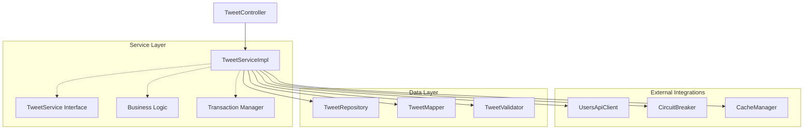
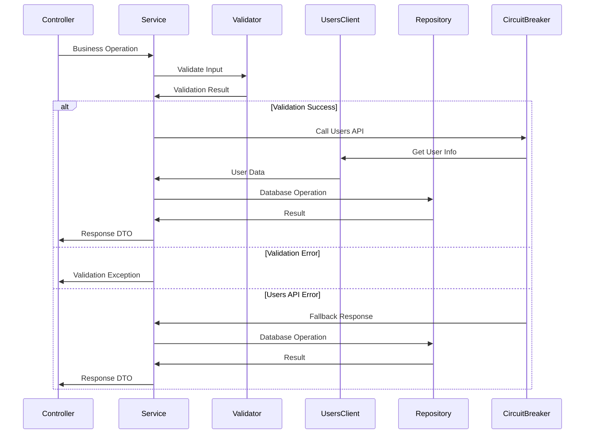

# Проектирование Service Layer для Tweet API

## Meta
- project: twitter-tweet-api
- design_date: 2025-01-27
- designer: AI Assistant
- version: 1.0
- status: completed
- layer: Service

## Executive Summary

Данный документ содержит детальное проектирование Service Layer для сервиса Tweet API. Проектирование основано на анализе бизнес-требований, архитектурных паттернах users-api и принципах микросервисной архитектуры.

## 1. Архитектурные принципы Service Layer

### 1.1 Основные принципы

#### Слоистая архитектура:
- **Controller** → **Service** → **Repository** → **Entity**
- **Инкапсуляция бизнес-логики** в Service Layer
- **Координация операций** между различными компонентами
- **Управление транзакциями** и консистентностью данных

#### Паттерны из users-api:
```java
@Service
@RequiredArgsConstructor
@Transactional
public class TweetServiceImpl implements TweetService {
    
    private final TweetRepository tweetRepository;
    private final TweetMapper tweetMapper;
    private final TweetValidator tweetValidator;
    private final UsersApiClient usersApiClient;
    
    @Override
    public TweetResponseDto createTweet(CreateTweetRequestDto request) {
        tweetValidator.validateForCreate(request);
        Tweet tweet = tweetMapper.toTweet(request);
        tweet.setStatus(TweetStatus.ACTIVE);
        Tweet savedTweet = tweetRepository.saveAndFlush(tweet);
        return tweetMapper.toTweetResponseDto(savedTweet);
    }
}
```

### 1.2 Ключевые компоненты

#### Интерфейс и реализация:
- **TweetService** - интерфейс с контрактом операций
- **TweetServiceImpl** - реализация бизнес-логики
- **@Service** - Spring аннотация для сервисных компонентов
- **@Transactional** - управление транзакциями

## 2. Проектирование бизнес-логики

### 2.1 Основные операции с твитами

#### Создание твита
```java
@Override
@Transactional
public TweetResponseDto createTweet(CreateTweetRequestDto request) {
    // 1. Валидация входных данных
    tweetValidator.validateForCreate(request);
    
    // 2. Проверка существования пользователя через users-api
    UserResponseDto user = usersApiClient.getUserById(request.userId())
        .orElseThrow(() -> new UserNotFoundException(request.userId()));
    
    // 3. Проверка статуса пользователя
    if (user.status() != UserStatus.ACTIVE) {
        throw new BusinessRuleValidationException(
            "INACTIVE_USER", 
            "Cannot create tweet for inactive user: " + request.userId()
        );
    }
    
    // 4. Создание твита
    Tweet tweet = tweetMapper.toTweet(request);
    tweet.setStatus(TweetStatus.ACTIVE);
    tweet.setCreatedAt(LocalDateTime.now());
    tweet.setUpdatedAt(LocalDateTime.now());
    
    // 5. Сохранение в БД
    Tweet savedTweet = tweetRepository.saveAndFlush(tweet);
    
    // 6. Возврат результата
    return tweetMapper.toTweetResponseDto(savedTweet);
}
```

**Особенности:**
- **@Transactional**: атомарность операции
- **Валидация**: проверка входных данных и бизнес-правил
- **Интеграция**: вызов users-api для проверки пользователя
- **Обработка ошибок**: типизированные исключения

#### Получение твита
```java
@Override
@Transactional(readOnly = true)
public Optional<TweetResponseDto> getTweetById(UUID tweetId) {
    return tweetRepository.findByIdAndStatusNot(tweetId, TweetStatus.DELETED)
        .map(tweetMapper::toTweetResponseDto);
}
```

**Особенности:**
- **@Transactional(readOnly = true)**: оптимизация для чтения
- **Soft delete**: исключение удаленных твитов
- **Optional**: безопасная обработка отсутствующих данных

#### Обновление твита
```java
@Override
@Transactional
public Optional<TweetResponseDto> updateTweet(UUID tweetId, UpdateTweetRequestDto request) {
    // 1. Поиск твита
    Tweet tweet = tweetRepository.findByIdAndStatusNot(tweetId, TweetStatus.DELETED)
        .orElse(null);
    
    if (tweet == null) {
        return Optional.empty();
    }
    
    // 2. Проверка прав автора
    if (!tweet.getUserId().equals(request.userId())) {
        throw new BusinessRuleValidationException(
            "AUTHOR_ONLY", 
            "Only tweet author can update tweet: " + tweetId
        );
    }
    
    // 3. Валидация обновления
    tweetValidator.validateForUpdate(request);
    
    // 4. Обновление данных
    tweetMapper.updateTweetFromUpdateDto(request, tweet);
    tweet.setUpdatedAt(LocalDateTime.now());
    
    // 5. Сохранение
    Tweet updatedTweet = tweetRepository.saveAndFlush(tweet);
    
    return Optional.of(tweetMapper.toTweetResponseDto(updatedTweet));
}
```

#### Удаление твита
```java
@Override
@Transactional
public Optional<TweetResponseDto> deleteTweet(UUID tweetId) {
    // 1. Поиск твита
    Tweet tweet = tweetRepository.findByIdAndStatusNot(tweetId, TweetStatus.DELETED)
        .orElse(null);
    
    if (tweet == null) {
        return Optional.empty();
    }
    
    // 2. Soft delete
    tweet.setStatus(TweetStatus.DELETED);
    tweet.setUpdatedAt(LocalDateTime.now());
    
    Tweet deletedTweet = tweetRepository.saveAndFlush(tweet);
    
    return Optional.of(tweetMapper.toTweetResponseDto(deletedTweet));
}
```

### 2.2 Социальные функции

#### Лайк твита
```java
@Override
@Transactional
public LikeResponseDto likeTweet(UUID tweetId, LikeTweetRequestDto request) {
    // 1. Проверка существования твита
    Tweet tweet = tweetRepository.findByIdAndStatusNot(tweetId, TweetStatus.DELETED)
        .orElseThrow(() -> new TweetNotFoundException(tweetId));
    
    // 2. Проверка существования пользователя
    UserResponseDto user = usersApiClient.getUserById(request.userId())
        .orElseThrow(() -> new UserNotFoundException(request.userId()));
    
    // 3. Проверка на самолайк
    if (tweet.getUserId().equals(request.userId())) {
        throw new BusinessRuleValidationException(
            "NO_SELF_LIKE", 
            "User cannot like their own tweet: " + tweetId
        );
    }
    
    // 4. Проверка существования лайка
    Optional<Like> existingLike = likeRepository.findByTweetIdAndUserId(tweetId, request.userId());
    if (existingLike.isPresent()) {
        throw new BusinessRuleValidationException(
            "DUPLICATE_LIKE", 
            "User has already liked this tweet: " + tweetId
        );
    }
    
    // 5. Создание лайка
    Like like = Like.builder()
        .tweetId(tweetId)
        .userId(request.userId())
        .createdAt(LocalDateTime.now())
        .build();
    
    Like savedLike = likeRepository.saveAndFlush(like);
    
    // 6. Обновление счетчика
    tweetRepository.incrementLikesCount(tweetId);
    
    return likeMapper.toLikeResponseDto(savedLike);
}
```

**Особенности:**
- **Атомарность**: вся операция в одной транзакции
- **Бизнес-правила**: проверка на самолайк и дублирование
- **Денормализация**: обновление счетчика лайков
- **Интеграция**: проверка пользователя через users-api

#### Убрать лайк
```java
@Override
@Transactional
public void unlikeTweet(UUID tweetId, UnlikeTweetRequestDto request) {
    // 1. Поиск лайка
    Like like = likeRepository.findByTweetIdAndUserId(tweetId, request.userId())
        .orElseThrow(() -> new LikeNotFoundException(tweetId, request.userId()));
    
    // 2. Удаление лайка
    likeRepository.delete(like);
    
    // 3. Обновление счетчика
    tweetRepository.decrementLikesCount(tweetId);
}
```

#### Ретвит
```java
@Override
@Transactional
public RetweetResponseDto retweetTweet(UUID tweetId, RetweetRequestDto request) {
    // 1. Проверка существования твита
    Tweet tweet = tweetRepository.findByIdAndStatusNot(tweetId, TweetStatus.DELETED)
        .orElseThrow(() -> new TweetNotFoundException(tweetId));
    
    // 2. Проверка существования пользователя
    UserResponseDto user = usersApiClient.getUserById(request.userId())
        .orElseThrow(() -> new UserNotFoundException(request.userId()));
    
    // 3. Проверка на саморетвит
    if (tweet.getUserId().equals(request.userId())) {
        throw new BusinessRuleValidationException(
            "NO_SELF_RETWEET", 
            "User cannot retweet their own tweet: " + tweetId
        );
    }
    
    // 4. Проверка существования ретвита
    Optional<Retweet> existingRetweet = retweetRepository.findByTweetIdAndUserId(tweetId, request.userId());
    if (existingRetweet.isPresent()) {
        throw new BusinessRuleValidationException(
            "DUPLICATE_RETWEET", 
            "User has already retweeted this tweet: " + tweetId
        );
    }
    
    // 5. Создание ретвита
    Retweet retweet = Retweet.builder()
        .tweetId(tweetId)
        .userId(request.userId())
        .comment(request.comment())
        .createdAt(LocalDateTime.now())
        .build();
    
    Retweet savedRetweet = retweetRepository.saveAndFlush(retweet);
    
    // 6. Обновление счетчика
    tweetRepository.incrementRetweetsCount(tweetId);
    
    return retweetMapper.toRetweetResponseDto(savedRetweet);
}
```

### 2.3 Получение данных

#### Твиты пользователя
```java
@Override
@Transactional(readOnly = true)
public Page<TweetResponseDto> getUserTweets(UUID userId, Pageable pageable) {
    // 1. Проверка существования пользователя
    UserResponseDto user = usersApiClient.getUserById(userId)
        .orElseThrow(() -> new UserNotFoundException(userId));
    
    // 2. Получение твитов с пагинацией
    Page<Tweet> tweets = tweetRepository.findByUserIdAndStatusNotOrderByCreatedAtDesc(
        userId, 
        TweetStatus.DELETED, 
        pageable
    );
    
    // 3. Преобразование в DTO
    return tweets.map(tweetMapper::toTweetResponseDto);
}
```

#### Лента новостей
```java
@Override
@Transactional(readOnly = true)
public Page<TweetResponseDto> getUserTimeline(UUID userId, Pageable pageable) {
    // 1. Проверка существования пользователя
    UserResponseDto user = usersApiClient.getUserById(userId)
        .orElseThrow(() -> new UserNotFoundException(userId));
    
    // 2. Получение подписок пользователя
    List<UUID> followingUserIds = followServiceClient.getFollowingUserIds(userId);
    
    // 3. Добавление собственного ID для включения своих твитов
    followingUserIds.add(userId);
    
    // 4. Получение твитов с пагинацией
    Page<Tweet> timeline = tweetRepository.findByUserIdInAndStatusNotOrderByCreatedAtDesc(
        followingUserIds, 
        TweetStatus.DELETED, 
        pageable
    );
    
    // 5. Преобразование в DTO
    return timeline.map(tweetMapper::toTweetResponseDto);
}
```

**Особенности:**
- **Интеграция**: вызов follow-service для получения подписок
- **Оптимизация**: использование IN запроса для множественных ID
- **Пагинация**: эффективная обработка больших объемов данных

## 3. Проектирование транзакционности

### 3.1 Уровни изоляции

#### Чтение данных:
```java
@Transactional(readOnly = true, isolation = Isolation.READ_COMMITTED)
public Optional<TweetResponseDto> getTweetById(UUID tweetId) {
    // Оптимизация для чтения
}
```

#### Запись данных:
```java
@Transactional(isolation = Isolation.REPEATABLE_READ)
public TweetResponseDto createTweet(CreateTweetRequestDto request) {
    // Гарантия консистентности при создании
}
```

#### Социальные функции:
```java
@Transactional(isolation = Isolation.SERIALIZABLE)
public LikeResponseDto likeTweet(UUID tweetId, LikeTweetRequestDto request) {
    // Максимальная изоляция для предотвращения дублирования
}
```

### 3.2 Управление транзакциями

#### Программное управление:
```java
@Autowired
private TransactionTemplate transactionTemplate;

public void complexOperation() {
    transactionTemplate.execute(status -> {
        try {
            // Сложная операция с множественными изменениями
            performOperation1();
            performOperation2();
            performOperation3();
            return null;
        } catch (Exception e) {
            status.setRollbackOnly();
            throw e;
        }
    });
}
```

#### Обработка исключений:
```java
@Transactional(rollbackFor = {BusinessRuleValidationException.class})
public TweetResponseDto createTweet(CreateTweetRequestDto request) {
    // Автоматический rollback при бизнес-ошибках
}
```

## 4. Проектирование интеграции с users-api

### 4.1 Клиент для users-api

#### UsersApiClient интерфейс:
```java
@Component
public interface UsersApiClient {
    
    Optional<UserResponseDto> getUserById(UUID userId);
    
    List<UserResponseDto> getUsersByIds(List<UUID> userIds);
    
    boolean isUserActive(UUID userId);
    
    UserRole getUserRole(UUID userId);
}
```

#### Реализация с Circuit Breaker:
```java
@Service
@RequiredArgsConstructor
public class UsersApiClientImpl implements UsersApiClient {
    
    private final RestTemplate restTemplate;
    private final CircuitBreaker circuitBreaker;
    
    @Override
    public Optional<UserResponseDto> getUserById(UUID userId) {
        return circuitBreaker.executeSupplier(() -> {
            try {
                ResponseEntity<UserResponseDto> response = restTemplate.getForEntity(
                    "/api/v1/users/{userId}", 
                    UserResponseDto.class, 
                    userId
                );
                return Optional.ofNullable(response.getBody());
            } catch (HttpClientErrorException.NotFound e) {
                return Optional.empty();
            } catch (Exception e) {
                throw new UsersApiException("Failed to get user: " + userId, e);
            }
        });
    }
    
    @Override
    public boolean isUserActive(UUID userId) {
        return circuitBreaker.executeSupplier(() -> {
            try {
                ResponseEntity<UserResponseDto> response = restTemplate.getForEntity(
                    "/api/v1/users/{userId}", 
                    UserResponseDto.class, 
                    userId
                );
                return response.getBody() != null && 
                       response.getBody().status() == UserStatus.ACTIVE;
            } catch (HttpClientErrorException.NotFound e) {
                return false;
            } catch (Exception e) {
                throw new UsersApiException("Failed to check user status: " + userId, e);
            }
        });
    }
}
```

### 4.2 Fallback стратегии

#### Fallback для недоступности users-api:
```java
@Service
public class UsersApiFallbackService implements UsersApiClient {
    
    @Override
    public Optional<UserResponseDto> getUserById(UUID userId) {
        // Fallback: возврат минимальной информации о пользователе
        log.warn("Users API unavailable, using fallback for user: {}", userId);
        return Optional.of(UserResponseDto.builder()
            .id(userId)
            .status(UserStatus.ACTIVE) // Предполагаем активный статус
            .role(UserRole.USER)       // Предполагаем обычного пользователя
            .build());
    }
    
    @Override
    public boolean isUserActive(UUID userId) {
        // Fallback: предполагаем активный статус
        log.warn("Users API unavailable, assuming active status for user: {}", userId);
        return true;
    }
}
```

### 4.3 Кэширование

#### Кэширование информации о пользователях:
```java
@Service
@RequiredArgsConstructor
public class CachedUsersApiClient implements UsersApiClient {
    
    private final UsersApiClient usersApiClient;
    private final CacheManager cacheManager;
    
    @Override
    @Cacheable(value = "users", key = "#userId")
    public Optional<UserResponseDto> getUserById(UUID userId) {
        return usersApiClient.getUserById(userId);
    }
    
    @Override
    @Cacheable(value = "user-status", key = "#userId")
    public boolean isUserActive(UUID userId) {
        return usersApiClient.isUserActive(userId);
    }
    
    @CacheEvict(value = {"users", "user-status"}, key = "#userId")
    public void evictUserCache(UUID userId) {
        // Принудительное обновление кэша
    }
}
```

## 5. Проектирование обработки ошибок

### 5.1 Типизированные исключения

#### Tweet-specific исключения:
```java
public class TweetNotFoundException extends RuntimeException {
    public TweetNotFoundException(UUID tweetId) {
        super("Tweet with id '" + tweetId + "' not found");
    }
}

public class LikeNotFoundException extends RuntimeException {
    public LikeNotFoundException(UUID tweetId, UUID userId) {
        super("Like not found for tweet '" + tweetId + "' and user '" + userId + "'");
    }
}

public class RetweetNotFoundException extends RuntimeException {
    public RetweetNotFoundException(UUID tweetId, UUID userId) {
        super("Retweet not found for tweet '" + tweetId + "' and user '" + userId + "'");
    }
}

public class UsersApiException extends RuntimeException {
    public UsersApiException(String message, Throwable cause) {
        super(message, cause);
    }
}
```

### 5.2 Обработка в GlobalExceptionHandler

#### Расширение GlobalExceptionHandler:
```java
@RestControllerAdvice
public class TweetApiExceptionHandler extends GlobalExceptionHandler {
    
    @ExceptionHandler(TweetNotFoundException.class)
    public ProblemDetail handleTweetNotFound(TweetNotFoundException ex) {
        ProblemDetail problemDetail = ProblemDetail.forStatusAndDetail(
            HttpStatus.NOT_FOUND,
            ex.getMessage()
        );
        problemDetail.setTitle("Tweet Not Found");
        problemDetail.setType(URI.create("https://example.com/errors/tweet-not-found"));
        problemDetail.setProperty("timestamp", Instant.now());
        return problemDetail;
    }
    
    @ExceptionHandler(UsersApiException.class)
    public ProblemDetail handleUsersApiException(UsersApiException ex) {
        ProblemDetail problemDetail = ProblemDetail.forStatusAndDetail(
            HttpStatus.SERVICE_UNAVAILABLE,
            "User service temporarily unavailable"
        );
        problemDetail.setTitle("Service Unavailable");
        problemDetail.setType(URI.create("https://example.com/errors/service-unavailable"));
        problemDetail.setProperty("timestamp", Instant.now());
        problemDetail.setProperty("originalError", ex.getMessage());
        return problemDetail;
    }
}
```

## 6. Архитектурная диаграмма Service Layer

### 6.1 Диаграмма взаимодействия



### 6.2 Диаграмма потока данных



## 7. Рекомендации по реализации

### 7.1 Структура пакетов

```
com.twitter.service/
├── TweetService.java              # Интерфейс сервиса
├── TweetServiceImpl.java         # Реализация сервиса
├── client/
│   ├── UsersApiClient.java       # Клиент для users-api
│   ├── UsersApiClientImpl.java   # Реализация клиента
│   └── UsersApiFallbackService.java # Fallback сервис
├── exception/
│   ├── TweetNotFoundException.java
│   ├── LikeNotFoundException.java
│   ├── RetweetNotFoundException.java
│   └── UsersApiException.java
└── config/
    ├── CircuitBreakerConfig.java
    └── CacheConfig.java
```

### 7.2 Зависимости

#### build.gradle:
```gradle
dependencies {
    implementation project(':shared:common-lib')
    implementation 'org.springframework.boot:spring-boot-starter-web'
    implementation 'org.springframework.boot:spring-boot-starter-data-jpa'
    implementation 'org.springframework.boot:spring-boot-starter-cache'
    implementation 'org.springframework.boot:spring-boot-starter-actuator'
    implementation 'io.github.resilience4j:resilience4j-spring-boot2'
    implementation 'io.github.resilience4j:resilience4j-circuitbreaker'
    implementation 'org.mapstruct:mapstruct'
    annotationProcessor 'org.mapstruct:mapstruct-processor'
}
```

### 7.3 Конфигурация

#### Circuit Breaker конфигурация:
```yaml
resilience4j:
  circuitbreaker:
    instances:
      users-api:
        failure-rate-threshold: 50
        wait-duration-in-open-state: 30s
        sliding-window-size: 10
        minimum-number-of-calls: 5
        permitted-number-of-calls-in-half-open-state: 3
        automatic-transition-from-open-to-half-open-enabled: true
```

#### Кэш конфигурация:
```yaml
spring:
  cache:
    type: caffeine
    caffeine:
      spec: maximumSize=1000,expireAfterWrite=5m
```

## 8. Заключение

### 8.1 Ключевые архитектурные решения

1. **Инкапсуляция бизнес-логики** в Service Layer
2. **Транзакционность операций** с правильными уровнями изоляции
3. **Интеграция с users-api** через Circuit Breaker и Fallback
4. **Типизированные исключения** для обработки ошибок
5. **Кэширование** для оптимизации производительности
6. **Валидация бизнес-правил** перед операциями

### 8.2 Готовность к реализации

Service Layer спроектирован с учетом:
- ✅ **Бизнес-требований** из анализа
- ✅ **Архитектурных паттернов** users-api
- ✅ **Интеграции** с внешними сервисами
- ✅ **Производительности** и масштабируемости

### 8.3 Следующие шаги

1. **Реализация Repository Layer** с JPA/Hibernate
2. **Создание Mapper классов** с MapStruct
3. **Настройка Circuit Breaker** и кэширования
4. **Интеграция с users-api** клиентом

---

*Документ создан: 2025-01-27*  
*Версия: 1.0*  
*Статус: Completed*
