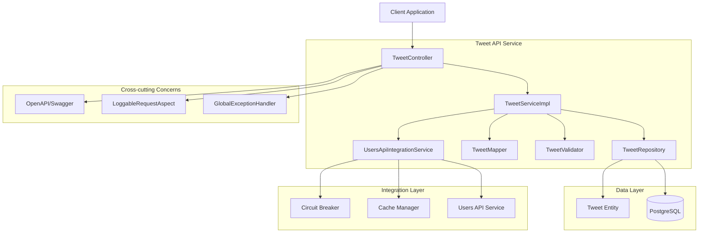
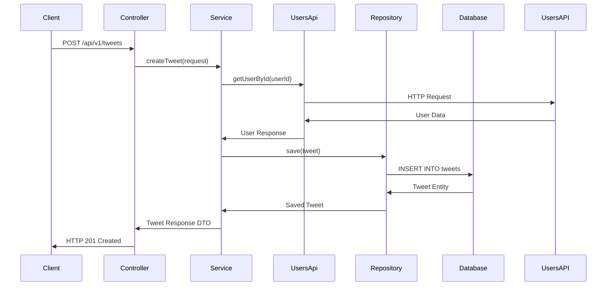

# Архитектурное проектирование Tweet API Service

## Meta
- project: twitter-tweet-api
- design_date: 2025-01-27
- designer: AI Assistant
- version: 1.0
- status: completed
- architecture: comprehensive

## Executive Summary

Данный документ содержит комплексное архитектурное проектирование сервиса Tweet API. Проектирование основано на анализе требований, существующих паттернов users-api, SQL модели данных и принципах микросервисной архитектуры.

## 1. Обзор архитектуры

### 1.1 Архитектурные принципы

#### Слоистая архитектура:
- **Controller Layer** - обработка HTTP запросов и маршрутизация
- **Service Layer** - бизнес-логика и координация операций
- **Repository Layer** - доступ к данным через JPA/Hibernate
- **DTO/Mapper Layer** - преобразование данных между слоями
- **Integration Layer** - взаимодействие с внешними сервисами

#### Микросервисные принципы:
- **Stateless** - сервис не хранит состояние между запросами
- **Resilient** - отказоустойчивость через Circuit Breaker и Fallback
- **Observable** - мониторинг и логирование для observability
- **Scalable** - горизонтальное масштабирование

### 1.2 Технологический стек

#### Основные технологии:
- **Spring Boot 3.5.5** - основной фреймворк
- **Java 24** - язык программирования
- **PostgreSQL 15+** - реляционная база данных
- **JPA/Hibernate** - ORM для работы с БД
- **MapStruct** - автоматический маппинг DTO ↔ Entity
- **Resilience4j** - Circuit Breaker и Retry механизмы
- **Caffeine** - кэширование для производительности
- **OpenAPI/Swagger** - документация API

## 2. Детальное описание слоев

### 2.1 Controller Layer

#### Основные компоненты:
- **TweetController** - REST endpoints для операций с твитами
- **TweetApi** - OpenAPI интерфейс для документации
- **GlobalExceptionHandler** - централизованная обработка ошибок
- **LoggableRequestAspect** - автоматическое логирование запросов

#### Ключевые паттерны:
```java
@RestController
@RequestMapping("/api/v1/tweets")
@RequiredArgsConstructor
public class TweetController implements TweetApi {
    
    private final TweetService tweetService;
    
    @LoggableRequest(hideFields = {"password"})
    @PostMapping
    @Override
    public ResponseEntity<TweetResponseDto> createTweet(@RequestBody @Valid CreateTweetRequestDto request) {
        TweetResponseDto tweet = tweetService.createTweet(request);
        return ResponseEntity.status(HttpStatus.CREATED).body(tweet);
    }
}
```

#### Особенности:
- **RESTful дизайн** с четким разделением ресурсов
- **Автоматическое логирование** через @LoggableRequest
- **Валидация входных данных** через Bean Validation
- **OpenAPI документация** через аннотации

### 2.2 Service Layer

#### Основные компоненты:
- **TweetService** - интерфейс бизнес-логики
- **TweetServiceImpl** - реализация бизнес-логики
- **UsersApiIntegrationService** - интеграция с users-api
- **TweetValidator** - валидация бизнес-правил

#### Ключевые паттерны:
```java
@Service
@RequiredArgsConstructor
@Transactional
public class TweetServiceImpl implements TweetService {
    
    private final TweetRepository tweetRepository;
    private final TweetMapper tweetMapper;
    private final UsersApiIntegrationService usersApiService;
    
    @Override
    @Transactional
    public TweetResponseDto createTweet(CreateTweetRequestDto request) {
        // Валидация пользователя через users-api
        UserResponseDto user = usersApiService.getUserById(request.userId())
            .orElseThrow(() -> new UserNotFoundException(request.userId()));
        
        // Проверка бизнес-правил
        if (user.status() != UserStatus.ACTIVE) {
            throw new BusinessRuleValidationException(
                "INACTIVE_USER", 
                "Cannot create tweet for inactive user: " + request.userId()
            );
        }
        
        // Создание твита
        Tweet tweet = tweetMapper.toTweet(request);
        Tweet savedTweet = tweetRepository.saveAndFlush(tweet);
        
        return tweetMapper.toTweetResponseDto(savedTweet);
    }
}
```

#### Особенности:
- **Транзакционность** с правильными уровнями изоляции
- **Интеграция с users-api** через Circuit Breaker
- **Валидация бизнес-правил** перед операциями
- **Обработка ошибок** с типизированными исключениями

### 2.3 Repository Layer

#### Основные компоненты:
- **TweetRepository** - операции с твитами
- **LikeRepository** - операции с лайками
- **RetweetRepository** - операции с ретвитами
- **TweetSpecification** - динамические запросы

#### Ключевые паттерны:
```java
public interface TweetRepository extends JpaRepository<Tweet, UUID>, JpaSpecificationExecutor<Tweet> {
    
    @Query("SELECT t FROM Tweet t WHERE t.id = :id AND t.isDeleted = false")
    Optional<Tweet> findByIdAndNotDeleted(@Param("id") UUID id);
    
    @Modifying
    @Query("UPDATE Tweet t SET t.likesCount = t.likesCount + 1 WHERE t.id = :tweetId")
    void incrementLikesCount(@Param("tweetId") UUID tweetId);
    
    @Query("SELECT t FROM Tweet t WHERE t.userId IN :userIds AND t.isDeleted = false ORDER BY t.createdAt DESC")
    Page<Tweet> findByUserIdInAndNotDeletedOrderByCreatedAtDesc(@Param("userIds") List<UUID> userIds, Pageable pageable);
}
```

#### Особенности:
- **JPA Entities** с оптимизированными индексами
- **Кастомные запросы** для сложных операций
- **Specification паттерн** для динамических запросов
- **Batch операции** для оптимизации производительности

### 2.4 DTO/Mapper Layer

#### Основные компоненты:
- **Request DTOs** - CreateTweetRequestDto, UpdateTweetRequestDto, LikeTweetRequestDto
- **Response DTOs** - TweetResponseDto, LikeResponseDto, RetweetResponseDto
- **Error DTOs** - ErrorResponseDto, ValidationErrorResponseDto
- **Mappers** - TweetMapper, LikeMapper, RetweetMapper

#### Ключевые паттерны:
```java
@Mapper(componentModel = "spring")
public interface TweetMapper {
    
    @Mapping(target = "id", ignore = true)
    @Mapping(target = "createdAt", ignore = true)
    @Mapping(target = "updatedAt", ignore = true)
    @Mapping(target = "isDeleted", ignore = true)
    Tweet toTweet(CreateTweetRequestDto requestDto);
    
    @Mapping(target = "stats", source = ".", qualifiedByName = "toTweetStats")
    TweetResponseDto toTweetResponseDto(Tweet tweet);
    
    @Named("toTweetStats")
    default TweetStatsDto toTweetStats(Tweet tweet) {
        return new TweetStatsDto(
            tweet.getLikesCount(),
            tweet.getRetweetsCount(),
            tweet.getRepliesCount()
        );
    }
}
```

#### Особенности:
- **Record-based DTOs** для неизменяемости
- **MapStruct мапперы** для автоматического преобразования
- **Bean Validation** с кастомными валидаторами
- **OpenAPI аннотации** для документации

### 2.5 Integration Layer

#### Основные компоненты:
- **UsersApiClient** - интерфейс для users-api
- **UsersApiClientImpl** - HTTP клиент с обработкой ошибок
- **CircuitBreaker** - защита от каскадных сбоев
- **FallbackService** - graceful degradation

#### Ключевые паттерны:
```java
@Service
@RequiredArgsConstructor
public class UsersApiIntegrationService {
    
    private final UsersApiClient usersApiClient;
    private final CircuitBreaker circuitBreaker;
    private final CacheManager cacheManager;
    
    @Retryable(value = {UsersApiException.class}, maxAttempts = 3)
    @CircuitBreaker(name = "users-api", fallbackMethod = "getUserByIdFallback")
    @Cacheable(value = "users", key = "#userId")
    public Optional<UserResponseDto> getUserById(UUID userId) {
        return usersApiClient.getUserById(userId);
    }
    
    public Optional<UserResponseDto> getUserByIdFallback(UUID userId, Exception ex) {
        log.warn("Users API unavailable, using fallback for user: {}", userId);
        return Optional.of(UserResponseDto.builder()
            .id(userId)
            .status(UserStatus.ACTIVE)
            .role(UserRole.USER)
            .build());
    }
}
```

#### Особенности:
- **HTTP REST интеграция** с users-api
- **Circuit Breaker** для отказоустойчивости
- **Retry механизмы** для временных сбоев
- **Кэширование** для оптимизации производительности

## 3. Диаграмма архитектуры

### 3.1 Общая архитектурная диаграмма



### 3.2 Диаграмма потока данных



## 4. Ключевые архитектурные решения

### 4.1 Производительность

#### Оптимизации:
- **Индексы БД** для частых запросов (user_id + created_at)
- **Денормализация** статистики (likes_count, retweets_count)
- **Кэширование** пользователей из users-api
- **Batch операции** для массовых обновлений
- **Пагинация** для больших наборов данных

#### Метрики производительности:
- **Чтение < 200ms** - критично для UX
- **Запись < 500ms** - приемлемо для операций изменения
- **1000 RPS** на чтение - высокая нагрузка
- **100 RPS** на запись - операционные ограничения

### 4.2 Отказоустойчивость

#### Защитные механизмы:
- **Circuit Breaker** для защиты от каскадных сбоев
- **Retry механизмы** для временных сбоев
- **Fallback стратегии** для graceful degradation
- **Timeout настройки** для предотвращения зависания

#### Обработка ошибок:
- **Типизированные исключения** для разных типов ошибок
- **Централизованная обработка** через GlobalExceptionHandler
- **RFC 7807 Problem Details** для стандартизированных ответов
- **Логирование** для debugging и мониторинга

### 4.3 Масштабируемость

#### Горизонтальное масштабирование:
- **Stateless архитектура** - сервис не хранит состояние
- **UUID идентификаторы** - поддержка распределенных систем
- **Load balancing** - распределение нагрузки
- **Database sharding** - подготовка к шардингу по user_id

#### Вертикальное масштабирование:
- **Оптимизированные запросы** - минимизация нагрузки на БД
- **Кэширование** - снижение нагрузки на внешние сервисы
- **Connection pooling** - эффективное использование ресурсов
- **Async обработка** - где возможно

### 4.4 Безопасность

#### Защитные меры:
- **Валидация входных данных** - предотвращение инъекций
- **Авторизация** - проверка прав доступа
- **Скрытие чувствительных данных** в логах
- **Rate limiting** - защита от DDoS атак

#### Аудит и мониторинг:
- **Структурированное логирование** с traceId/spanId
- **Метрики производительности** через Actuator
- **Health checks** для мониторинга состояния
- **Distributed tracing** для debugging

## 5. Готовность к реализации

### 5.1 Созданные артефакты

#### Документы проектирования:
1. **USERS_API_ARCHITECTURE_ANALYSIS.md** - анализ архитектуры users-api
2. **SHARED_LIB_ANALYSIS.md** - анализ shared/common-lib компонентов
3. **CONTROLLER_LAYER_DESIGN.md** - проектирование Controller Layer
4. **SERVICE_LAYER_DESIGN.md** - проектирование Service Layer
5. **REPOSITORY_LAYER_DESIGN.md** - проектирование Repository Layer
6. **DTO_MAPPER_LAYER_DESIGN.md** - проектирование DTO/Mapper Layer
7. **USERS_API_INTEGRATION_DESIGN.md** - проектирование интеграции с users-api

#### Архитектурные диаграммы:
- Диаграммы взаимодействия для каждого слоя
- Диаграммы потока данных
- Общая архитектурная диаграмма
- Диаграммы интеграции с внешними сервисами

### 5.2 Техническая готовность

#### Готовые компоненты:
- ✅ **Архитектурные паттерны** из users-api
- ✅ **Shared компоненты** из common-lib
- ✅ **SQL модель данных** с индексами и ограничениями
- ✅ **API контракты** с OpenAPI спецификацией
- ✅ **Интеграция** с users-api через Circuit Breaker

#### Следующие шаги:
1. **Реализация кода** на основе проектирования
2. **Настройка инфраструктуры** (БД, кэш, мониторинг)
3. **Тестирование** всех слоев и интеграций
4. **Документация** для разработчиков и операторов

## 6. Заключение

### 6.1 Ключевые достижения

Архитектурное проектирование Tweet API Service завершено с созданием:

1. **Комплексной архитектуры** с четким разделением слоев
2. **Детального проектирования** каждого компонента
3. **Интеграционных решений** с users-api
4. **Паттернов отказоустойчивости** и производительности
5. **Готовности к реализации** с конкретными артефактами

### 6.2 Архитектурные преимущества

- **Масштабируемость** - горизонтальное и вертикальное масштабирование
- **Отказоустойчивость** - Circuit Breaker, Retry, Fallback стратегии
- **Производительность** - кэширование, индексы, оптимизированные запросы
- **Maintainability** - четкое разделение ответственности, тестируемость
- **Observability** - логирование, метрики, health checks

### 6.3 Готовность к следующему этапу

Архитектурное проектирование создало прочную основу для:
- **Implementation Phase** - детальная реализация кода
- **Testing Phase** - комплексное тестирование
- **Deployment Phase** - развертывание в production
- **Operations Phase** - мониторинг и поддержка

---

*Документ создан: 2025-01-27*  
*Версия: 1.0*  
*Статус: Completed*
