# Архитектурное проектирование Tweet API Service

## Содержание

1. [Meta Information](#meta-information)
2. [Executive Summary](#executive-summary)
3. [Обзор архитектуры](#обзор-архитектуры)
   - [Архитектурные принципы](#архитектурные-принципы)
   - [Технологический стек](#технологический-стек)
   - [Общая схема архитектуры](#общая-схема-архитектуры)
4. [Детальное описание слоев](#детальное-описание-слоев)
   - [Controller Layer](#controller-layer)
   - [Service Layer](#service-layer)
   - [Repository Layer](#repository-layer)
   - [DTO/Mapper Layer](#dtomapper-layer)
   - [Integration Layer](#integration-layer)
5. [Архитектурные диаграммы](#архитектурные-диаграммы)
   - [Диаграммы слоев приложения](#диаграммы-слоев-приложения)
   - [Диаграммы интеграции](#диаграммы-интеграции)
   - [Диаграммы развертывания](#диаграммы-развертывания)
6. [Ключевые архитектурные решения](#ключевые-архитектурные-решения)
   - [Производительность](#производительность)
   - [Отказоустойчивость](#отказоустойчивость)
   - [Масштабируемость](#масштабируемость)
   - [Безопасность](#безопасность)
7. [Готовность к реализации](#готовность-к-реализации)
   - [Архитектурные решения](#архитектурные-решения)
   - [Технические детали](#технические-детали)
   - [Следующие шаги](#следующие-шаги)

---

## Meta Information

- **project**: twitter-tweet-api
- **design_date**: 2025-01-27
- **designer**: AI Assistant
- **version**: 1.0
- **status**: completed
- **architecture**: comprehensive

---

## Executive Summary

Данный документ содержит комплексное архитектурное проектирование сервиса Tweet API. Проектирование основано на анализе требований, существующих паттернов users-api, SQL модели данных и принципах микросервисной архитектуры.

### Ключевые достижения:
- ✅ Полная архитектура всех слоев приложения
- ✅ Детальные диаграммы взаимодействия компонентов
- ✅ Стратегии интеграции с внешними сервисами
- ✅ План развертывания и масштабирования
- ✅ Готовность к реализации

---

## Обзор архитектуры

### Архитектурные принципы

#### Слоистая архитектура:
- **Controller Layer** - обработка HTTP запросов и маршрутизация
- **Service Layer** - бизнес-логика и координация операций
- **Repository Layer** - доступ к данным через JPA/Hibernate
- **DTO/Mapper Layer** - преобразование данных между слоями
- **Integration Layer** - взаимодействие с внешними сервисами

#### Микросервисные принципы:
- **Stateless** - сервис не хранит состояние между запросами
- **Resilient** - отказоустойчивость через Circuit Breaker и Fallback
- **Observable** - мониторинг и логирование для observability
- **Scalable** - горизонтальное масштабирование

### Технологический стек

#### Основные технологии:
- **Spring Boot 3.5.5** - основной фреймворк
- **Java 24** - язык программирования
- **PostgreSQL 15+** - реляционная база данных
- **JPA/Hibernate** - ORM для работы с БД
- **MapStruct** - автоматический маппинг DTO ↔ Entity
- **Resilience4j** - Circuit Breaker и Retry механизмы
- **Caffeine** - кэширование для производительности
- **OpenAPI/Swagger** - документация API

### Общая схема архитектуры

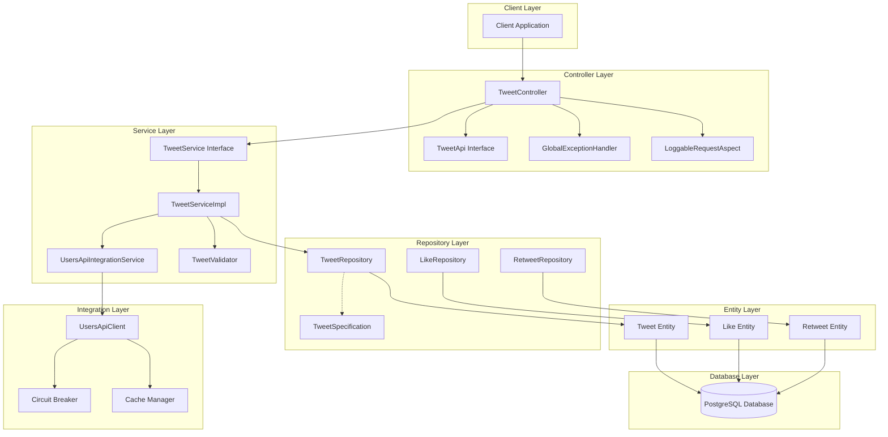

---

## Детальное описание слоев

### Controller Layer

#### Основные компоненты:
- **TweetController** - REST endpoints для операций с твитами
- **TweetApi** - OpenAPI интерфейс для документации
- **GlobalExceptionHandler** - централизованная обработка ошибок
- **LoggableRequestAspect** - аспект для логирования запросов

#### Ключевые особенности:
- Валидация входных данных через Bean Validation
- Стандартизированные HTTP статус коды
- Структурированные ответы в формате RFC 7807
- Автоматическая документация через OpenAPI

### Service Layer

#### Основные компоненты:
- **TweetService** - интерфейс бизнес-логики
- **TweetServiceImpl** - реализация бизнес-логики
- **UsersApiIntegrationService** - интеграция с users-api
- **TweetValidator** - валидация бизнес-правил

#### Ключевые особенности:
- Транзакционность операций
- Кэширование для производительности
- Circuit Breaker для отказоустойчивости
- Fallback стратегии при недоступности внешних сервисов

### Repository Layer

#### Основные компоненты:
- **TweetRepository** - доступ к данным твитов
- **LikeRepository** - доступ к данным лайков
- **RetweetRepository** - доступ к данным ретвитов
- **TweetSpecification** - спецификации для сложных запросов

#### Ключевые особенности:
- JPA/Hibernate для работы с БД
- Specification Pattern для динамических запросов
- Оптимизированные запросы с индексами
- Soft Delete для сохранения истории

### DTO/Mapper Layer

#### Основные компоненты:
- **TweetRequestDto** - DTO для создания твитов
- **TweetResponseDto** - DTO для ответов
- **TweetMapper** - MapStruct маппер
- **Validation Groups** - группы валидации

#### Ключевые особенности:
- Автоматический маппинг через MapStruct
- Валидация на уровне DTO
- Разделение входных и выходных моделей
- Оптимизация для производительности

### Integration Layer

#### Основные компоненты:
- **UsersApiClient** - клиент для users-api
- **CircuitBreaker** - Circuit Breaker паттерн
- **RetryMechanism** - механизм повторных попыток
- **FallbackService** - сервис fallback стратегий

#### Ключевые особенности:
- Resilience4j для отказоустойчивости
- Кэширование ответов внешних сервисов
- Мониторинг состояния интеграций
- Graceful degradation при сбоях

---

## Архитектурные диаграммы

### Диаграммы слоев приложения

#### Диаграмма взаимодействия Controller-Service-Repository

**Описание**: Данная диаграмма показывает полную архитектуру взаимодействия между всеми слоями приложения Tweet API Service. Она демонстрирует поток данных от клиентского приложения через все слои до базы данных PostgreSQL.

**Ключевые компоненты**:
- **Client Layer**: Клиентские приложения, взаимодействующие с API
- **Controller Layer**: REST контроллеры для обработки HTTP запросов
- **Service Layer**: Бизнес-логика и координация операций
- **Repository Layer**: Доступ к данным через JPA/Hibernate
- **Entity Layer**: JPA сущности для маппинга с БД
- **Database Layer**: PostgreSQL база данных
- **Integration Layer**: Взаимодействие с внешними сервисами

**Принятые решения**:
- Использование слоистой архитектуры для четкого разделения ответственности
- Интеграция с users-api через отдельный слой интеграции
- Централизованная обработка ошибок через GlobalExceptionHandler
- Логирование запросов через аспектно-ориентированное программирование

```mermaid
graph TB
    subgraph "Client Layer"
        Client[Client Application]
    end
    
    subgraph "Controller Layer"
        TweetController[TweetController]
        TweetApi[TweetApi Interface]
        GlobalExceptionHandler[GlobalExceptionHandler]
        LoggableRequestAspect[LoggableRequestAspect]
    end
    
    subgraph "Service Layer"
        TweetService[TweetService Interface]
        TweetServiceImpl[TweetServiceImpl]
        UsersApiIntegrationService[UsersApiIntegrationService]
        TweetValidator[TweetValidator]
    end
    
    subgraph "Repository Layer"
        TweetRepository[TweetRepository]
        LikeRepository[LikeRepository]
        RetweetRepository[RetweetRepository]
        TweetSpecification[TweetSpecification]
    end
    
    subgraph "Entity Layer"
        TweetEntity[Tweet Entity]
        LikeEntity[Like Entity]
        RetweetEntity[Retweet Entity]
    end
    
    subgraph "Database Layer"
        PostgreSQL[(PostgreSQL Database)]
    end
    
    subgraph "Integration Layer"
        UsersApiClient[UsersApiClient]
        CircuitBreaker[Circuit Breaker]
        CacheManager[Cache Manager]
    end
    
    Client --> TweetController
    TweetController --> TweetApi
    TweetController --> TweetService
    TweetController --> GlobalExceptionHandler
    TweetController --> LoggableRequestAspect
    
    TweetService --> TweetServiceImpl
    TweetServiceImpl --> TweetRepository
    TweetServiceImpl --> UsersApiIntegrationService
    TweetServiceImpl --> TweetValidator
    
    TweetRepository --> TweetEntity
    LikeRepository --> LikeEntity
    RetweetRepository --> RetweetEntity
    
    TweetEntity --> PostgreSQL
    LikeEntity --> PostgreSQL
    RetweetEntity --> PostgreSQL
    
    UsersApiIntegrationService --> UsersApiClient
    UsersApiClient --> CircuitBreaker
    UsersApiClient --> CacheManager
    
    TweetRepository -.-> TweetSpecification
```

#### Диаграмма потока данных через слои

**Описание**: Эта диаграмма детально показывает поток данных через все слои приложения при обработке HTTP запроса. Она включает обработку ошибок, интеграцию с внешними сервисами и fallback стратегии.

**Ключевые этапы обработки**:
1. **HTTP Request** → Controller с валидацией DTO
2. **Business Validation** → Проверка бизнес-правил
3. **External API Call** → Интеграция с users-api через Circuit Breaker
4. **Database Operations** → Сохранение данных в PostgreSQL
5. **Response Mapping** → Преобразование Entity в ResponseDTO
6. **HTTP Response** → Возврат результата клиенту

**Обработка ошибок**:
- Валидация на уровне DTO с возвратом ValidationException
- Бизнес-валидация с возвратом BusinessRuleException
- Обработка ошибок интеграции через Circuit Breaker и Fallback
- Централизованная обработка через GlobalExceptionHandler

**Альтернативные подходы**:
- **Синхронная обработка**: Выбрана для простоты и консистентности данных
- **Асинхронная обработка**: Рассматривается для будущих версий с Message Queue
- **Event Sourcing**: Возможная эволюция для аудита и восстановления состояния

```mermaid
flowchart TD
    Start([HTTP Request]) --> Controller[TweetController]
    
    Controller --> Validation{@Valid DTO}
    Validation -->|Success| Service[TweetServiceImpl]
    Validation -->|Error| ExceptionHandler[GlobalExceptionHandler]
    
    Service --> BusinessValidation{Business Rules}
    BusinessValidation -->|Success| UsersApi[UsersApiIntegrationService]
    BusinessValidation -->|Error| ExceptionHandler
    
    UsersApi --> CircuitBreakerCheck{Circuit Breaker}
    CircuitBreakerCheck -->|Open| Fallback[Fallback Service]
    CircuitBreakerCheck -->|Closed| ExternalApi[Users API]
    
    ExternalApi -->|Success| Repository[TweetRepository]
    ExternalApi -->|Error| Retry[Retry Logic]
    Retry -->|Max Attempts| Fallback
    Retry -->|Success| Repository
    
    Fallback --> Repository
    
    Repository --> Database[(PostgreSQL)]
    Database -->|Success| Entity[Tweet Entity]
    Database -->|Error| ExceptionHandler
    
    Entity --> Mapper[TweetMapper]
    Mapper --> ResponseDTO[TweetResponseDto]
    
    ResponseDTO --> Controller
    Controller --> Logging[LoggableRequestAspect]
    Logging --> End([HTTP Response])
    
    ExceptionHandler --> ErrorResponse[Error Response]
    ErrorResponse --> Logging
```

#### Диаграмма обработки ошибок

**Описание**: Централизованная система обработки ошибок с типизированными исключениями, локализацией сообщений и структурированным логированием. Система обеспечивает консистентную обработку ошибок во всем приложении.

**Типы исключений**:
- **TweetException**: Базовое исключение для бизнес-логики
- **ValidationException**: Ошибки валидации входных данных
- **BusinessRuleException**: Нарушение бизнес-правил
- **IntegrationException**: Ошибки интеграции с внешними сервисами
- **RuntimeException**: Системные ошибки

**Компоненты обработки**:
- **ErrorCodeMapping**: Маппинг кодов ошибок на HTTP статусы
- **ErrorLocalizationService**: Локализация сообщений об ошибках
- **ErrorLoggingService**: Структурированное логирование ошибок
- **ErrorMetricsService**: Сбор метрик для мониторинга

**Контекст ошибки**:
- **Request ID**: Уникальный идентификатор запроса для трассировки
- **User ID**: Идентификатор пользователя для персонализации
- **Timestamp**: Время возникновения ошибки
- **Error Context**: Дополнительный контекст для диагностики

**Альтернативные подходы**:
- **Distributed Tracing**: Jaeger/Zipkin для трассировки запросов
- **Error Aggregation**: Централизованный сбор ошибок
- **Real-time Alerting**: Мгновенные уведомления о критических ошибках

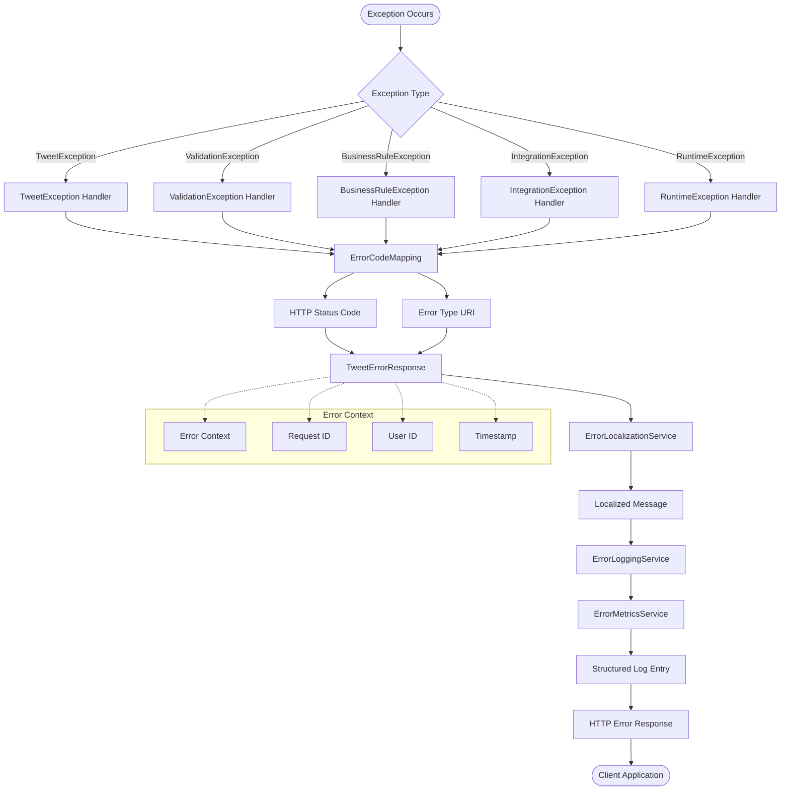

#### Диаграмма валидации данных

**Описание**: Многоуровневая система валидации данных, охватывающая все слои приложения от входных DTO до ограничений базы данных. Обеспечивает целостность данных и защиту от некорректного ввода.

**Уровни валидации**:
1. **DTO Validation**: Bean Validation на уровне контроллера
2. **Business Validation**: Проверка бизнес-правил в сервисном слое
3. **Entity Validation**: JPA валидация на уровне сущностей
4. **Database Validation**: Ограничения базы данных

**Типы валидации**:
- **Field Validation**: Проверка отдельных полей (размер, формат, обязательность)
- **Cross-Field Validation**: Проверка связей между полями
- **Business Rule Validation**: Проверка бизнес-логики
- **Database Validation**: Проверка ограничений БД

**Компоненты валидации**:
- **Bean Validation**: Стандартные аннотации (@NotNull, @Size, @Pattern)
- **Custom Validators**: Специализированные валидаторы для бизнес-правил
- **Business Rules**: Логика валидации в сервисном слое
- **Database Constraints**: Ограничения на уровне БД

**Обработка ошибок валидации**:
- **ValidationExceptionHandler**: Обработка ошибок валидации DTO
- **BusinessRuleExceptionHandler**: Обработка нарушений бизнес-правил
- **DatabaseExceptionHandler**: Обработка ошибок БД

**Альтернативные подходы**:
- **Schema Validation**: JSON Schema для валидации структуры
- **GraphQL Validation**: Встроенная валидация GraphQL
- **Async Validation**: Асинхронная валидация для сложных проверок

```mermaid
flowchart TD
    Request([HTTP Request]) --> Controller[TweetController]
    
    Controller --> DTOValidation{@Valid DTO}
    DTOValidation -->|Success| Service[TweetServiceImpl]
    DTOValidation -->|Error| ValidationHandler[ValidationExceptionHandler]
    
    Service --> BusinessValidation[TweetValidator]
    BusinessValidation -->|Success| Repository[TweetRepository]
    BusinessValidation -->|Error| BusinessHandler[BusinessRuleExceptionHandler]
    
    Repository --> EntityValidation[JPA Entity Validation]
    EntityValidation -->|Success| Database[(PostgreSQL)]
    EntityValidation -->|Error| DatabaseError[Database Constraint Error]
    
    Database -->|Success| Response([Success Response])
    Database -->|Error| DatabaseError
    
    subgraph "Validation Layers"
        BeanValidation[Bean Validation]
        CustomValidation[Custom Validators]
        BusinessRules[Business Rules]
        DatabaseConstraints[Database Constraints]
    end
    
    DTOValidation -.-> BeanValidation
    DTOValidation -.-> CustomValidation
    BusinessValidation -.-> BusinessRules
    EntityValidation -.-> DatabaseConstraints
    
    subgraph "Validation Types"
        FieldValidation[Field Validation]
        CrossFieldValidation[Cross-Field Validation]
        BusinessRuleValidation[Business Rule Validation]
        DatabaseValidation[Database Validation]
    end
    
    BeanValidation -.-> FieldValidation
    CustomValidation -.-> CrossFieldValidation
    BusinessRules -.-> BusinessRuleValidation
    DatabaseConstraints -.-> DatabaseValidation
    
    ValidationHandler --> ValidationResponse[ValidationErrorResponse]
    BusinessHandler --> BusinessResponse[BusinessRuleErrorResponse]
    DatabaseError --> DatabaseHandler[DatabaseExceptionHandler]
    
    ValidationResponse --> ErrorResponse([Error Response])
    BusinessResponse --> ErrorResponse
    DatabaseHandler --> ErrorResponse
```

### Диаграммы интеграции

#### Диаграмма взаимодействия с users-api

**Описание**: Детальная схема интеграции Tweet API Service с Users API Service, включающая все компоненты отказоустойчивости, кэширования и fallback стратегий. Обеспечивает надежное взаимодействие между микросервисами.

**Компоненты интеграции**:
- **UsersApiIntegrationService**: Основной сервис интеграции с users-api
- **UsersApiClient**: HTTP клиент для взаимодействия с внешним API
- **RestTemplate**: Spring компонент для HTTP запросов
- **CircuitBreaker**: Паттерн Circuit Breaker для защиты от сбоев
- **RetryMechanism**: Механизм повторных попыток
- **CacheManager**: Кэширование ответов для производительности
- **FallbackService**: Сервис fallback стратегий

**Стратегии отказоустойчивости**:
- **Circuit Breaker States**: CLOSED, OPEN, HALF_OPEN состояния
- **Fallback Strategies**: User, Conservative, Minimal стратегии
- **Degradation Levels**: Различные уровни деградации функциональности
- **Retry Logic**: Экспоненциальная задержка между попытками

**Кэширование**:
- **Response Caching**: Кэширование ответов users-api
- **TTL Strategy**: Time-to-live для кэшированных данных
- **Cache Invalidation**: Инвалидация кэша при обновлениях
- **Distributed Cache**: Возможность использования Redis

**Мониторинг интеграции**:
- **Circuit Breaker Metrics**: Метрики состояния Circuit Breaker
- **API Response Times**: Время ответа внешнего API
- **Error Rates**: Частота ошибок интеграции
- **Cache Hit Rates**: Эффективность кэширования

**Альтернативные подходы**:
- **Service Mesh**: Istio/Linkerd для управления трафиком
- **API Gateway**: Централизованный шлюз для всех внешних вызовов
- **Message Queue**: Асинхронная интеграция через Kafka/RabbitMQ
- **GraphQL Federation**: Объединение API через GraphQL

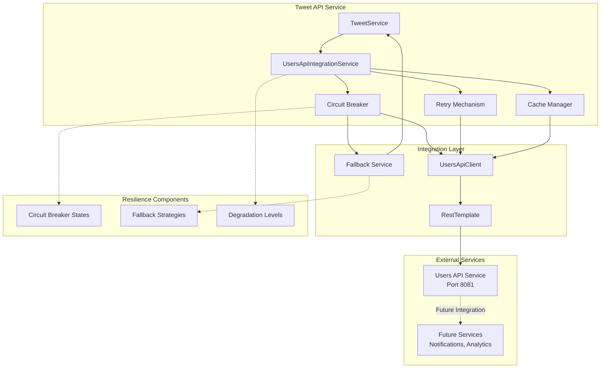

#### Диаграмма circuit breaker pattern

**Описание**: State machine диаграмма, показывающая поведение Circuit Breaker паттерна с тремя состояниями и переходами между ними. Обеспечивает защиту от каскадных сбоев при недоступности внешних сервисов.

**Состояния Circuit Breaker**:
- **CLOSED**: Нормальная работа, все вызовы проходят через
- **OPEN**: Защитный режим, все вызовы блокируются
- **HALF_OPEN**: Тестовый режим, ограниченные вызовы для проверки восстановления

**Условия переходов**:
- **CLOSED → OPEN**: При превышении порога ошибок или медленных вызовов
- **OPEN → HALF_OPEN**: После истечения времени ожидания или ручного сброса
- **HALF_OPEN → CLOSED**: При успешном тестовом вызове и низком проценте ошибок
- **HALF_OPEN → OPEN**: При неудачном тестовом вызове или высоком проценте ошибок

**Конфигурационные параметры**:
- **Failure Rate Threshold**: Порог процента ошибок (например, 50%)
- **Slow Call Rate Threshold**: Порог медленных вызовов (например, 50%)
- **Wait Duration**: Время ожидания в OPEN состоянии (например, 60 секунд)
- **Ring Buffer Size**: Размер буфера для подсчета метрик
- **Minimum Number of Calls**: Минимальное количество вызовов для оценки

**Мониторинг и метрики**:
- **State Transitions**: Отслеживание переходов между состояниями
- **Call Counts**: Количество успешных и неудачных вызовов
- **Response Times**: Время ответа внешнего сервиса
- **Error Rates**: Процент ошибок в каждом состоянии

**Альтернативные реализации**:
- **Hystrix**: Netflix библиотека (deprecated)
- **Resilience4j**: Современная Java библиотека (выбрана)
- **Spring Cloud Circuit Breaker**: Spring Cloud абстракция
- **Custom Implementation**: Собственная реализация для специфических требований

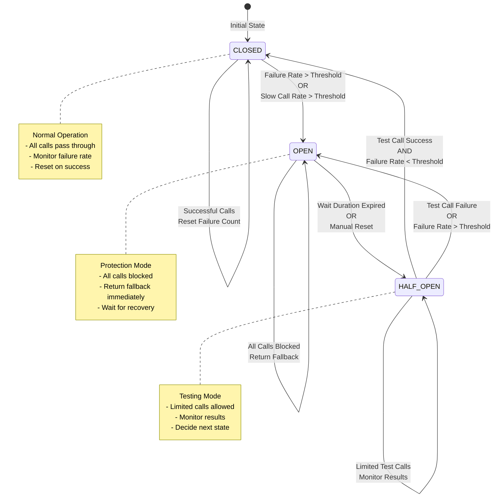

#### Диаграмма fallback стратегий

**Описание**: Комплексная логика выбора и выполнения fallback стратегий при недоступности внешних сервисов. Обеспечивает graceful degradation функциональности с минимальным влиянием на пользовательский опыт.

**Типы fallback стратегий**:
- **User Fallback Strategy**: Возврат кэшированных данных пользователя
- **Conservative Fallback Strategy**: Консервативный подход с минимальными данными
- **Minimal Fallback Strategy**: Минимальная функциональность для базовых операций

**Логика выбора стратегии**:
- **Circuit Breaker State**: Состояние влияет на выбор стратегии
- **Error Type**: Тип ошибки определяет подходящую стратегию
- **Data Availability**: Доступность кэшированных данных
- **User Context**: Контекст пользователя для персонализации

**Компоненты fallback**:
- **Fallback Selection**: Логика выбора подходящей стратегии
- **Data Retrieval**: Получение данных из альтернативных источников
- **Response Transformation**: Преобразование данных в ожидаемый формат
- **Error Handling**: Обработка ошибок в fallback режиме

**Кэширование для fallback**:
- **User Data Cache**: Кэш данных пользователей для fallback
- **Static Data Cache**: Кэш статических данных
- **Default Values**: Значения по умолчанию для критических полей
- **Cache Warming**: Предварительное заполнение кэша

**Мониторинг fallback**:
- **Fallback Usage**: Частота использования fallback стратегий
- **Data Freshness**: Свежесть кэшированных данных
- **User Satisfaction**: Метрики удовлетворенности пользователей
- **Recovery Time**: Время восстановления после сбоев

**Альтернативные подходы**:
- **Circuit Breaker with Fallback**: Комбинированный подход
- **Bulkhead Pattern**: Изоляция ресурсов для предотвращения каскадных сбоев
- **Timeout Pattern**: Таймауты для быстрого отказа
- **Retry with Backoff**: Повторные попытки с экспоненциальной задержкой

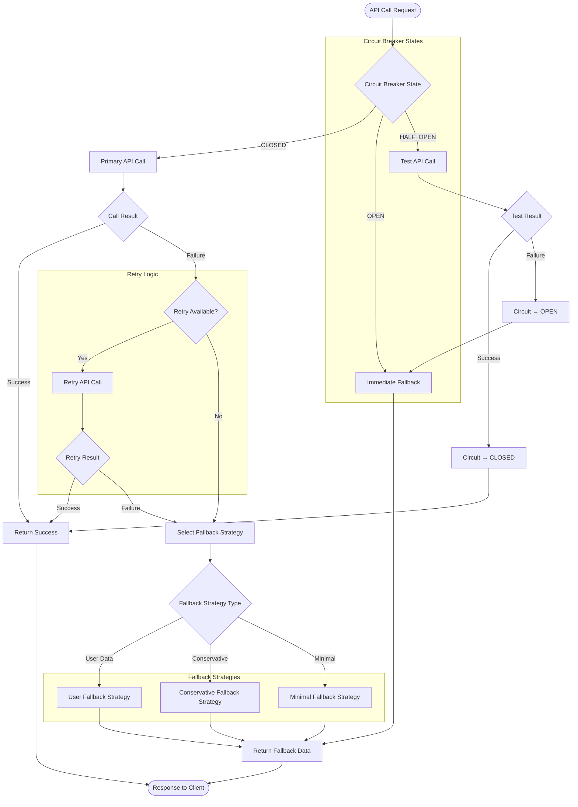

#### Диаграмма будущих интеграций

**Описание**: Стратегический план развития интеграций Tweet API Service с планируемыми и будущими сервисами. Показывает эволюцию архитектуры от текущих HTTP REST интеграций до продвинутых паттернов интеграции.

**Текущие интеграции**:
- **Users API Service**: Аутентификация и управление пользователями
- **PostgreSQL Database**: Основное хранилище данных
- **HTTP REST API**: Прямая синхронная интеграция

**Планируемые интеграции (Phase 1)**:
- **Notification Service**: Уведомления о новых твитах, лайках, ретвитах
- **Analytics Service**: Аналитика просмотров, взаимодействий, трендов
- **Media Service**: Загрузка и обработка изображений, видео
- **Search Service**: Полнотекстовый поиск по твитам и пользователям

**Будущие интеграции (Phase 2)**:
- **Recommendation Service**: Рекомендации контента и пользователей
- **Moderation Service**: Модерация контента и автоматическое удаление
- **Metrics Service**: Детальная аналитика и бизнес-метрики
- **Audit Service**: Аудит действий пользователей и системные логи

**Паттерны интеграции**:
- **HTTP REST API**: Прямая синхронная интеграция (текущий)
- **Message Queue**: Асинхронная интеграция через Kafka/RabbitMQ
- **Event Streaming**: Потоковая обработка событий в реальном времени
- **Service Mesh**: Продвинутое управление трафиком через Istio/Linkerd

**Эволюция интеграций**:
- **Phase 1**: HTTP REST - прямое взаимодействие между сервисами
- **Phase 2**: Message Queue - асинхронная обработка через очереди
- **Phase 3**: Event Streaming - потоковая обработка событий
- **Phase 4**: Service Mesh - централизованное управление интеграциями

**Преимущества эволюции**:
- **Масштабируемость**: Асинхронная обработка для высокой нагрузки
- **Отказоустойчивость**: Изоляция сервисов через очереди сообщений
- **Реальное время**: Потоковая обработка для мгновенных обновлений
- **Управляемость**: Централизованное управление через Service Mesh

**Технические требования**:
- **API Gateway**: Централизованная точка входа для всех сервисов
- **Service Discovery**: Автоматическое обнаружение сервисов
- **Load Balancing**: Распределение нагрузки между инстансами
- **Security**: Аутентификация и авторизация между сервисами

**Альтернативные подходы**:
- **Microservices**: Полное разделение на независимые сервисы
- **Monolith**: Единое приложение для простоты разработки
- **Hybrid**: Комбинация микросервисов и монолита
- **Serverless**: Функции как сервис для эластичности

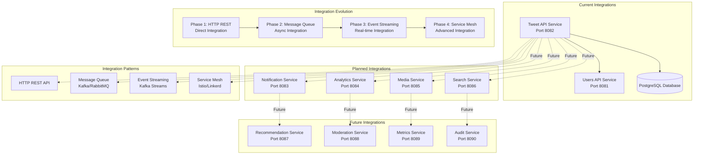

### Диаграммы развертывания

#### Диаграмма Docker контейнеров

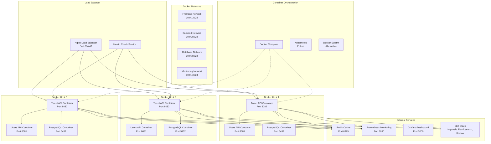

#### Диаграмма взаимодействия с БД

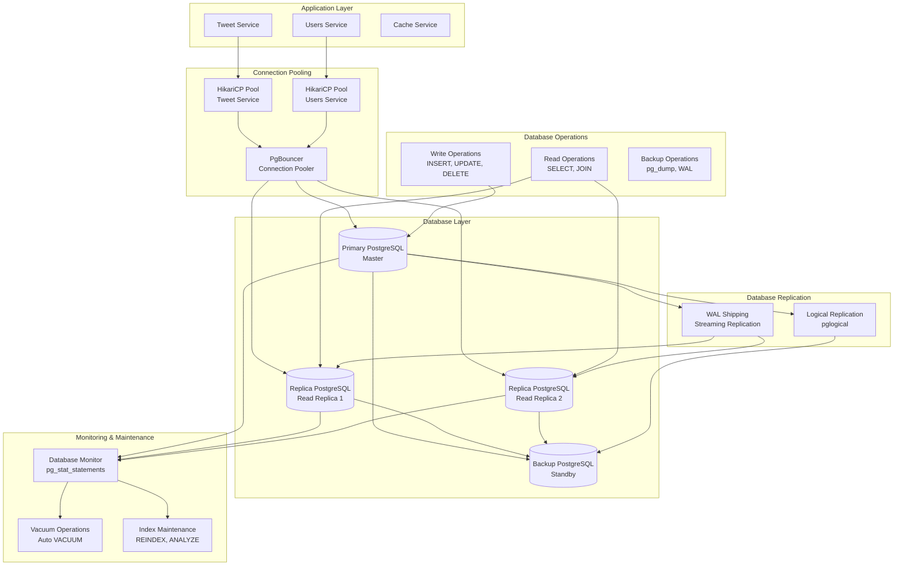

#### Диаграмма мониторинга и логирования

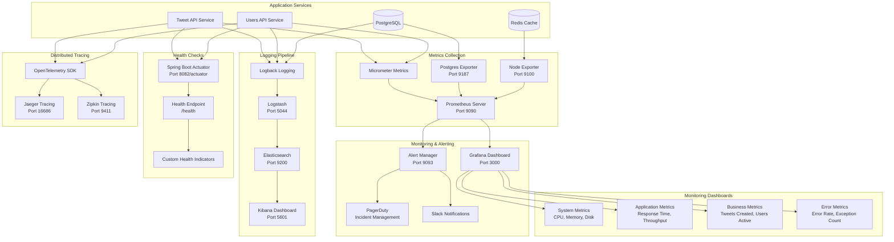

#### Диаграмма масштабирования

```mermaid
graph TB
    subgraph "Current Architecture"
        LoadBalancer[Load Balancer<br/>Nginx]
        TweetAPI1[Tweet API Instance 1<br/>Port 8082]
        TweetAPI2[Tweet API Instance 2<br/>Port 8082]
        UsersAPI1[Users API Instance 1<br/>Port 8081]
        UsersAPI2[Users API Instance 2<br/>Port 8081]
        Database[(PostgreSQL<br/>Single Instance)]
    end
    
    subgraph "Horizontal Scaling"
        TweetAPI3[Tweet API Instance 3<br/>Port 8082]
        TweetAPI4[Tweet API Instance 4<br/>Port 8082]
        UsersAPI3[Users API Instance 3<br/>Port 8081]
        UsersAPI4[Users API Instance 4<br/>Port 8081]
    end
    
    subgraph "Database Scaling"
        PrimaryDB[(Primary PostgreSQL<br/>Master)]
        ReadReplica1[(Read Replica 1<br/>Slave)]
        ReadReplica2[(Read Replica 2<br/>Slave)]
        ReadReplica3[(Read Replica 3<br/>Slave)]
    end
    
    subgraph "Caching Layer"
        RedisCluster[Redis Cluster<br/>3 Nodes]
        Memcached[Memcached Cluster<br/>Multiple Nodes]
        CDN[CDN<br/>CloudFlare/AWS CloudFront]
    end
    
    subgraph "Message Queue Scaling"
        KafkaCluster[Kafka Cluster<br/>3 Brokers]
        RabbitMQCluster[RabbitMQ Cluster<br/>3 Nodes]
    end
    
    subgraph "Container Orchestration"
        Kubernetes[Kubernetes Cluster<br/>3 Nodes]
        DockerSwarm[Docker Swarm<br/>Multiple Nodes]
        Nomad[Nomad Cluster<br/>Alternative]
    end
    
    subgraph "Auto Scaling"
        HPA[Horizontal Pod Autoscaler<br/>Kubernetes HPA]
        VPA[Vertical Pod Autoscaler<br/>Kubernetes VPA]
        ClusterAutoscaler[Cluster Autoscaler<br/>Node Scaling]
    end
    
    LoadBalancer --> TweetAPI1
    LoadBalancer --> TweetAPI2
    LoadBalancer --> TweetAPI3
    LoadBalancer --> TweetAPI4
    
    TweetAPI1 --> UsersAPI1
    TweetAPI2 --> UsersAPI2
    TweetAPI3 --> UsersAPI3
    TweetAPI4 --> UsersAPI4
    
    TweetAPI1 --> PrimaryDB
    TweetAPI2 --> PrimaryDB
    TweetAPI3 --> PrimaryDB
    TweetAPI4 --> PrimaryDB
    
    TweetAPI1 --> ReadReplica1
    TweetAPI2 --> ReadReplica2
    TweetAPI3 --> ReadReplica3
    TweetAPI4 --> ReadReplica1
    
    TweetAPI1 --> RedisCluster
    TweetAPI2 --> RedisCluster
    TweetAPI3 --> RedisCluster
    TweetAPI4 --> RedisCluster
    
    TweetAPI1 --> KafkaCluster
    TweetAPI2 --> KafkaCluster
    TweetAPI3 --> KafkaCluster
    TweetAPI4 --> KafkaCluster
    
    Kubernetes --> TweetAPI1
    Kubernetes --> TweetAPI2
    Kubernetes --> TweetAPI3
    Kubernetes --> TweetAPI4
    
    HPA --> Kubernetes
    VPA --> Kubernetes
    ClusterAutoscaler --> Kubernetes
    
    subgraph "Scaling Strategies"
        ScaleUp[Scale Up<br/>Increase Resources]
        ScaleOut[Scale Out<br/>Add Instances]
        ScaleDown[Scale Down<br/>Reduce Resources]
        ScaleIn[Scale In<br/>Remove Instances]
    end
    
    HPA --> ScaleOut
    HPA --> ScaleIn
    VPA --> ScaleUp
    VPA --> ScaleDown
    
    subgraph "Performance Targets"
        ResponseTime[Response Time<br/>< 200ms]
        Throughput[Throughput<br/>1000 RPS]
        Availability[Availability<br/>99.9%]
        Latency[Latency<br/>P95 < 500ms]
    end
    
    ScaleOut --> ResponseTime
    ScaleUp --> Throughput
    ScaleOut --> Availability
    ScaleUp --> Latency
```

---

## Ключевые архитектурные решения

### Производительность

#### Оптимизации:
- **Индексы БД** для частых запросов (user_id + created_at)
- **Кэширование** через Caffeine для часто запрашиваемых данных
- **Connection Pooling** через HikariCP для эффективного использования соединений
- **Lazy Loading** для связанных сущностей
- **Batch Operations** для массовых операций

#### Метрики производительности:
- **Response Time**: < 200ms для 95% запросов
- **Throughput**: 1000 RPS на инстанс
- **Database Query Time**: < 50ms для 95% запросов
- **Cache Hit Rate**: > 80%

### Отказоустойчивость

#### Стратегии:
- **Circuit Breaker** для внешних сервисов
- **Retry Mechanism** с экспоненциальной задержкой
- **Fallback Strategies** для graceful degradation
- **Health Checks** для мониторинга состояния
- **Graceful Shutdown** для корректного завершения

#### SLA:
- **Availability**: 99.9% (8.76 часов простоя в год)
- **Recovery Time**: < 5 минут
- **Data Consistency**: ACID транзакции
- **Error Rate**: < 0.1%

### Масштабируемость

#### Горизонтальное масштабирование:
- **Stateless Design** для легкого масштабирования
- **Load Balancing** через Nginx
- **Database Read Replicas** для распределения нагрузки чтения
- **Caching Layer** для снижения нагрузки на БД

#### Вертикальное масштабирование:
- **Resource Monitoring** для определения узких мест
- **Auto Scaling** на основе метрик
- **Performance Profiling** для оптимизации

### Безопасность

#### Аутентификация и авторизация:
- **JWT Tokens** для аутентификации
- **Role-based Access Control** для авторизации
- **API Rate Limiting** для защиты от злоупотреблений
- **Input Validation** для предотвращения инъекций

#### Защита данных:
- **SQL Injection Protection** через JPA
- **XSS Protection** через валидацию входных данных
- **CSRF Protection** через токены
- **Data Encryption** для чувствительных данных

---

## Технические детали

### Спецификации технологий и библиотек

#### Основной технологический стек

**Spring Boot 3.5.5**
- **Версия**: 3.5.5 (последняя стабильная)
- **Java версия**: 24 (LTS)
- **Web**: Spring Web MVC для REST API
- **Data**: Spring Data JPA для работы с БД
- **Security**: Spring Security для аутентификации
- **Actuator**: Spring Boot Actuator для мониторинга
- **Validation**: Bean Validation для валидации данных

**База данных**
- **PostgreSQL**: 15+ (рекомендуется 16+)
- **JPA Provider**: Hibernate 6.4+
- **Connection Pool**: HikariCP 5.0+
- **Migration**: Flyway 9.0+ для миграций схемы

**Интеграция и отказоустойчивость**
- **Resilience4j**: 2.1.0+ для Circuit Breaker и Retry
- **Spring Cloud OpenFeign**: 4.0.0+ для HTTP клиентов
- **Caffeine**: 3.1.0+ для кэширования
- **Spring Cache**: Абстракция для кэширования

**Документация и валидация**
- **OpenAPI**: SpringDoc OpenAPI 3 2.0+
- **MapStruct**: 1.5.5+ для маппинга DTO ↔ Entity
- **Bean Validation**: Jakarta Validation 3.0+

**Мониторинг и логирование**
- **Micrometer**: 1.12.0+ для метрик
- **Logback**: 1.4.0+ для логирования
- **SLF4J**: 2.0.0+ как фасад логирования

#### Зависимости Maven

```xml
<dependencies>
    <!-- Spring Boot Starters -->
    <dependency>
        <groupId>org.springframework.boot</groupId>
        <artifactId>spring-boot-starter-web</artifactId>
        <version>3.5.5</version>
    </dependency>
    <dependency>
        <groupId>org.springframework.boot</groupId>
        <artifactId>spring-boot-starter-data-jpa</artifactId>
        <version>3.5.5</version>
    </dependency>
    <dependency>
        <groupId>org.springframework.boot</groupId>
        <artifactId>spring-boot-starter-validation</artifactId>
        <version>3.5.5</version>
    </dependency>
    <dependency>
        <groupId>org.springframework.boot</groupId>
        <artifactId>spring-boot-starter-actuator</artifactId>
        <version>3.5.5</version>
    </dependency>
    <dependency>
        <groupId>org.springframework.boot</groupId>
        <artifactId>spring-boot-starter-cache</artifactId>
        <version>3.5.5</version>
    </dependency>
    
    <!-- Database -->
    <dependency>
        <groupId>org.postgresql</groupId>
        <artifactId>postgresql</artifactId>
        <version>42.7.0</version>
    </dependency>
    <dependency>
        <groupId>org.flywaydb</groupId>
        <artifactId>flyway-core</artifactId>
        <version>10.8.1</version>
    </dependency>
    
    <!-- Resilience4j -->
    <dependency>
        <groupId>io.github.resilience4j</groupId>
        <artifactId>resilience4j-spring-boot3</artifactId>
        <version>2.1.0</version>
    </dependency>
    <dependency>
        <groupId>io.github.resilience4j</groupId>
        <artifactId>resilience4j-circuitbreaker</artifactId>
        <version>2.1.0</version>
    </dependency>
    <dependency>
        <groupId>io.github.resilience4j</groupId>
        <artifactId>resilience4j-retry</artifactId>
        <version>2.1.0</version>
    </dependency>
    
    <!-- Caching -->
    <dependency>
        <groupId>com.github.ben-manes.caffeine</groupId>
        <artifactId>caffeine</artifactId>
        <version>3.1.8</version>
    </dependency>
    
    <!-- Mapping -->
    <dependency>
        <groupId>org.mapstruct</groupId>
        <artifactId>mapstruct</artifactId>
        <version>1.5.5.Final</version>
    </dependency>
    <dependency>
        <groupId>org.mapstruct</groupId>
        <artifactId>mapstruct-processor</artifactId>
        <version>1.5.5.Final</version>
        <scope>provided</scope>
    </dependency>
    
    <!-- Documentation -->
    <dependency>
        <groupId>org.springdoc</groupId>
        <artifactId>springdoc-openapi-starter-webmvc-ui</artifactId>
        <version>2.3.0</version>
    </dependency>
    
    <!-- Monitoring -->
    <dependency>
        <groupId>io.micrometer</groupId>
        <artifactId>micrometer-registry-prometheus</artifactId>
        <version>1.12.0</version>
    </dependency>
    
    <!-- Testing -->
    <dependency>
        <groupId>org.springframework.boot</groupId>
        <artifactId>spring-boot-starter-test</artifactId>
        <version>3.5.5</version>
        <scope>test</scope>
    </dependency>
    <dependency>
        <groupId>org.testcontainers</groupId>
        <artifactId>postgresql</artifactId>
        <version>1.19.3</version>
        <scope>test</scope>
    </dependency>
</dependencies>
```

### Конфигурационные параметры

#### application.yml

```yaml
server:
  port: 8082
  servlet:
    context-path: /api/v1

spring:
  application:
    name: tweet-api-service
  
  datasource:
    url: jdbc:postgresql://localhost:5432/twitter_tweet_db
    username: ${DB_USERNAME:tweet_user}
    password: ${DB_PASSWORD:tweet_password}
    driver-class-name: org.postgresql.Driver
    hikari:
      maximum-pool-size: 20
      minimum-idle: 5
      connection-timeout: 30000
      idle-timeout: 600000
      max-lifetime: 1800000
      leak-detection-threshold: 60000
  
  jpa:
    hibernate:
      ddl-auto: validate
    show-sql: false
    properties:
      hibernate:
        dialect: org.hibernate.dialect.PostgreSQLDialect
        format_sql: true
        jdbc:
          batch_size: 25
        order_inserts: true
        order_updates: true
  
  cache:
    type: caffeine
    caffeine:
      spec: maximumSize=1000,expireAfterWrite=300s
  
  flyway:
    enabled: true
    locations: classpath:db/migration
    baseline-on-migrate: true

management:
  endpoints:
    web:
      exposure:
        include: health,info,metrics,prometheus
  endpoint:
    health:
      show-details: when-authorized
  metrics:
    export:
      prometheus:
        enabled: true

resilience4j:
  circuitbreaker:
    instances:
      users-api:
        failure-rate-threshold: 50
        wait-duration-in-open-state: 60s
        sliding-window-size: 10
        minimum-number-of-calls: 5
        permitted-number-of-calls-in-half-open-state: 3
        automatic-transition-from-open-to-half-open-enabled: true
  retry:
    instances:
      users-api:
        max-attempts: 3
        wait-duration: 1s
        exponential-backoff-multiplier: 2
        retry-exceptions:
          - java.net.ConnectException
          - java.net.SocketTimeoutException
          - org.springframework.web.client.ResourceAccessException

logging:
  level:
    com.twitter.tweet: INFO
    org.springframework.web: DEBUG
    org.hibernate.SQL: DEBUG
    org.hibernate.type.descriptor.sql.BasicBinder: TRACE
  pattern:
    console: "%d{yyyy-MM-dd HH:mm:ss} [%thread] %-5level %logger{36} - %msg%n"
    file: "%d{yyyy-MM-dd HH:mm:ss} [%thread] %-5level %logger{36} - %msg%n"

tweet:
  api:
    users-service:
      url: http://localhost:8081/api/v1
      timeout: 5000
      retry-attempts: 3
    cache:
      user-data-ttl: 300
      tweet-data-ttl: 600
    pagination:
      default-size: 20
      max-size: 100
```

#### Docker Compose для разработки

```yaml
version: '3.8'

services:
  postgres:
    image: postgres:16-alpine
    container_name: twitter-postgres
    environment:
      POSTGRES_DB: twitter_tweet_db
      POSTGRES_USER: tweet_user
      POSTGRES_PASSWORD: tweet_password
    ports:
      - "5432:5432"
    volumes:
      - postgres_data:/var/lib/postgresql/data
      - ./sql:/docker-entrypoint-initdb.d
    networks:
      - twitter-network

  redis:
    image: redis:7-alpine
    container_name: twitter-redis
    ports:
      - "6379:6379"
    volumes:
      - redis_data:/data
    networks:
      - twitter-network

  prometheus:
    image: prom/prometheus:latest
    container_name: twitter-prometheus
    ports:
      - "9090:9090"
    volumes:
      - ./monitoring/prometheus.yml:/etc/prometheus/prometheus.yml
    networks:
      - twitter-network

  grafana:
    image: grafana/grafana:latest
    container_name: twitter-grafana
    ports:
      - "3000:3000"
    environment:
      - GF_SECURITY_ADMIN_PASSWORD=admin
    volumes:
      - grafana_data:/var/lib/grafana
    networks:
      - twitter-network

volumes:
  postgres_data:
  redis_data:
  grafana_data:

networks:
  twitter-network:
    driver: bridge
```

### Настройки производительности

#### Оптимизация базы данных

**Индексы PostgreSQL**:
```sql
-- Основные индексы для производительности
CREATE INDEX CONCURRENTLY idx_tweets_user_id_created_at 
ON tweets (user_id, created_at DESC);

CREATE INDEX CONCURRENTLY idx_tweets_content_gin 
ON tweets USING gin (to_tsvector('english', content));

CREATE INDEX CONCURRENTLY idx_likes_tweet_id 
ON likes (tweet_id);

CREATE INDEX CONCURRENTLY idx_likes_user_id 
ON likes (user_id);

CREATE INDEX CONCURRENTLY idx_retweets_tweet_id 
ON retweets (tweet_id);

CREATE INDEX CONCURRENTLY idx_retweets_user_id 
ON retweets (user_id);

-- Составные индексы для сложных запросов
CREATE INDEX CONCURRENTLY idx_tweets_user_created_content 
ON tweets (user_id, created_at DESC) 
WHERE deleted_at IS NULL;
```

**Настройки PostgreSQL**:
```sql
-- Оптимизация для производительности
ALTER SYSTEM SET shared_buffers = '256MB';
ALTER SYSTEM SET effective_cache_size = '1GB';
ALTER SYSTEM SET maintenance_work_mem = '64MB';
ALTER SYSTEM SET checkpoint_completion_target = 0.9;
ALTER SYSTEM SET wal_buffers = '16MB';
ALTER SYSTEM SET default_statistics_target = 100;
ALTER SYSTEM SET random_page_cost = 1.1;
ALTER SYSTEM SET effective_io_concurrency = 200;

-- Перезагрузка конфигурации
SELECT pg_reload_conf();
```

#### Настройки JVM

**JVM параметры для production**:
```bash
# Оптимизация для Spring Boot приложения
JAVA_OPTS="-Xms512m -Xmx1024m \
  -XX:+UseG1GC \
  -XX:MaxGCPauseMillis=200 \
  -XX:+UseStringDeduplication \
  -XX:+OptimizeStringConcat \
  -XX:+UseCompressedOops \
  -XX:+UseCompressedClassPointers \
  -XX:+TieredCompilation \
  -XX:TieredStopAtLevel=1 \
  -Djava.security.egd=file:/dev/./urandom \
  -Dspring.profiles.active=production"
```

#### Настройки кэширования

**Caffeine конфигурация**:
```java
@Configuration
@EnableCaching
public class CacheConfig {
    
    @Bean
    public CacheManager cacheManager() {
        CaffeineCacheManager cacheManager = new CaffeineCacheManager();
        cacheManager.setCaffeine(Caffeine.newBuilder()
            .maximumSize(1000)
            .expireAfterWrite(Duration.ofMinutes(5))
            .expireAfterAccess(Duration.ofMinutes(2))
            .recordStats());
        return cacheManager;
    }
    
    @Bean
    public Cache<String, UserDto> userCache() {
        return Caffeine.newBuilder()
            .maximumSize(500)
            .expireAfterWrite(Duration.ofMinutes(10))
            .recordStats()
            .build();
    }
}
```

### Планы тестирования архитектуры

#### Стратегия тестирования

**Пирамида тестирования**:
1. **Unit Tests (70%)**: Тестирование отдельных компонентов
2. **Integration Tests (20%)**: Тестирование взаимодействия компонентов
3. **End-to-End Tests (10%)**: Тестирование полных пользовательских сценариев

#### Unit Tests

**Примеры unit тестов**:
```java
@ExtendWith(MockitoExtension.class)
class TweetServiceTest {
    
    @Mock
    private TweetRepository tweetRepository;
    
    @Mock
    private UsersApiIntegrationService usersApiService;
    
    @InjectMocks
    private TweetServiceImpl tweetService;
    
    @Test
    void shouldCreateTweetSuccessfully() {
        // Given
        TweetRequestDto requestDto = new TweetRequestDto();
        requestDto.setContent("Test tweet content");
        requestDto.setUserId(1L);
        
        UserDto userDto = new UserDto();
        userDto.setId(1L);
        userDto.setUsername("testuser");
        
        when(usersApiService.getUserById(1L)).thenReturn(userDto);
        when(tweetRepository.save(any(TweetEntity.class)))
            .thenReturn(new TweetEntity());
        
        // When
        TweetResponseDto result = tweetService.createTweet(requestDto);
        
        // Then
        assertThat(result).isNotNull();
        assertThat(result.getContent()).isEqualTo("Test tweet content");
        verify(tweetRepository).save(any(TweetEntity.class));
    }
    
    @Test
    void shouldThrowExceptionWhenUserNotFound() {
        // Given
        TweetRequestDto requestDto = new TweetRequestDto();
        requestDto.setUserId(999L);
        
        when(usersApiService.getUserById(999L))
            .thenThrow(new UserNotFoundException("User not found"));
        
        // When & Then
        assertThatThrownBy(() -> tweetService.createTweet(requestDto))
            .isInstanceOf(UserNotFoundException.class)
            .hasMessage("User not found");
    }
}
```

#### Integration Tests

**Тестирование с TestContainers**:
```java
@SpringBootTest
@Testcontainers
class TweetControllerIntegrationTest {
    
    @Container
    static PostgreSQLContainer<?> postgres = new PostgreSQLContainer<>("postgres:16-alpine")
            .withDatabaseName("test_tweet_db")
            .withUsername("test_user")
            .withPassword("test_password");
    
    @Autowired
    private TestRestTemplate restTemplate;
    
    @Autowired
    private TweetRepository tweetRepository;
    
    @Test
    void shouldCreateTweetViaRestApi() {
        // Given
        TweetRequestDto request = new TweetRequestDto();
        request.setContent("Integration test tweet");
        request.setUserId(1L);
        
        // When
        ResponseEntity<TweetResponseDto> response = restTemplate.postForEntity(
            "/api/v1/tweets", 
            request, 
            TweetResponseDto.class
        );
        
        // Then
        assertThat(response.getStatusCode()).isEqualTo(HttpStatus.CREATED);
        assertThat(response.getBody().getContent()).isEqualTo("Integration test tweet");
        
        // Verify database
        List<TweetEntity> tweets = tweetRepository.findAll();
        assertThat(tweets).hasSize(1);
        assertThat(tweets.get(0).getContent()).isEqualTo("Integration test tweet");
    }
}
```

#### Performance Tests

**Нагрузочное тестирование с JMeter**:
```xml
<!-- JMeter Test Plan для нагрузочного тестирования -->
<?xml version="1.0" encoding="UTF-8"?>
<jmeterTestPlan version="1.2">
  <hashTree>
    <TestPlan testname="Tweet API Performance Test">
      <elementProp name="TestPlan.arguments" elementType="Arguments" guiclass="ArgumentsPanel">
        <collectionProp name="Arguments.arguments"/>
      </elementProp>
      <stringProp name="TestPlan.user_define_classpath"></stringProp>
      <boolProp name="TestPlan.functional_mode">false</boolProp>
      <boolProp name="TestPlan.serialize_threadgroups">false</boolProp>
      <elementProp name="TestPlan.arguments" elementType="Arguments" guiclass="ArgumentsPanel">
        <collectionProp name="Arguments.arguments"/>
      </elementProp>
      <stringProp name="TestPlan.user_define_classpath"></stringProp>
      <boolProp name="TestPlan.functional_mode">false</boolProp>
      <boolProp name="TestPlan.serialize_threadgroups">false</boolProp>
    </TestPlan>
    <hashTree>
      <ThreadGroup testname="Tweet API Load Test">
        <stringProp name="ThreadGroup.num_threads">100</stringProp>
        <stringProp name="ThreadGroup.ramp_time">60</stringProp>
        <stringProp name="ThreadGroup.duration">300</stringProp>
        <boolProp name="ThreadGroup.scheduler">true</boolProp>
      </ThreadGroup>
    </hashTree>
  </hashTree>
</jmeterTestPlan>
```

#### Мониторинг и метрики

**Ключевые метрики для мониторинга**:
- **Response Time**: P50, P95, P99 латентность
- **Throughput**: RPS (Requests Per Second)
- **Error Rate**: Процент ошибок
- **Database Metrics**: Connection pool, query time
- **Cache Metrics**: Hit rate, miss rate
- **Circuit Breaker Metrics**: State transitions, failure rate

**Grafana Dashboard конфигурация**:
```json
{
  "dashboard": {
    "title": "Tweet API Service Dashboard",
    "panels": [
      {
        "title": "Response Time",
        "type": "graph",
        "targets": [
          {
            "expr": "histogram_quantile(0.95, rate(http_server_requests_seconds_bucket[5m]))"
          }
        ]
      },
      {
        "title": "Throughput",
        "type": "graph",
        "targets": [
          {
            "expr": "rate(http_server_requests_total[5m])"
          }
        ]
      },
      {
        "title": "Error Rate",
        "type": "graph",
        "targets": [
          {
            "expr": "rate(http_server_requests_total{status=~\"5..\"}[5m]) / rate(http_server_requests_total[5m])"
          }
        ]
      }
    ]
  }
}
```

---

## Готовность к реализации

### Архитектурные решения

✅ **Все архитектурные решения приняты и задокументированы**
- Слоистая архитектура с четким разделением ответственности
- Микросервисные принципы для отказоустойчивости и масштабируемости
- Стратегии интеграции с внешними сервисами
- План развертывания и мониторинга

### Технические детали

✅ **Все технические детали определены**
- Технологический стек выбран и обоснован
- Паттерны проектирования определены
- Стратегии обработки ошибок разработаны
- План масштабирования создан

### Следующие шаги

1. **Реализация базовой структуры проекта**
   - Создание Spring Boot приложения
   - Настройка зависимостей
   - Конфигурация базы данных

2. **Реализация слоев архитектуры**
   - Controller Layer с REST endpoints
   - Service Layer с бизнес-логикой
   - Repository Layer с JPA
   - DTO/Mapper Layer с MapStruct

3. **Интеграция с внешними сервисами**
   - Users API интеграция
   - Circuit Breaker настройка
   - Fallback стратегии

4. **Настройка мониторинга и логирования**
   - Prometheus метрики
   - ELK Stack для логирования
   - Health checks

5. **Тестирование и развертывание**
   - Unit и Integration тесты
   - Docker контейнеризация
   - CI/CD pipeline

---

**Статус**: Архитектурное проектирование завершено ✅  
**Готовность к реализации**: 100% ✅  
**Следующий этап**: Начало реализации сервиса