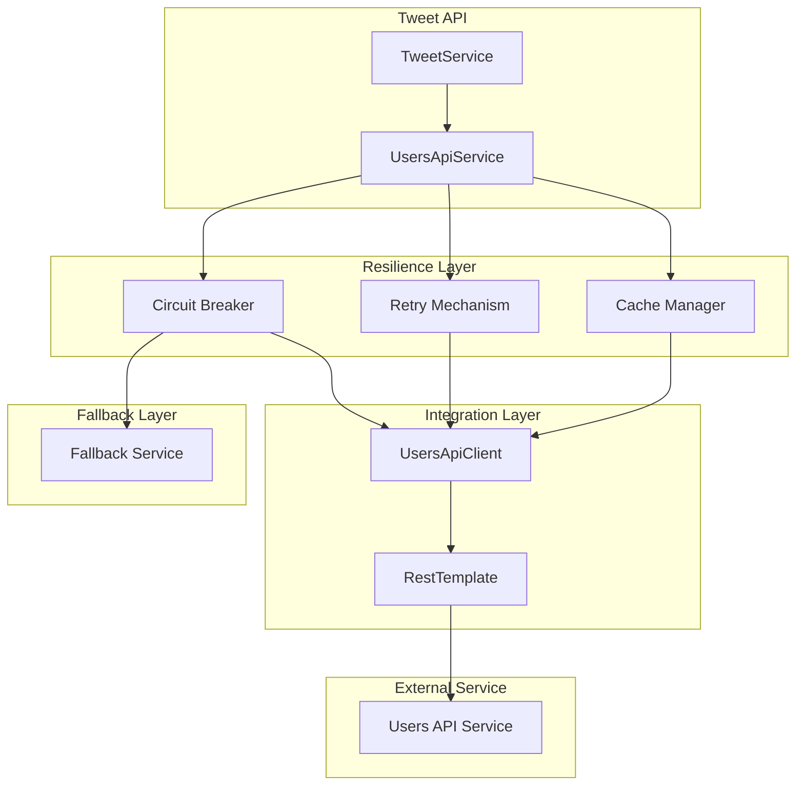
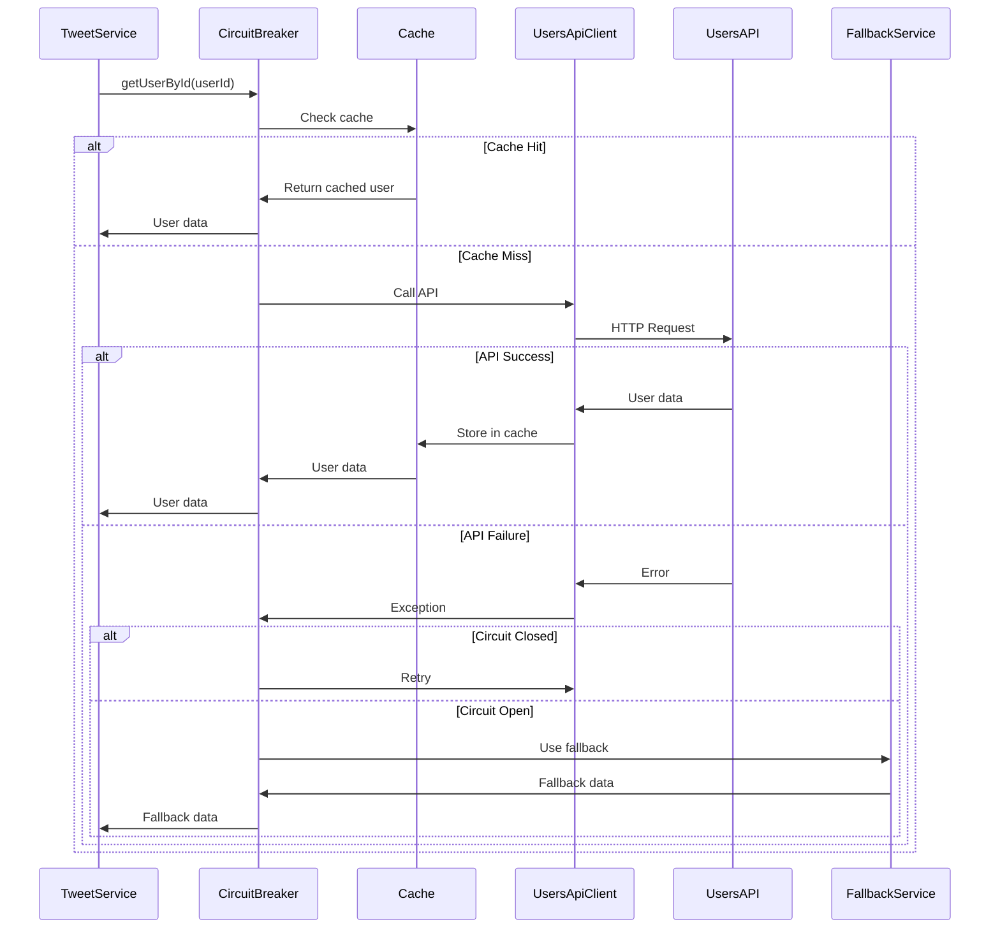

# Проектирование интеграции с users-api для Tweet API

## Meta
- project: twitter-tweet-api
- design_date: 2025-01-27
- designer: AI Assistant
- version: 1.0
- status: completed
- integration: users-api

## Executive Summary

Данный документ содержит детальное проектирование интеграции с users-api для сервиса Tweet API. Проектирование основано на принципах микросервисной архитектуры, отказоустойчивости и производительности.

## 1. Архитектурные принципы интеграции

### 1.1 Основные принципы

#### Микросервисная интеграция:
- **HTTP REST API** для синхронного взаимодействия
- **Circuit Breaker** для отказоустойчивости
- **Retry механизмы** для обработки временных сбоев
- **Fallback стратегии** для graceful degradation

#### Паттерны интеграции:
```java
@Service
@RequiredArgsConstructor
public class UsersApiIntegrationService {
    
    private final UsersApiClient usersApiClient;
    private final CircuitBreaker circuitBreaker;
    private final CacheManager cacheManager;
    
    @Retryable(value = {UsersApiException.class}, maxAttempts = 3, backoff = @Backoff(delay = 1000))
    @CircuitBreaker(name = "users-api", fallbackMethod = "getUserByIdFallback")
    @Cacheable(value = "users", key = "#userId")
    public Optional<UserResponseDto> getUserById(UUID userId) {
        return usersApiClient.getUserById(userId);
    }
    
    public Optional<UserResponseDto> getUserByIdFallback(UUID userId, Exception ex) {
        log.warn("Users API unavailable, using fallback for user: {}", userId);
        return Optional.of(UserResponseDto.builder()
            .id(userId)
            .status(UserStatus.ACTIVE)
            .role(UserRole.USER)
            .build());
    }
}
```

### 1.2 Ключевые компоненты

#### Клиент для users-api:
- **UsersApiClient** - интерфейс для взаимодействия
- **UsersApiClientImpl** - реализация с HTTP клиентом
- **Circuit Breaker** - защита от каскадных сбоев
- **Retry механизм** - повторные попытки при временных сбоях

## 2. Проектирование HTTP клиента

### 2.1 UsersApiClient интерфейс

#### Контракт взаимодействия:
```java
@Component
public interface UsersApiClient {
    
    /**
     * Получение пользователя по ID
     */
    Optional<UserResponseDto> getUserById(UUID userId);
    
    /**
     * Получение множественных пользователей по ID
     */
    List<UserResponseDto> getUsersByIds(List<UUID> userIds);
    
    /**
     * Проверка существования пользователя
     */
    boolean existsUser(UUID userId);
    
    /**
     * Проверка активности пользователя
     */
    boolean isUserActive(UUID userId);
    
    /**
     * Получение роли пользователя
     */
    UserRole getUserRole(UUID userId);
    
    /**
     * Получение статуса пользователя
     */
    UserStatus getUserStatus(UUID userId);
    
    /**
     * Batch проверка активности пользователей
     */
    Map<UUID, Boolean> checkUsersActiveStatus(List<UUID> userIds);
}
```

### 2.2 UsersApiClientImpl реализация

#### HTTP клиент с обработкой ошибок:
```java
@Service
@RequiredArgsConstructor
@Slf4j
public class UsersApiClientImpl implements UsersApiClient {
    
    private final RestTemplate restTemplate;
    private final UsersApiProperties properties;
    
    @Override
    public Optional<UserResponseDto> getUserById(UUID userId) {
        try {
            String url = properties.getBaseUrl() + "/api/v1/users/{userId}";
            ResponseEntity<UserResponseDto> response = restTemplate.getForEntity(
                url, 
                UserResponseDto.class, 
                userId
            );
            
            if (response.getStatusCode() == HttpStatus.OK && response.getBody() != null) {
                return Optional.of(response.getBody());
            }
            
            return Optional.empty();
            
        } catch (HttpClientErrorException.NotFound e) {
            log.debug("User not found: {}", userId);
            return Optional.empty();
            
        } catch (HttpClientErrorException e) {
            log.warn("Client error when getting user {}: {}", userId, e.getMessage());
            throw new UsersApiException("Client error: " + e.getMessage(), e);
            
        } catch (HttpServerErrorException e) {
            log.error("Server error when getting user {}: {}", userId, e.getMessage());
            throw new UsersApiException("Server error: " + e.getMessage(), e);
            
        } catch (ResourceAccessException e) {
            log.error("Connection timeout when getting user {}: {}", userId, e.getMessage());
            throw new UsersApiException("Connection timeout: " + e.getMessage(), e);
            
        } catch (Exception e) {
            log.error("Unexpected error when getting user {}: {}", userId, e.getMessage(), e);
            throw new UsersApiException("Unexpected error: " + e.getMessage(), e);
        }
    }
    
    @Override
    public List<UserResponseDto> getUsersByIds(List<UUID> userIds) {
        try {
            String url = properties.getBaseUrl() + "/api/v1/users/batch";
            
            BatchUsersRequestDto request = BatchUsersRequestDto.builder()
                .userIds(userIds)
                .build();
            
            HttpHeaders headers = new HttpHeaders();
            headers.setContentType(MediaType.APPLICATION_JSON);
            HttpEntity<BatchUsersRequestDto> entity = new HttpEntity<>(request, headers);
            
            ResponseEntity<BatchUsersResponseDto> response = restTemplate.postForEntity(
                url, 
                entity, 
                BatchUsersResponseDto.class
            );
            
            if (response.getStatusCode() == HttpStatus.OK && response.getBody() != null) {
                return response.getBody().getUsers();
            }
            
            return Collections.emptyList();
            
        } catch (Exception e) {
            log.error("Error getting users by IDs {}: {}", userIds, e.getMessage(), e);
            throw new UsersApiException("Error getting users by IDs: " + e.getMessage(), e);
        }
    }
    
    @Override
    public boolean existsUser(UUID userId) {
        try {
            String url = properties.getBaseUrl() + "/api/v1/users/{userId}/exists";
            ResponseEntity<Boolean> response = restTemplate.getForEntity(
                url, 
                Boolean.class, 
                userId
            );
            
            return response.getStatusCode() == HttpStatus.OK && 
                   Boolean.TRUE.equals(response.getBody());
            
        } catch (HttpClientErrorException.NotFound e) {
            return false;
            
        } catch (Exception e) {
            log.warn("Error checking user existence {}: {}", userId, e.getMessage());
            throw new UsersApiException("Error checking user existence: " + e.getMessage(), e);
        }
    }
    
    @Override
    public boolean isUserActive(UUID userId) {
        Optional<UserResponseDto> user = getUserById(userId);
        return user.isPresent() && user.get().status() == UserStatus.ACTIVE;
    }
    
    @Override
    public UserRole getUserRole(UUID userId) {
        Optional<UserResponseDto> user = getUserById(userId);
        return user.map(UserResponseDto::role).orElse(UserRole.USER);
    }
    
    @Override
    public UserStatus getUserStatus(UUID userId) {
        Optional<UserResponseDto> user = getUserById(userId);
        return user.map(UserResponseDto::status).orElse(UserStatus.INACTIVE);
    }
    
    @Override
    public Map<UUID, Boolean> checkUsersActiveStatus(List<UUID> userIds) {
        try {
            List<UserResponseDto> users = getUsersByIds(userIds);
            
            return users.stream()
                .collect(Collectors.toMap(
                    UserResponseDto::id,
                    user -> user.status() == UserStatus.ACTIVE
                ));
                
        } catch (Exception e) {
            log.error("Error checking users active status {}: {}", userIds, e.getMessage(), e);
            throw new UsersApiException("Error checking users active status: " + e.getMessage(), e);
        }
    }
}
```

## 3. Проектирование Circuit Breaker

### 3.1 Circuit Breaker конфигурация

#### Resilience4j конфигурация:
```java
@Configuration
@EnableConfigurationProperties(UsersApiProperties.class)
public class CircuitBreakerConfig {
    
    @Bean
    public CircuitBreaker usersApiCircuitBreaker() {
        CircuitBreakerConfig config = CircuitBreakerConfig.custom()
            .failureRateThreshold(50)                    // 50% failure rate threshold
            .waitDurationInOpenState(Duration.ofSeconds(30)) // Wait 30s before trying again
            .slidingWindowSize(10)                       // Last 10 calls
            .minimumNumberOfCalls(5)                     // Minimum 5 calls before calculating failure rate
            .permittedNumberOfCallsInHalfOpenState(3)    // Allow 3 calls in half-open state
            .automaticTransitionFromOpenToHalfOpenEnabled(true)
            .recordExceptions(UsersApiException.class)  // Record these exceptions as failures
            .ignoreExceptions(HttpClientErrorException.NotFound.class) // Don't count 404 as failure
            .build();
            
        return CircuitBreaker.of("users-api", config);
    }
    
    @Bean
    public Retry usersApiRetry() {
        RetryConfig config = RetryConfig.custom()
            .maxAttempts(3)                              // Maximum 3 attempts
            .waitDuration(Duration.ofMillis(1000))       // Wait 1s between attempts
            .retryExceptions(UsersApiException.class)    // Retry on these exceptions
            .ignoreExceptions(HttpClientErrorException.NotFound.class) // Don't retry on 404
            .build();
            
        return Retry.of("users-api", config);
    }
    
    @Bean
    public TimeLimiter usersApiTimeLimiter() {
        TimeLimiterConfig config = TimeLimiterConfig.custom()
            .timeoutDuration(Duration.ofSeconds(5))     // 5 second timeout
            .build();
            
        return TimeLimiter.of("users-api", config);
    }
}
```

### 3.2 Использование Circuit Breaker

#### В сервисном слое:
```java
@Service
@RequiredArgsConstructor
@Slf4j
public class TweetServiceImpl implements TweetService {
    
    private final UsersApiClient usersApiClient;
    private final CircuitBreaker circuitBreaker;
    private final Retry retry;
    private final TimeLimiter timeLimiter;
    
    @Override
    @Transactional
    public TweetResponseDto createTweet(CreateTweetRequestDto request) {
        // Проверка пользователя с Circuit Breaker
        UserResponseDto user = circuitBreaker.executeSupplier(() -> 
            usersApiClient.getUserById(request.userId())
                .orElseThrow(() -> new UserNotFoundException(request.userId()))
        );
        
        // Проверка статуса пользователя
        if (user.status() != UserStatus.ACTIVE) {
            throw new BusinessRuleValidationException(
                "INACTIVE_USER", 
                "Cannot create tweet for inactive user: " + request.userId()
            );
        }
        
        // Создание твита...
        Tweet tweet = tweetMapper.toTweet(request);
        Tweet savedTweet = tweetRepository.saveAndFlush(tweet);
        
        return tweetMapper.toTweetResponseDto(savedTweet);
    }
    
    @Override
    @Transactional(readOnly = true)
    public Page<TweetResponseDto> getUserTweets(UUID userId, Pageable pageable) {
        // Проверка пользователя с Retry
        UserResponseDto user = retry.executeSupplier(() -> 
            usersApiClient.getUserById(userId)
                .orElseThrow(() -> new UserNotFoundException(userId))
        );
        
        // Получение твитов...
        Page<Tweet> tweets = tweetRepository.findByUserIdAndNotDeletedOrderByCreatedAtDesc(
            userId, 
            pageable
        );
        
        return tweets.map(tweetMapper::toTweetResponseDto);
    }
}
```

## 4. Проектирование Fallback стратегий

### 4.1 Fallback сервис

#### Graceful degradation:
```java
@Service
@Slf4j
public class UsersApiFallbackService implements UsersApiClient {
    
    @Override
    public Optional<UserResponseDto> getUserById(UUID userId) {
        log.warn("Users API unavailable, using fallback for user: {}", userId);
        
        // Fallback: возврат минимальной информации о пользователе
        UserResponseDto fallbackUser = UserResponseDto.builder()
            .id(userId)
            .login("unknown_user")
            .firstName("Unknown")
            .lastName("User")
            .email("unknown@example.com")
            .status(UserStatus.ACTIVE)  // Предполагаем активный статус
            .role(UserRole.USER)        // Предполагаем обычного пользователя
            .createdAt(LocalDateTime.now())
            .build();
            
        return Optional.of(fallbackUser);
    }
    
    @Override
    public List<UserResponseDto> getUsersByIds(List<UUID> userIds) {
        log.warn("Users API unavailable, using fallback for users: {}", userIds);
        
        return userIds.stream()
            .map(this::getUserById)
            .filter(Optional::isPresent)
            .map(Optional::get)
            .collect(Collectors.toList());
    }
    
    @Override
    public boolean existsUser(UUID userId) {
        log.warn("Users API unavailable, assuming user exists: {}", userId);
        return true; // Предполагаем, что пользователь существует
    }
    
    @Override
    public boolean isUserActive(UUID userId) {
        log.warn("Users API unavailable, assuming user is active: {}", userId);
        return true; // Предполагаем активный статус
    }
    
    @Override
    public UserRole getUserRole(UUID userId) {
        log.warn("Users API unavailable, assuming user role: {}", userId);
        return UserRole.USER; // Предполагаем обычного пользователя
    }
    
    @Override
    public UserStatus getUserStatus(UUID userId) {
        log.warn("Users API unavailable, assuming user status: {}", userId);
        return UserStatus.ACTIVE; // Предполагаем активный статус
    }
    
    @Override
    public Map<UUID, Boolean> checkUsersActiveStatus(List<UUID> userIds) {
        log.warn("Users API unavailable, assuming all users are active: {}", userIds);
        
        return userIds.stream()
            .collect(Collectors.toMap(
                Function.identity(),
                userId -> true // Предполагаем, что все пользователи активны
            ));
    }
}
```

### 4.2 Условные Fallback стратегии

#### Адаптивные стратегии:
```java
@Service
@RequiredArgsConstructor
public class AdaptiveUsersApiService {
    
    private final UsersApiClient primaryClient;
    private final UsersApiFallbackService fallbackService;
    private final CircuitBreaker circuitBreaker;
    
    public Optional<UserResponseDto> getUserById(UUID userId) {
        CircuitBreaker.State state = circuitBreaker.getState();
        
        switch (state) {
            case CLOSED:
                // Нормальная работа - используем основной клиент
                return primaryClient.getUserById(userId);
                
            case OPEN:
                // Circuit Breaker открыт - используем fallback
                log.warn("Circuit breaker is OPEN, using fallback for user: {}", userId);
                return fallbackService.getUserById(userId);
                
            case HALF_OPEN:
                // Пробуем основной клиент, но готовы к fallback
                try {
                    return primaryClient.getUserById(userId);
                } catch (Exception e) {
                    log.warn("Primary client failed in HALF_OPEN state, using fallback: {}", e.getMessage());
                    return fallbackService.getUserById(userId);
                }
                
            default:
                return fallbackService.getUserById(userId);
        }
    }
    
    public boolean isUserActive(UUID userId) {
        // Для критических операций используем более консервативный подход
        try {
            return primaryClient.isUserActive(userId);
        } catch (Exception e) {
            log.warn("Primary client failed, using conservative fallback for user: {}", userId);
            // Консервативный подход: предполагаем неактивного пользователя
            return false;
        }
    }
}
```

## 5. Проектирование кэширования

### 5.1 Кэш конфигурация

#### Caffeine кэш:
```java
@Configuration
@EnableCaching
public class CacheConfig {
    
    @Bean
    public CacheManager cacheManager() {
        CaffeineCacheManager cacheManager = new CaffeineCacheManager();
        cacheManager.setCaffeine(Caffeine.newBuilder()
            .maximumSize(1000)                    // Максимум 1000 записей
            .expireAfterWrite(Duration.ofMinutes(5)) // Истекает через 5 минут
            .expireAfterAccess(Duration.ofMinutes(2)) // Истекает при неиспользовании 2 минуты
            .recordStats()                         // Включить статистику
        );
        return cacheManager;
    }
    
    @Bean
    public CacheResolver cacheResolver() {
        return new SimpleCacheResolver(cacheManager());
    }
}
```

### 5.2 Кэшированный клиент

#### Кэширование пользователей:
```java
@Service
@RequiredArgsConstructor
@Slf4j
public class CachedUsersApiService implements UsersApiClient {
    
    private final UsersApiClient delegate;
    
    @Override
    @Cacheable(value = "users", key = "#userId")
    public Optional<UserResponseDto> getUserById(UUID userId) {
        log.debug("Cache miss for user: {}, fetching from API", userId);
        return delegate.getUserById(userId);
    }
    
    @Override
    @Cacheable(value = "user-exists", key = "#userId")
    public boolean existsUser(UUID userId) {
        log.debug("Cache miss for user existence: {}, fetching from API", userId);
        return delegate.existsUser(userId);
    }
    
    @Override
    @Cacheable(value = "user-active", key = "#userId")
    public boolean isUserActive(UUID userId) {
        log.debug("Cache miss for user active status: {}, fetching from API", userId);
        return delegate.isUserActive(userId);
    }
    
    @Override
    @Cacheable(value = "user-role", key = "#userId")
    public UserRole getUserRole(UUID userId) {
        log.debug("Cache miss for user role: {}, fetching from API", userId);
        return delegate.getUserRole(userId);
    }
    
    @Override
    @Cacheable(value = "user-status", key = "#userId")
    public UserStatus getUserStatus(UUID userId) {
        log.debug("Cache miss for user status: {}, fetching from API", userId);
        return delegate.getUserStatus(userId);
    }
    
    // Методы для управления кэшем
    @CacheEvict(value = {"users", "user-exists", "user-active", "user-role", "user-status"}, key = "#userId")
    public void evictUserCache(UUID userId) {
        log.info("Evicting cache for user: {}", userId);
    }
    
    @CacheEvict(value = {"users", "user-exists", "user-active", "user-role", "user-status"}, allEntries = true)
    public void evictAllUserCache() {
        log.info("Evicting all user cache");
    }
}
```

## 6. Проектирование мониторинга и метрик

### 6.1 Метрики интеграции

#### Custom метрики:
```java
@Component
@RequiredArgsConstructor
public class UsersApiMetrics {
    
    private final MeterRegistry meterRegistry;
    private final Counter successCounter;
    private final Counter failureCounter;
    private final Timer responseTimer;
    
    public UsersApiMetrics(MeterRegistry meterRegistry) {
        this.meterRegistry = meterRegistry;
        this.successCounter = Counter.builder("users.api.calls.success")
            .description("Number of successful calls to users API")
            .register(meterRegistry);
        this.failureCounter = Counter.builder("users.api.calls.failure")
            .description("Number of failed calls to users API")
            .register(meterRegistry);
        this.responseTimer = Timer.builder("users.api.response.time")
            .description("Response time for users API calls")
            .register(meterRegistry);
    }
    
    public void recordSuccess() {
        successCounter.increment();
    }
    
    public void recordFailure() {
        failureCounter.increment();
    }
    
    public Timer.Sample startTimer() {
        return Timer.start(meterRegistry);
    }
    
    public void recordResponseTime(Timer.Sample sample) {
        sample.stop(responseTimer);
    }
}
```

### 6.2 Health Check

#### Health indicator для users-api:
```java
@Component
@RequiredArgsConstructor
public class UsersApiHealthIndicator implements HealthIndicator {
    
    private final UsersApiClient usersApiClient;
    private final CircuitBreaker circuitBreaker;
    
    @Override
    public Health health() {
        try {
            // Проверяем состояние Circuit Breaker
            CircuitBreaker.State state = circuitBreaker.getState();
            
            // Пробуем простой вызов API
            usersApiClient.existsUser(UUID.randomUUID());
            
            return Health.up()
                .withDetail("circuitBreaker", state.name())
                .withDetail("api", "users-api")
                .withDetail("status", "available")
                .build();
                
        } catch (Exception e) {
            return Health.down()
                .withDetail("circuitBreaker", circuitBreaker.getState().name())
                .withDetail("api", "users-api")
                .withDetail("status", "unavailable")
                .withDetail("error", e.getMessage())
                .build();
        }
    }
}
```

## 7. Архитектурная диаграмма интеграции

### 7.1 Диаграмма взаимодействия



### 7.2 Диаграмма потока данных



## 8. Рекомендации по реализации

### 8.1 Структура пакетов

```
com.twitter.integration/
├── client/
│   ├── UsersApiClient.java
│   ├── UsersApiClientImpl.java
│   └── CachedUsersApiService.java
├── fallback/
│   ├── UsersApiFallbackService.java
│   └── AdaptiveUsersApiService.java
├── config/
│   ├── CircuitBreakerConfig.java
│   ├── CacheConfig.java
│   └── RestTemplateConfig.java
├── metrics/
│   ├── UsersApiMetrics.java
│   └── UsersApiHealthIndicator.java
├── dto/
│   ├── BatchUsersRequestDto.java
│   └── BatchUsersResponseDto.java
└── exception/
    └── UsersApiException.java
```

### 8.2 Зависимости

#### build.gradle:
```gradle
dependencies {
    implementation 'org.springframework.boot:spring-boot-starter-web'
    implementation 'org.springframework.boot:spring-boot-starter-cache'
    implementation 'org.springframework.boot:spring-boot-starter-actuator'
    implementation 'io.github.resilience4j:resilience4j-spring-boot2'
    implementation 'io.github.resilience4j:resilience4j-circuitbreaker'
    implementation 'io.github.resilience4j:resilience4j-retry'
    implementation 'io.github.resilience4j:resilience4j-timelimiter'
    implementation 'com.github.ben-manes.caffeine:caffeine'
    implementation 'io.micrometer:micrometer-core'
}
```

### 8.3 Конфигурация

#### application.yml:
```yaml
resilience4j:
  circuitbreaker:
    instances:
      users-api:
        failure-rate-threshold: 50
        wait-duration-in-open-state: 30s
        sliding-window-size: 10
        minimum-number-of-calls: 5
        permitted-number-of-calls-in-half-open-state: 3
        automatic-transition-from-open-to-half-open-enabled: true
  retry:
    instances:
      users-api:
        max-attempts: 3
        wait-duration: 1s
        retry-exceptions:
          - com.twitter.integration.exception.UsersApiException
  timelimiter:
    instances:
      users-api:
        timeout-duration: 5s

spring:
  cache:
    type: caffeine
    caffeine:
      spec: maximumSize=1000,expireAfterWrite=5m,expireAfterAccess=2m

users-api:
  base-url: http://localhost:8081
  timeout: 5000
  retry-attempts: 3
```

## 9. Заключение

### 9.1 Ключевые архитектурные решения

1. **HTTP REST интеграция** с users-api через RestTemplate
2. **Circuit Breaker** для защиты от каскадных сбоев
3. **Retry механизмы** для обработки временных сбоев
4. **Fallback стратегии** для graceful degradation
5. **Кэширование** для оптимизации производительности
6. **Мониторинг и метрики** для observability

### 9.2 Готовность к реализации

Интеграция с users-api спроектирована с учетом:
- ✅ **Отказоустойчивости** через Circuit Breaker и Fallback
- ✅ **Производительности** через кэширование и оптимизацию
- ✅ **Мониторинга** через метрики и health checks
- ✅ **Масштабируемости** через асинхронные паттерны

### 9.3 Следующие шаги

1. **Реализация интеграции** с users-api
2. **Настройка Circuit Breaker** и Retry механизмов
3. **Конфигурация кэширования** и мониторинга
4. **Тестирование** интеграции и fallback стратегий

---

*Документ создан: 2025-01-27*  
*Версия: 1.0*  
*Статус: Completed*
